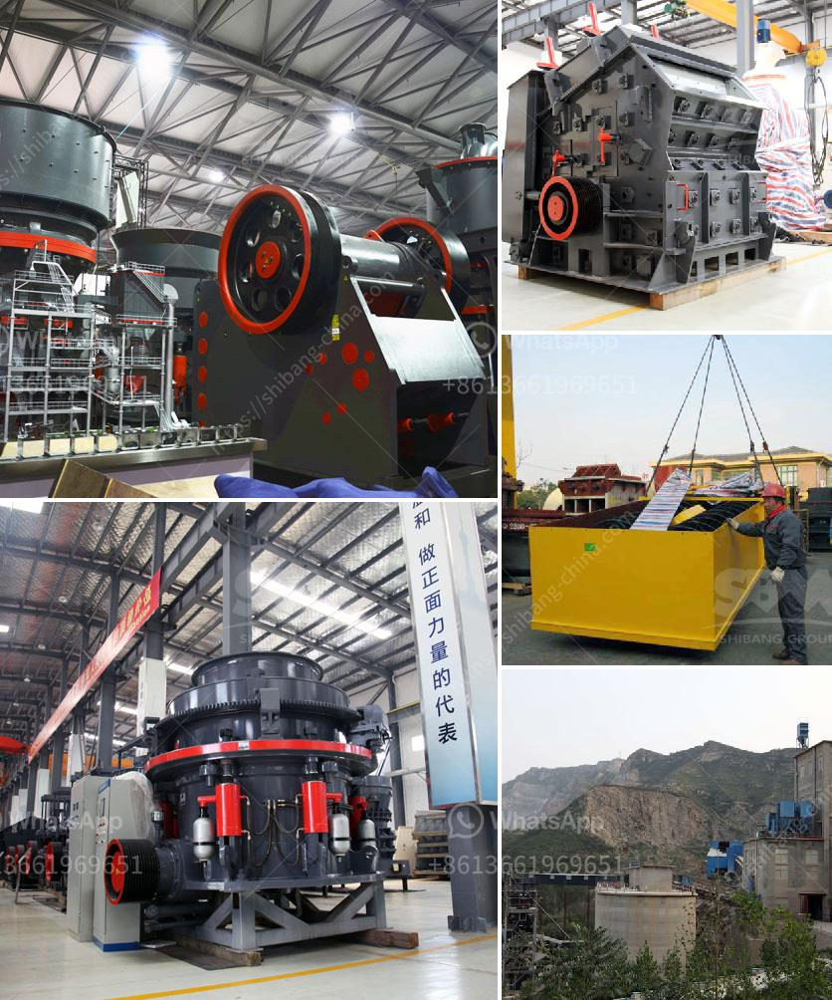

<h3>7 Factors Affecting the Price of Jaw Crusher</h3>
Jaw crusher is a commonly used mechanical equipment for ore crushing and processing. Unlike ordinary ore crushers, the jaw crusher has a relatively large crushing force and can be used for granite, dolomite, calcite and other materials with a hardness of up to 320 MPa. Therefore, it is often used in various industrial sectors such as transportation, energy, cement, construction, and chemicals.

However, the price of the jaw crusher is not fixed and it varies from different manufacturers. The following are some important factors that affect the jaw crusher price.

Different manufacturers have different prices for the same type of jaw crusher. When selecting a jaw crusher, users should consider the reputation and service level of the manufacturer, and choose a reliable and reputable manufacturer to ensure the quality of the equipment and the after-sales service.

The quality of the jaw crusher directly affects the equipment price. The better the quality, the higher the price. On the contrary, the price of jaw crusher with poor quality will be lower.

The jaw crusher is made of advanced technology and materials, and the components and parts are made of high-strength materials to exert higher crushing strength and longer service life. The more advanced the technology and the better the materials, the higher the price of the equipment.

The production cost of the jaw crusher is determined by factors such as the size of the production capacity, the type of material, the equipment configuration, and the required output granularity. Higher production costs will inevitably lead to higher equipment prices.

The supply and demand relationship in the market directly affects the price of the jaw crusher. When the supply exceeds the demand, the price will be relatively low; on the contrary, when the demand exceeds the supply, the price will be relatively high.

Transportation and labor costs are also important factors affecting the price of jaw crushers. The cost of transportation and labor accounts for a considerable proportion in the total cost of the equipment. Therefore, manufacturers with convenient transportation and lower labor costs can provide customers with jaw crushers at a lower price.

The profit margin of jaw crusher manufacturers also affects the price of the equipment to some extent. Manufacturers with higher profit margins will set relatively higher prices for their products, while manufacturers with lower profit margins will offer more favorable prices to attract customers. In addition, different sales models, such as direct sales, online sales, and agent sales, will also affect the price of the jaw crusher.

In conclusion, there are various factors that affect the price of the jaw crusher, including the brand, quality, technology, production cost, market supply and demand, transportation and labor costs, profit margin, and sales model. Users should consider these factors comprehensively when selecting equipment, and choose the one that suits their own production needs and reasonable price.
<h3>Contact us</h3><ul><li><strong>Whatsapp:&nbsp;<a href="https://wa.me/8613661969651">+8613661969651</a></strong></li><li><a href="https://swt.shibang-china.com/?git&amp;zhl&amp;7 Factors Affecting the Price of Jaw Crusher"><strong>Online Service(chat now)</strong></a></li></ul><h3>Related</h3><ul><li><a href='How to maintain stone crusher equipment.md'>How to maintain stone crusher equipment?</a></li><li><a href='How to Configure Crusher Indonesia ？.md'>How to Configure Crusher Indonesia ？</a></li><li><a href='How to select a vibrating screen in Britain.md'>How to select a vibrating screen in Britain?</a></li><li><a href='How can I improve the grinding of a raw mill.md'>How can I improve the grinding of a raw mill?</a></li><li><a href='How to extract copper from tailings.md'>How to extract copper from tailings?</a></li></ul>