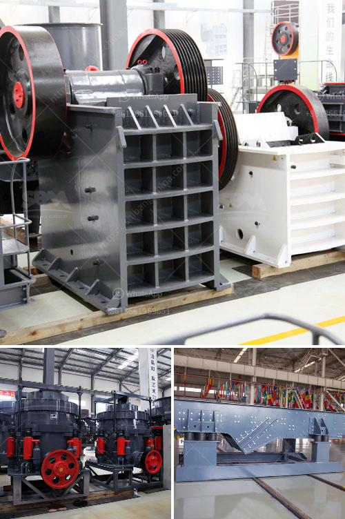

<h3>How To Build A Top Quarry In Nigeria?</h3>
Quarrying is an integral part of the construction industry in Nigeria. As a major contributor to the GDP, quarrying provides raw materials for infrastructure development, residential and commercial buildings, and industrial activities. Building a top quarry in Nigeria requires careful planning and execution. Here are the steps to take to build a successful quarry in Nigeria.

1. Conduct thorough market research: Before starting a quarry, it is essential to understand the demand for raw materials in the local market. Investigate whether there is a demand-supply gap and assess potential customers, including construction companies, road builders, and other stakeholders. A comprehensive market research will help determine the size and location of the quarry, ensuring it meets the needs of the market.

2. Obtain necessary licenses and permits: Quarrying requires several permits and licenses from relevant government agencies. It is crucial to obtain all the necessary legal documentation to operate a quarry legally. This may include environmental permits, land permits, mining licenses, and others. Engaging qualified legal professionals will ensure compliance with all legal requirements.

3. Identify a suitable location: The location of the quarry will significantly impact its success. Look for areas abundant in natural resources, such as limestone, granite, or sand. Conduct geological surveys to determine the quality and quantity of the raw materials in potential locations. Additionally, consider proximity to transportation networks, as well as access to utilities like water and electricity.

4. Develop a comprehensive business plan: A well-thought-out business plan is crucial for securing funding and attracting investors. Outline your quarry's vision, mission, and objectives, detailing the financial projections, marketing strategies, and operational plans. A comprehensive business plan will serve as a roadmap for successfully establishing and managing the quarry.

5. Acquire necessary equipment: Investing in the right equipment is essential for efficient quarry operations. Identify the machinery and tools required for mining, processing, transportation, and storage of raw materials. Some of the essential equipment includes excavators, crushers, conveyors, and trucks. It is advisable to purchase durable and reliable equipment from reputable suppliers to minimize downtime and maintenance costs.

6. Hire skilled workforce: A skilled and experienced workforce is vital for the successful operation of a quarry. Employ professionals with expertise in mining, geology, engineering, and logistics. Additionally, hire administrative staff to manage finances, permits, and legal matters. Providing appropriate training and ensuring a safe working environment will help retain top talent in the long run.

7. Implement efficient extraction and processing methods: Once the quarry is operational, focus on optimizing the extraction and processing techniques. Implement efficient blasting methods to maximize the yield of usable material. Invest in modern technologies for crushing, screening, and processing to ensure high-quality output with minimal waste. Regularly assess and improve the operational processes to achieve maximum efficiency.

8. Prioritize safety and environmental sustainability: Safety and environmental sustainability are paramount in quarry operations. Adhere to strict safety protocols and provide appropriate personal protective equipment (PPE) to employees. Implement proper waste management practices and undertake restoration and land rehabilitation initiatives to minimize the environmental impact.

Building a top quarry in Nigeria requires careful planning, financial investment, and adherence to legal regulations. With thorough market research, strategic location selection, and the right equipment and workforce, a quarry can become a profitable venture. However, it is essential to prioritize safety, environmental sustainability, and quality control to ensure long-term success in the industry.
<h3>Contact us</h3><ul><li><strong>Whatsapp:&nbsp;<a href="https://wa.me/8613661969651">+8613661969651</a></strong></li><li><a href="https://swt.shibang-china.com/?git&amp;zhl&amp;How To Build A Top Quarry In Nigeria"><strong>Online Service(chat now)</strong></a></li></ul><h3>Related</h3><ul><li><a href='How to import stone crusher machine from China to Canada.md'>How to import stone crusher machine from China to Canada?</a></li><li><a href='How to fit water pipes on vibrating screen in sand washing plant.md'>How to fit water pipes on vibrating screen in sand washing plant?</a></li><li><a href='how crusher metal detectors work .md'>how crusher metal detectors work ?</a></li><li><a href='7 Tips on how to maintain an impact crusher.md'>7 Tips on how to maintain an impact crusher?</a></li><li><a href='How to start a granite quarry.md'>How to start a granite quarry?</a></li></ul>