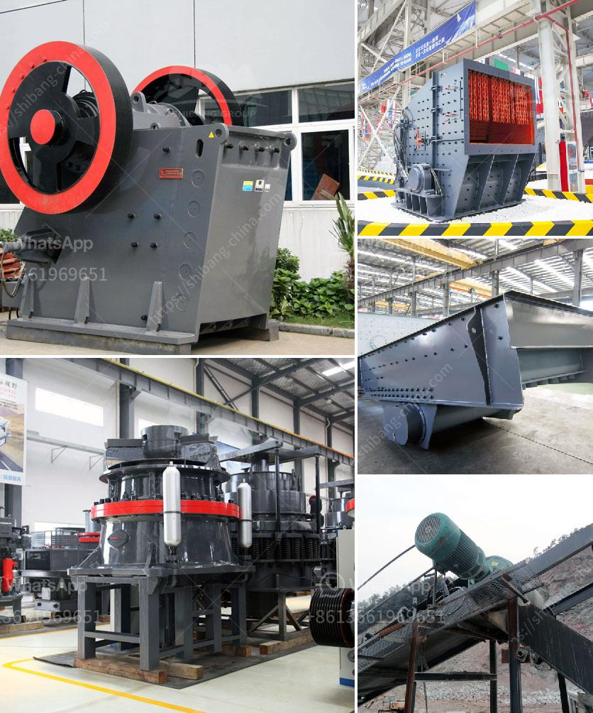

<h3>How To Build Your Own Rock Crusher Plant？</h3>
Building your own rock crusher plant is not an easy task. However, it is something that anyone with a bit of determination and the right knowledge can do. It is important to understand that building a rock crusher plant is not just for professionals or skilled construction workers. With the right tools and materials, anyone can create their own rock crusher plant and enjoy the benefits of having a versatile and efficient crushing solution at their disposal.

Before you begin building your rock crusher plant, it is essential to have a clear plan in mind. This plan should include the size and scope of your project, the type of rock you will be crushing, and the desired output. It is important to consider your budget, as building a rock crusher plant can be costly. However, with careful planning and resourcefulness, it is possible to build a highly efficient and cost-effective crushing solution.

The first step in building your rock crusher plant is to choose the location. You will need a site that is easily accessible and has enough space to accommodate your equipment and materials. It is also important to consider the proximity to your source of rocks. Ideally, you want to minimize transportation costs by locating your plant close to where the rocks will be extracted.

Once you have chosen the location, it is time to gather the necessary tools and materials. You will need a variety of heavy machinery, including a rock crusher, a feeder, conveyor belts, and screening equipment. These can be rented or purchased, depending on your budget and the duration of your project. It is important to choose machinery that is suitable for the type of rock you will be crushing, as different rocks require different crushing methods.

Next, you will need to prepare the site for construction. This includes clearing the area of any obstacles, such as trees or debris. It is also important to level the ground and ensure proper drainage. Building a strong foundation is crucial to the stability and longevity of your rock crusher plant.

Once the site is prepared, it is time to assemble your machinery. Follow the manufacturer's instructions carefully and ensure that all components are properly installed and secured. It is also important to conduct regular maintenance and inspections to keep your equipment in optimal condition.

In addition to the machinery, you will also need to install electrical and plumbing systems. These should be done by a qualified professional to ensure compliance with safety regulations and to prevent any potential hazards.

Finally, once your rock crusher plant is fully assembled and operational, it is essential to have a plan for rock disposal. This may involve working with local government agencies or hiring a specialized company for rock removal and recycling.

Building your own rock crusher plant is a rewarding and challenging endeavor. It requires careful planning, resourcefulness, and a strong commitment to safety and sustainability. However, with the right tools, materials, and expertise, anyone can build a rock crusher plant and enjoy the freedom and satisfaction that comes with it. So, roll up your sleeves and get ready to build your own rock crusher plant today!
<h3>Contact us</h3><ul><li><strong>Whatsapp:&nbsp;<a href="https://wa.me/8613661969651">+8613661969651</a></strong></li><li><a href="https://swt.shibang-china.com/?git&amp;zhl&amp;How To Build Your Own Rock Crusher Plant？"><strong>Online Service(chat now)</strong></a></li></ul><h3>Related</h3><ul><li><a href='How to choose type of crusher.md'>How to choose type of crusher?</a></li><li><a href='how to separate iron from basalt？.md'>how to separate iron from basalt？</a></li><li><a href='How to wash manufacturing sand .md'>How to wash manufacturing sand ?</a></li><li><a href='How to determine the fineness of dolomite and how to make it reach the target fineness.md'>How to determine the fineness of dolomite and how to make it reach the target fineness?</a></li><li><a href='How to design an iron ore processing facility with crushing and beneficiation.md'>How to design an iron ore processing facility with crushing and beneficiation?</a></li></ul>