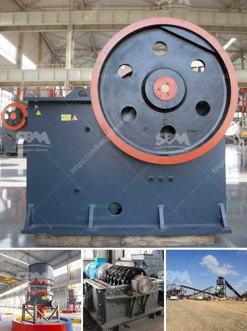

<h3>How big is a 100 tph rock crushing plant</h3>
The design of crushing plants is indispensable in the effort to produce high-quality aggregates. Many different factors need to be taken into account when designing a crushing plant, such as its structure, material, capacity, and size. Having a crushing plant that suits your needs is crucial for productivity and efficiency.

One of the most commonly used crushing plants is the jaw crusher. It is included in various stone processing lines and has decades of experience in this field. Due to its ability to crush hard and abrasive materials, jaw crushers are used as primary crushers for rock, but also for recycling purposes.

A 100 tph rock crushing plant with jaw crusher + cone crusher, vibrating screen, and belt conveyors as the main crushing equipment, and combines the working process of jaw crusher, cone crusher, and vibrating screen into one machine. The final product sizes are based on the cone crusher model, which includes 2mm, 4mm, 6mm, 8mm, 10mm, 12mm, 16mm, 20mm, 25mm, etc.

The output sizes are different depending on the model of cone crusher, and the capacity ranges from 80 to 1000 tph. However, the jaw crusher can crush rocks with a maximum feed size of 830mm. Therefore, each type of cone crusher can be customized to suit different applications.

The 100 tph rock crushing plant consists of a jaw crusher, a cone crusher, a vibrating screen, and belt conveyors. The primary jaw crusher is responsible for reducing the size of the rocks to smaller sizes, while the secondary cone crusher produces the final product sizes.

The vibrating screen separates the material that meets the size requirements from the oversized material, which goes back to the cone crusher for further crushing. The belt conveyors transport the final products to their respective storage areas or loading points.

A 100 tph rock crushing plant requires both machines and manpower to operate. The main equipment includes maintenance tools, operators' training, and safety equipment. The manpower required ranges from the physical laborers to the skilled technicians, engineers, and project managers who oversee the entire operation.

The physical laborers are responsible for unloading the rocks from trucks, feeding the jaw crusher, and removing the crushed rocks from the secondary cone crusher. The skilled technicians are in charge of maintaining and repairing the machines, while the engineers and project managers oversee the overall operation, ensuring its efficiency and productivity.

In conclusion, a 100 tph rock crushing plant with jaw crusher + cone crusher, vibrating screen, and belt conveyors is an efficient and productive crushing plant that meets the requirements of high-quality aggregates for various construction applications. With a compact structure, reliable performance, and easy operation, it provides a wide range of choices for customers in terms of customized solutions.
<h3>Contact us</h3><ul><li><strong>Whatsapp:&nbsp;<a href="https://wa.me/8613661969651">+8613661969651</a></strong></li><li><a href="https://swt.shibang-china.com/?git&amp;zhl&amp;How big is a 100 tph rock crushing plant"><strong>Online Service(chat now)</strong></a></li></ul><h3>Related</h3><ul><li><a href='How to wash clay out of bauxite.md'>How to wash clay out of bauxite?</a></li><li><a href='How to Choose a Vibrating Feeder.md'>How to Choose a Vibrating Feeder?</a></li><li><a href='How to build sand and gravel wash plant.md'>How to build sand and gravel wash plant?</a></li><li><a href='How to install a conveyor belt for the coal mill.md'>How to install a conveyor belt for the coal mill?</a></li><li><a href='How to Grind Manganese Ores Using a Ball Mill.md'>How to Grind Manganese Ores Using a Ball Mill?</a></li></ul>