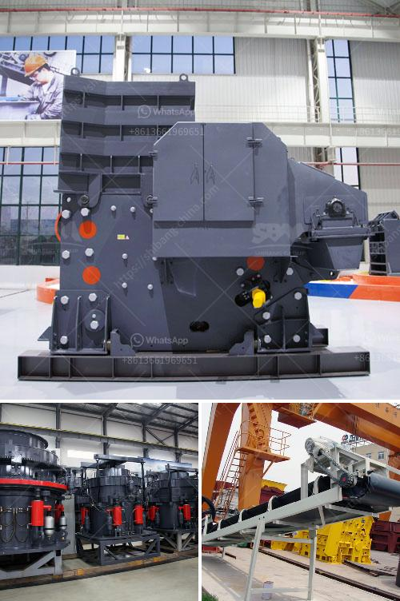

<h3>How calcite is mined and processed ?</h3>
Calcite is a mineral, known for its crystal forms and widely used in applications such as building materials, paint, and ceramics. The mining process for calcite is similar to the extraction of other minerals. It includes the following stages:

1. Exploration: The first step in the mining process of calcite is to identify potential deposits. This is done through geological studies, which include analyzing the area's rock formations and sampling the mineral. Geologists may also use remote sensing techniques, such as aerial surveys or satellite imagery, to locate promising sites.

2. Site Preparation: Once a viable deposit is found, the mining site needs to be prepared. This involves clearing vegetation, removing topsoil, and constructing access roads and infrastructure. The goal is to create a safe and efficient work environment for the mining operations.

3. Extraction: The actual mining of calcite can be done through various methods, depending on the characteristics of the deposit and its location. One common method is open-pit mining, where the mineral is excavated from an open pit or borrow. This method is suitable for shallow deposits that are close to the surface.

Another method is underground mining, which is used for deeper deposits or those located in areas that cannot be accessed by open pits. In underground mining, tunnels or shafts are created to reach the mineral. This method requires more advanced equipment and techniques, such as drilling and blasting, to extract calcite from the rock formation.

4. Crushing and Grinding: Once the calcite is extracted, it needs to be crushed and grinded before being used for various applications. The crushing process involves using jaw, cone, or impact crushers to break up the calcite into suitable sizes. The grinding process, on the other hand, involves using ball mills or other types of grinding machines to grind the calcite into a fine powder.

5. Classification: After the crushing and grinding process, the calcite powder is classified according to particle size. This is important for ensuring the consistency and quality of the final product. Classification can be done using various techniques, such as air classifiers or sedimentation tanks.

6. Purification: In some cases, further purification steps may be required to remove impurities from the calcite powder. This can involve processes such as flotation, magnetic separation, or chemical treatments to improve the purity and whiteness of the final product.

7. Packaging and Distribution: Once the calcite powder is processed and purified, it is ready for packaging and distribution. The final product is usually sold in bags, bulk, or as a component in other products, such as paints or plastics. Proper packaging and labeling are important to ensure safe transportation and compliance with regulatory standards.

In conclusion, the mining and processing of calcite involve several stages, including exploration, extraction, crushing, grinding, classification, purification, and packaging. These steps are essential for producing high-quality calcite powder that can be used in various industries.
<h3>Contact us</h3><ul><li><strong>Whatsapp:&nbsp;<a href="https://wa.me/8613661969651">+8613661969651</a></strong></li><li><a href="https://swt.shibang-china.com/?git&amp;zhl&amp;How calcite is mined and processed "><strong>Online Service(chat now)</strong></a></li></ul><h3>Related</h3><ul><li><a href='How to build a manganese ore concentrator What crushing machinery do you need.md'>How to build a manganese ore concentrator? What crushing machinery do you need?</a></li><li><a href='How to start a gold ore mining business.md'>How to start a gold ore mining business?</a></li><li><a href='how to choose a portable crusher plant ？.md'>how to choose a portable crusher plant ？</a></li><li><a href='How to select a crusher to crush different minerals.md'>How to select a crusher to crush different minerals?</a></li><li><a href='How to maintain stone crusher equipment.md'>How to maintain stone crusher equipment?</a></li></ul>