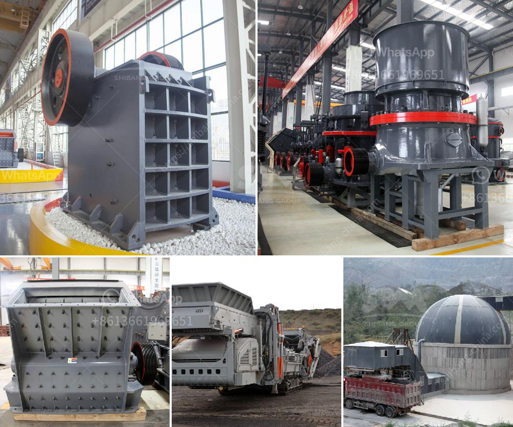

<h3>How can I improve the grinding of a raw mill?</h3>
Raw mills are crucial equipment in cement manufacturing. They grind raw materials into fine powder, enabling the efficient production of cement. However, optimizing the grinding process in a raw mill has its challenges. It requires balancing several factors to maintain a high-quality end product while maximizing the mill's productivity.

1. Optimize mill internals: Ensuring that the mill internals such as grinding media, liners, and diaphragms are in good condition is essential. Regularly inspect and replace worn-out parts to maintain an efficient grinding process. Additionally, consider using high-quality and durable materials for mill internals to enhance their lifespan and performance.

2. Control the mill ventilation: Proper airflow within the mill is crucial for efficient grinding. Adequate ventilation helps transport the fine particles out of the mill, preventing them from accumulating and potentially affecting the grinding process. Adjust the mill ventilation system to achieve the desired airflow and ensure that it is balanced across the mill.

3. Optimize mill feed: An appropriate mill feed is vital for achieving optimal grinding performance. Ensure a consistent and controlled feed into the mill by using a well-designed feeding system. Avoid overfeeding or underfeeding the mill, as it can lead to inefficient grinding and increased energy consumption.

4. Adjust mill speed: The rotational speed of the mill affects the grinding efficiency. Experiment with different mill speeds to find the optimal speed for your specific raw materials and desired fineness. However, be cautious not to exceed the recommended speed, as it can cause excessive wear on the mill's internals.

5. Monitor and control mill parameters: Regularly monitor critical mill parameters such as temperature, pressure, and power consumption. Anomalies in these parameters can indicate issues with the grinding process. Use advanced process control systems to automatically adjust the mill settings based on real-time data, ensuring optimal performance and reducing manual interventions.

6. Regular maintenance: Scheduled mill maintenance plays a vital role in optimizing grinding performance. Conduct routine inspections, cleanings, and lubrication to prevent breakdowns and ensure smooth operations. Follow manufacturer recommendations on maintenance procedures to maximize the mill's longevity and performance.

7. Invest in modern technology: Consider adopting advanced technologies and equipment to enhance the grinding process. High-efficiency separators, vertical roller mills, or other modern grinding technologies can significantly improve the overall performance of the raw mill. Evaluate the feasibility of investing in these technologies based on your specific requirements and budget.

Improving the grinding process in a raw mill is a continuous effort that requires a proactive approach. Regularly monitor, evaluate, and adapt different strategies to optimize the grinding performance. Collaboration with suppliers, experts, and industry peers can provide valuable insights and ideas for achieving efficient and productive grinding operations.
<h3>Contact us</h3><ul><li><strong>Whatsapp:&nbsp;<a href="https://wa.me/8613661969651">+8613661969651</a></strong></li><li><a href="https://swt.shibang-china.com/?git&amp;zhl&amp;How can I improve the grinding of a raw mill"><strong>Online Service(chat now)</strong></a></li></ul><h3>Related</h3><ul><li><a href='How to choose a generator for a crusher plant .md'>How to choose a generator for a crusher plant ?</a></li><li><a href='How to Configure Crusher Indonesia ？.md'>How to Configure Crusher Indonesia ？</a></li><li><a href='How to crush hard stones into powder.md'>How to crush hard stones into powder?</a></li><li><a href='How to install the impact crusher .md'>How to install the impact crusher ?</a></li><li><a href='How to choose a jaw crusher.md'>How to choose a jaw crusher?</a></li></ul>