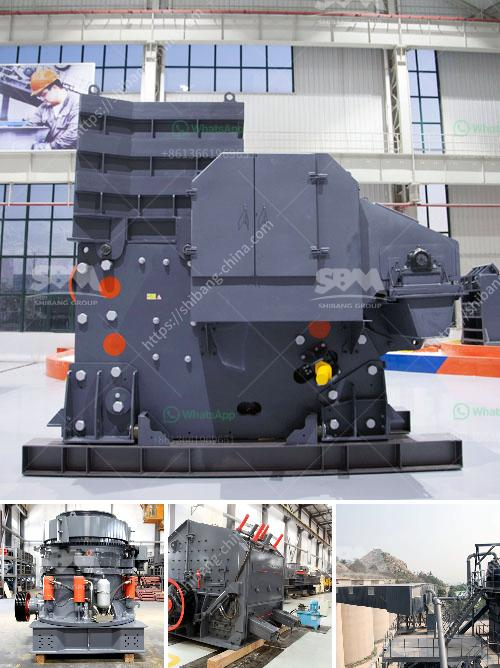

<h3>How can one avoid chalking during kaolin crushing?</h3>
Kaolin, also known as china clay, is a clay mineral primarily composed of kaolinite. Kaolin is widely used in various industries due to its unique properties, such as its high whiteness, fine particle size, and excellent plasticity. However, one common issue that arises during the crushing process of kaolin is chalking.

Chalking refers to the formation of a powdery residue on the surface of kaolin particles, which reduces its quality and market value. Chalking occurs due to the interaction between the kaolin particles and the crushing equipment, resulting in the detachment of the fine particles from the surface of the larger particles.

1. Selection of appropriate crushing equipment: The choice of crushing equipment plays a crucial role in preventing chalking. It is important to select equipment that minimizes the generation of fine particles and ensures a uniform size distribution. Crushing equipment such as jaw crushers, cone crushers, or impact crushers with adjustable settings can help achieve the desired particle size without excessive generation of fines.

2. Optimize crushing parameters: Adjusting the crushing parameters such as the speed of the crusher, the gap between the crushing surfaces, and the feed size can significantly impact the occurrence of chalking. Proper optimization of these parameters can help reduce the generation of fines and prevent chalking.

3. Control moisture content: The moisture content of kaolin is another factor that can contribute to chalking. Excessive moisture can lead to agglomeration and promote the detachment of fine particles during crushing. Therefore, it is essential to control the moisture content of the kaolin feed to the crushing equipment.

4. Implement dust control measures: Chalking often results in the formation of a powdery dust, which can be a health hazard and lead to environmental contamination. Implementing effective dust control measures, such as using dust suppression systems, enclosing the crushing area, and proper ventilation, can help minimize chalking-related dust issues.

5. Regular equipment maintenance: Regular maintenance of the crushing equipment is vital to prevent chalking and ensure optimal performance. Wear parts, such as crusher liners, should be inspected and replaced when necessary to avoid excessive wear and generation of fines. Additionally, lubrication of the equipment and proper alignment of the crushing surfaces are essential for efficient crushing and minimizing chalking.

In conclusion, chalking during kaolin crushing can be prevented through careful selection of appropriate crushing equipment, optimization of crushing parameters, controlling moisture content, implementing dust control measures, and regular equipment maintenance. By implementing these measures, the quality of the crushed kaolin can be improved, leading to enhanced market value and customer satisfaction.
<h3>Contact us</h3><ul><li><strong>Whatsapp:&nbsp;<a href="https://wa.me/8613661969651">+8613661969651</a></strong></li><li><a href="https://swt.shibang-china.com/?git&amp;zhl&amp;How can one avoid chalking during kaolin crushing"><strong>Online Service(chat now)</strong></a></li></ul><h3>Related</h3><ul><li><a href='How to select a crusher to crush different minerals.md'>How to select a crusher to crush different minerals?</a></li><li><a href='How to maintain vertical raw mill in cement plant.md'>How to maintain vertical raw mill in cement plant?</a></li><li><a href='How to design an iron ore conveyor.md'>How to design an iron ore conveyor?</a></li><li><a href='How big is a 100 tph rock crushing plant.md'>How big is a 100 tph rock crushing plant</a></li><li><a href='How to build a manganese ore concentrator What crushing machinery do you need.md'>How to build a manganese ore concentrator? What crushing machinery do you need?</a></li></ul>