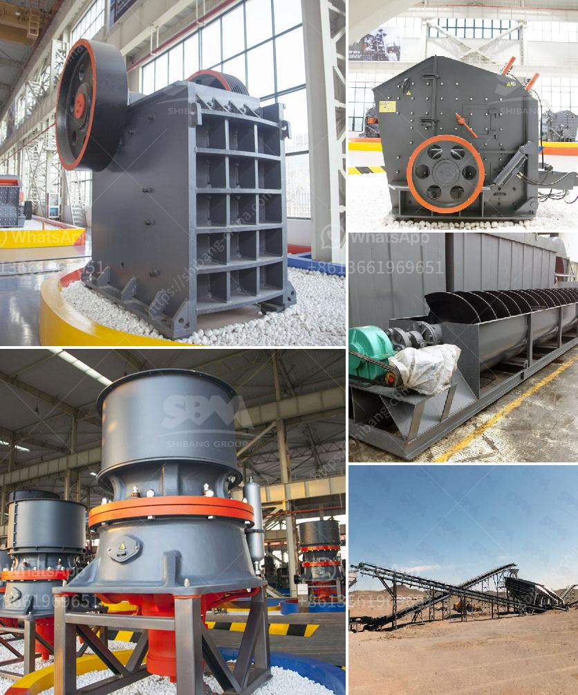

<h3>How can the throughput capacity of a ball mill be increased?</h3>
Ball mills are widely used in mineral processing, cement, silicate products, and other industries, and can be used for wet grinding and dry grinding. In the process of grinding, the material is broken under the action of grinding media in the ball mill. When the grinding media hits the material, it will generate a certain amount of heat, which is the heat of grinding. Although the heat generated during grinding is relatively small, it cannot be ignored. In order to increase the throughput capacity of the ball mill, the grinding media and the material in the ball mill must be matched reasonably.

In the usual operation of the ball mill, the grinding media directly contacts the materials to be ground. Considering the fineness of the material, the specific gravity of the materials and the grinding media, the choice of grinding media is crucial. Generally, larger diameter steel balls are used for coarse grinding, and smaller diameter steel balls are used for fine grinding. The size and proportion of steel balls also affect the productivity and efficiency of the ball mill. For example, excessive ball load will result in impingement grinding, leading to high energy consumption and uneven product particle size.

In order to ensure the effective grinding of materials and improve the output of the ball mill, the grinding mode should be optimized. According to the physical and chemical properties of the materials to be ground, the grinding conditions can be adjusted, such as dry grinding or wet grinding, intermittent grinding or continuous grinding, etc. The grinding mode should be selected reasonably to improve the grinding efficiency and maximize the production capacity of the ball mill.

The grading of grinding media directly affects the working efficiency of the ball mill. Different sizes of grinding media can generate different impact and grinding forces. When the grinding media is graded and the proportion of grinding media of different sizes is reasonable, the grinding efficiency will be improved, and the ball mill will have more processing capacity.

The ratio of grinding media to materials determines the cutting and impacting force of grinding media on materials. It directly affects the grinding efficiency and production capacity of the ball mill. In general, the ratio of grinding media to material is 1:0.5-1:2. The size and proportion of grinding media and the grinding time also affect the grinding efficiency. Many experiments have proved that enhanced grinding efficiency can be achieved by using smaller steel balls in ball mills.

Although the aforementioned factors are the main factors affecting the grinding efficiency and capacity of the ball mill, there are still other factors that contribute to the grinding effect. For example, the shape and movement of the grinding media in the ball mill directly affect the grinding efficiency and grinding effect. These factors should be considered when selecting the grinding media and designing the ball mill.

In conclusion, how to improve the throughput capacity of a ball mill relies on various factors, such as the grinding media size and proportion, the grading and filling rate of grinding media, the shape and movement of grinding media, and the grinding mode of materials. These factors will affect the grinding efficiency and ultimately the production capacity of the ball mill. Therefore, it is important to choose the appropriate grinding media and adjust the grinding conditions to improve the throughput capacity of the ball mill.
<h3>Contact us</h3><ul><li><strong>Whatsapp:&nbsp;<a href="https://wa.me/8613661969651">+8613661969651</a></strong></li><li><a href="https://swt.shibang-china.com/?git&amp;zhl&amp;How can the throughput capacity of a ball mill be increased"><strong>Online Service(chat now)</strong></a></li></ul><h3>Related</h3><ul><li><a href='how does a stone crushing quarry work .md'>how does a stone crushing quarry work ?</a></li><li><a href='How can we solve the problem of the crusher bearing heating.md'>How can we solve the problem of the crusher bearing heating?</a></li><li><a href='How to setting up of stone crusher unit in maharashtra and order there of .md'>How to setting up of stone crusher unit in maharashtra and order there of ?</a></li><li><a href='How to design a crushing plant.md'>How to design a crushing plant?</a></li><li><a href='How to extract dust from a ball mill.md'>How to extract dust from a ball mill?</a></li></ul>