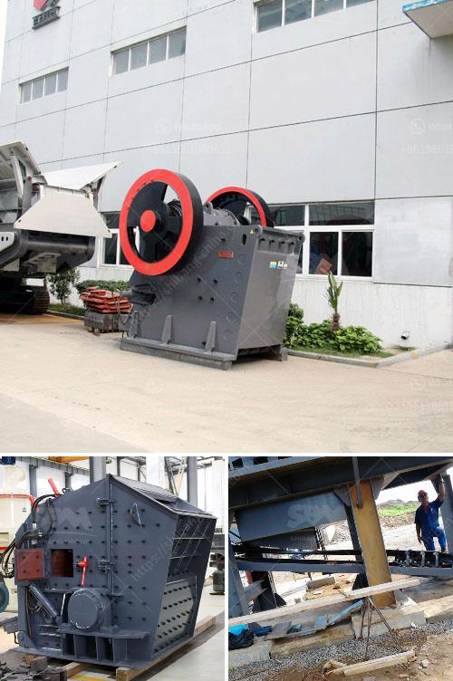

<h3>How can we improve cement mill production?</h3>
Cement production involves a complex process that includes several steps. One of the crucial aspects that affect the efficiency and overall success of this production is the cement mill. With the continuous improvement of technology, the cement mill production has steadily been enhanced. However, there is still room for further improvement to increase its output and optimize the overall process. In this article, we will discuss some ways to improve cement mill production.

Firstly, it is imperative to properly classify the raw materials before they enter the cement mill. The size of the particles plays a crucial role in determining the quality and efficiency of the final product. If the raw materials are not properly classified, it can lead to poor grinding and lower production rates. Having an efficient classifier system in place ensures that the particles are evenly sized and allows for better control over the grinding process.

Secondly, optimizing the grinding process is another key aspect that can significantly improve cement mill production. The grinding process consumes a large amount of energy and contributes to the overall cost of cement production. Therefore, it is essential to minimize energy consumption while maximizing output. One way to achieve this is by using grinding aids. These additives can improve the grinding efficiency, reduce clinker grinding time, and potentially increase mill output.

Moreover, maintaining the cement mill's internal parts is vital for its smooth operation and productivity. Regular inspection and maintenance of the mill's liners, grinding media, and other wear parts ensure their optimal performance. Worn-out parts can significantly impact the mill's production and may lead to system failure. Therefore, it is necessary to have a maintenance schedule in place and promptly replace or repair any damaged components.

Another critical factor in enhancing cement mill production is controlling the mill's temperature during the grinding process. Excessive heat can negatively affect the quality and setting time of cement. Therefore, it is crucial to monitor and control the mill's temperature, especially when grinding materials with high moisture content. Various techniques, such as employing water spray systems or adjusting the mill ventilation, can help regulate the temperature and maintain the desired quality of the final product.

Additionally, utilizing advanced equipment and technologies can further improve cement mill production. The integration of automation and real-time monitoring systems allows for better control and optimization of the grinding process. Automation reduces the dependency on manual operations, minimizes human error, and increases overall efficiency. Real-time monitoring systems provide accurate data and insights that help identify potential issues in real-time, allowing for immediate corrective actions.

In conclusion, improving cement mill production requires a holistic approach that includes optimizing the grinding process, proper classification of raw materials, regular maintenance of internal parts, controlling the mill's temperature, and utilizing advanced equipment and technologies. By implementing these measures, cement mill production can be enhanced, leading to higher output, improved quality, and reduced operational costs. Continuous research and innovation in this field can further push the boundaries of cement mill production and contribute to the overall growth and development of the cement industry.
<h3>Contact us</h3><ul><li><strong>Whatsapp:&nbsp;<a href="https://wa.me/8613661969651">+8613661969651</a></strong></li><li><a href="https://swt.shibang-china.com/?git&amp;zhl&amp;How can we improve cement mill production"><strong>Online Service(chat now)</strong></a></li></ul><h3>Related</h3><ul><li><a href='How to remove calcium oxide from manganese ore.md'>How to remove calcium oxide from manganese ore?</a></li><li><a href='How to manufacture marble powder with a mesh size of 1000.md'>How to manufacture marble powder with a mesh size of 1000?</a></li><li><a href='How to maintain stone crushing plant.md'>How to maintain stone crushing plant?</a></li><li><a href='How do we crush cobaltite.md'>How do we crush cobaltite?</a></li><li><a href='How to choose crusher for limestone.md'>How to choose crusher for limestone?</a></li></ul>