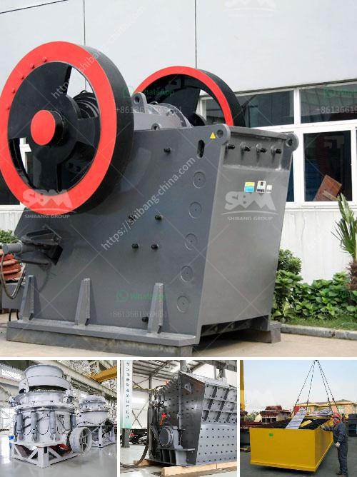

<h3>How can we prevent rocks from coming out of the impact crusher's work?</h3>
Impact crushers are crucial equipment used in construction, mining, and demolition activities. These robust machines are designed to crush materials and produce high-quality aggregates. However, one common issue that arises during their operation is rocks coming out of the crusher. This occurrence can not only pose safety risks for workers but also cause damage to nearby machinery and structures. To prevent rocks from coming out of the impact crusher's work, several measures can be taken.

Firstly, it is essential to ensure that the impact crusher is correctly fed with materials. Overfeeding or uneven feeding can lead to issues such as material spillage and rocks escaping from the crusher. To prevent this, operators should monitor the input of materials carefully and adjust the feeding rate accordingly. Moreover, a constant and uniform feed of material into the crusher will enhance its efficiency and reduce the likelihood of rocks escaping during the crushing process.

Secondly, regular maintenance and inspection of the impact crusher can play a significant role in preventing rocks from coming out. Wear parts such as blow bars, liner plates, and impact plates should be inspected regularly and replaced when necessary. Worn-out parts can reduce the efficiency of the crusher and increase the chances of material spillage. Additionally, checking the clearance between the blow bars and the impact plates can help to minimize the escape of rocks. If the clearance is too large, it can cause larger rocks to pass through without being crushed properly, leading to potential hazards.

Furthermore, installing proper safety devices can greatly reduce the risk of rocks coming out of the impact crusher. For instance, robust grizzly screens or vibrating feeders can be employed to remove oversized or unwanted materials before they enter the crusher. This pre-screening process not only improves the crusher's performance but also prevents large rocks from getting stuck and potentially causing blockages or damage.

In addition to preventive measures, operator training and adherence to safety protocols are crucial in maintaining a safe working environment. Operators should be educated on the correct operation and maintenance procedures for the impact crusher. They should also wear appropriate personal protective equipment (PPE) and follow safety guidelines to minimize the risk of accidents. Regular safety meetings and audits can help reinforce these practices and ensure that all workers are aware of potential hazards and how to mitigate them.

Lastly, it is essential to invest in a high-quality impact crusher that is designed for efficient and safe operation. Choosing a reputable manufacturer and ensuring that the crusher meets industry standards can significantly reduce the likelihood of rocks escaping during its work. Additionally, working closely with the manufacturer's technical support team can provide valuable insights and recommendations for optimizing the crusher's performance and preventing material spillage.

In conclusion, preventing rocks from coming out of the impact crusher's work requires a combination of proper feeding, regular maintenance, safety devices, operator training, and high-quality equipment. By implementing these measures, we can enhance safety, protect machinery and structures, and improve the overall efficiency of impact crushers in various industries.
<h3>Contact us</h3><ul><li><strong>Whatsapp:&nbsp;<a href="https://wa.me/8613661969651">+8613661969651</a></strong></li><li><a href="https://swt.shibang-china.com/?git&amp;zhl&amp;How can we prevent rocks from coming out of the impact crushers work"><strong>Online Service(chat now)</strong></a></li></ul><h3>Related</h3><ul><li><a href='How to install a stone crusher production line ？.md'>How to install a stone crusher production line ？</a></li><li><a href='How to design a cement processing plant.md'>How to design a cement processing plant?</a></li><li><a href='How to set up a clinker grinding unit.md'>How to set up a clinker grinding unit?</a></li><li><a href='How to get the best aggregates after crushing and screening.md'>How to get the best aggregates after crushing and screening?</a></li><li><a href='How to replace the vertical impact crusher on the production line.md'>How to replace the vertical impact crusher on the production line?</a></li></ul>