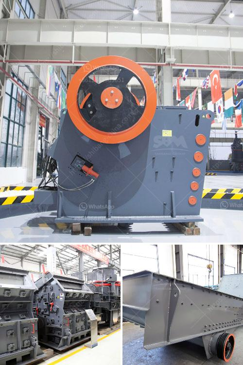

<h3>How can we reduce the amount of fines generated from a coal double roll crusher?</h3>
Coal is a valuable and abundant energy resource that plays a significant role in global energy production. However, the crushing process of coal generates fines, which can be problematic for various reasons. Fines not only reduce the efficiency of coal combustion but also cause environmental concerns and increase operational costs. Therefore, finding effective ways to reduce the amount of fines generated from a coal double roll crusher is of utmost importance. In this article, we will discuss some potential solutions to address this issue.

One approach to reducing fines generation is to optimize the crusher parameters. The double roll crusher consists of two parallel rolls, which rotate in opposite directions. To achieve the desired size reduction, the gap between the rolls needs to be carefully controlled. If the gap is too wide, larger-sized coal particles may pass through without being crushed, resulting in increased fines generation. On the other hand, if the gap is too narrow, excessive pressure may be applied, leading to excessive fines generation. Therefore, adjusting the gap between the rolls based on the coal characteristics and desired product size can significantly reduce fines generation.

Another potential solution is to install a screening system before the double roll crusher. A screening system can separate the coal feed into different size fractions, allowing the crusher to operate more efficiently. By eliminating oversized coal particles before crushing, the need for excessive pressure or multiple crushing stages can be reduced, resulting in lower fines generation. Additionally, a screening system can also remove any impurities or foreign materials that may affect the crusher performance and increase fines generation.

Furthermore, the use of advanced crushing technologies can greatly help in reducing fines generation. For instance, incorporating adjustable impact bars or sizers in the crushing chamber can control the amount of energy applied to the coal particles, thereby reducing fines generation. Similarly, utilizing modern control systems can enable real-time monitoring of the crusher operation, allowing operators to make necessary adjustments to minimize fines generation.

In addition to these technical solutions, regular maintenance and inspection of the double roll crusher are essential to ensure optimal performance and minimize fines generation. This includes routine lubrication, inspection of wear parts, and addressing any operational or mechanical issues promptly. A well-maintained crusher not only reduces fines generation but also extends the equipment's lifespan and improves overall operational efficiency.

Lastly, promoting effective coal stockpile management can also help in reducing fines generation. Stockpiling coal correctly, such as using appropriate stacking techniques, can minimize segregation and degradation, resulting in reduced fines during crushing. Proper moisture control of the coal is also crucial, as overly wet or dry coal can increase fines generation. Therefore, implementing best practices for coal stockpile management, including regular monitoring and proper maintenance, is essential.

In conclusion, reducing fines generated from a coal double roll crusher requires a comprehensive approach that combines technical solutions, regular maintenance, and effective coal stockpile management. By optimizing crusher parameters, incorporating screening systems, adopting advanced crushing technologies, and implementing proper maintenance practices, operators can successfully reduce fines generation. This not only enhances the efficiency of coal combustion but also alleviates environmental concerns and minimizes operational costs.
<h3>Contact us</h3><ul><li><strong>Whatsapp:&nbsp;<a href="https://wa.me/8613661969651">+8613661969651</a></strong></li><li><a href="https://swt.shibang-china.com/?git&amp;zhl&amp;How can we reduce the amount of fines generated from a coal double roll crusher"><strong>Online Service(chat now)</strong></a></li></ul><h3>Related</h3><ul><li><a href='How to choose the best mining equipment.md'>How to choose the best mining equipment?</a></li><li><a href='How to crush basalt rock.md'>How to crush basalt rock?</a></li><li><a href='How to build granite crusher machine Australia.md'>How to build granite crusher machine Australia?</a></li><li><a href='How to improve pulveriser capacity.md'>How to improve pulveriser capacity?</a></li><li><a href='How much does an iron ore crushing machine cost.md'>How much does an iron ore crushing machine cost?</a></li></ul>