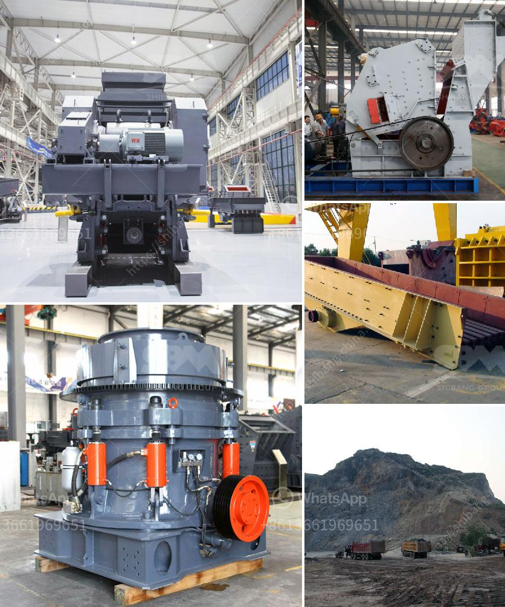

<h3>How can we solve the problem of the crusher bearing heating?</h3>
Crusher bearings play a crucial role in the performance of the crusher, as they are responsible for holding the crushing forces and allowing the crusher to rotate freely, resulting in stone crushing. However, bearing heating is a common problem faced by many crusher operators due to various reasons. It not only affects the efficiency of the crusher but also increases the risk of bearing failure. Therefore, finding a solution to this problem is essential for smooth crusher operation and maximizing production.

One of the main causes of bearing heating is lack of lubrication. Insufficient lubrication can result in increased friction between the bearing surfaces, leading to excessive heat generation. To tackle this issue, regular and proper lubrication is of utmost importance. The crusher bearings should be lubricated as per the manufacturer's recommendations, using a high-quality lubricant that meets the required specifications. It is crucial to check the oil level and quality regularly and top up or change the lubricant when necessary. Additionally, ensuring that the lubrication system is functioning correctly is vital. Regular maintenance and inspection of the lubrication system can help prevent bearing heating due to inadequate lubrication.

Another factor contributing to bearing heating is contamination. The ingress of dirt, dust, and debris into the bearing can hinder proper lubrication and cause excessive heat buildup. Hence, it is crucial to maintain cleanliness in the crusher's surrounding area. Implementing effective dust control measures, such as installing dust suppression systems, using proper seals and covers, and regularly cleaning the crusher and its components, can help minimize contamination and prevent bearing heating.

Moreover, overloading the crusher can also lead to bearing heating. Excessive workload on the crusher puts immense pressure on the bearings, resulting in heat generation. To mitigate this problem, it is important to operate the crusher within its designed capacities. Crusher operators should be aware of the maximum allowable load and avoid exceeding it. Keeping a track of the feed size and adjusting the crusher accordingly can also help prevent overloading.

In addition to the above measures, proper maintenance and inspection of the crusher are essential to identify and rectify any issues that may cause bearing heating. Regularly checking the bearing temperature using temperature sensors, conducting visual inspections for any signs of wear or damage, and addressing any abnormalities promptly can help prevent further damage to the bearings.

In conclusion, solving the problem of crusher bearing heating requires a holistic approach that includes regular lubrication, effective dust control, proper loading, and diligent maintenance. By implementing these measures, crusher operators can significantly reduce the risk of bearing heating, improve the crusher's efficiency, and ensure uninterrupted stone crushing operations. Ultimately, this will lead to enhanced productivity and cost savings for the operators.
<h3>Contact us</h3><ul><li><strong>Whatsapp:&nbsp;<a href="https://wa.me/8613661969651">+8613661969651</a></strong></li><li><a href="https://swt.shibang-china.com/?git&amp;zhl&amp;How can we solve the problem of the crusher bearing heating"><strong>Online Service(chat now)</strong></a></li></ul><h3>Related</h3><ul><li><a href='How to analyze the critical frequency of a vibrating screen.md'>How to analyze the critical frequency of a vibrating screen?</a></li><li><a href='How to make sand from rocks.md'>How to make sand from rocks?</a></li><li><a href='How to get gold from ore crushing.md'>How to get gold from ore crushing?</a></li><li><a href='How the limestone crusher works .md'>How the limestone crusher works ?</a></li><li><a href='How much crushing power does a gyratory crusher have.md'>How much crushing power does a gyratory crusher have?</a></li></ul>