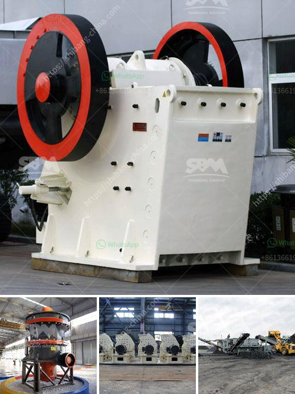

<h3>How can you tell the head has come up on of cone crusher?</h3>
A cone crusher is a type of secondary crusher that takes medium grained feed from a primary crusher and then further crushes the feed to a finer level as per the requirement. Modern cone crushers that use hydraulic hold-down clamping technology are enabling industries to crush down more capacity, with much more power.

One common issue is that the head of the cone crusher tends to lift up during operation. This happens especially when there is too much material being processed. When the head has come up, it can cause problems, such as inconsistent product gradation, reduced capacity, and increased wear on the liner. Therefore, it is crucial to identify the signs indicating that the head has come up on a cone crusher to prevent any further damage.

One of the primary signs to look for is a decrease in the reduction ratio. The reduction ratio is the ratio of the size of the feed material to the size of the crushed product. When the head has come up on the cone crusher, it affects the crushing chamber's geometry, leading to a reduction in the reduction ratio. This means that the cone crusher is not efficiently reducing the feed material to the desired final product size.

Another sign of the head coming up is an increase in the power draw of the crusher. The power draw is the amount of power consumed by the crusher to crush the feed material. When the head has come up, it disrupts the proper functioning of the crusher, requiring more power to achieve the same level of crushing. An increase in power draw indicates that the head has come up, and adjustments need to be made.

Furthermore, an uneven wear pattern on the crusher's wear parts, such as the mantle and concave, can also be indicative of the head coming up. When the head lifts, it can cause uneven crushing, leading to uneven wear on the liner surfaces. Regular monitoring and inspection of the wear patterns can help identify if the head has come up and take appropriate action to fix it.

Additionally, reduced capacity of the cone crusher is another sign that the head has come up. When the head is not properly seated, it affects the crusher's ability to process the material efficiently, leading to a decrease in the overall capacity. Monitoring the crusher's production rate can help identify if the head has come up and take corrective measures to restore the capacity.

In conclusion, identifying the signs that the head has come up on a cone crusher is crucial to ensure the crusher's optimal performance and prevent any further damage. Monitoring the reduction ratio, power draw, wear patterns, and capacity can help detect any issues with the cone crusher's head and enable timely adjustments or repairs. Proper maintenance and regular inspections are essential to ensure the cone crusher operates at its maximum efficiency and productivity.
<h3>Contact us</h3><ul><li><strong>Whatsapp:&nbsp;<a href="https://wa.me/8613661969651">+8613661969651</a></strong></li><li><a href="https://swt.shibang-china.com/?git&amp;zhl&amp;How can you tell the head has come up on of cone crusher"><strong>Online Service(chat now)</strong></a></li></ul><h3>Related</h3><ul><li><a href='How much is the stone crusher plant.md'>How much is the stone crusher plant?</a></li><li><a href='How to manage a quarry plant 10 suggestions.md'>How to manage a quarry plant? 10 suggestions</a></li><li><a href='how to repair a vibrating Sand Washer  ？.md'>how to repair a vibrating Sand Washer  ？</a></li><li><a href='how does a stone crushing quarry work .md'>how does a stone crushing quarry work ?</a></li><li><a href='How to break material using a hammer crusher.md'>How to break material using a hammer crusher?</a></li></ul>