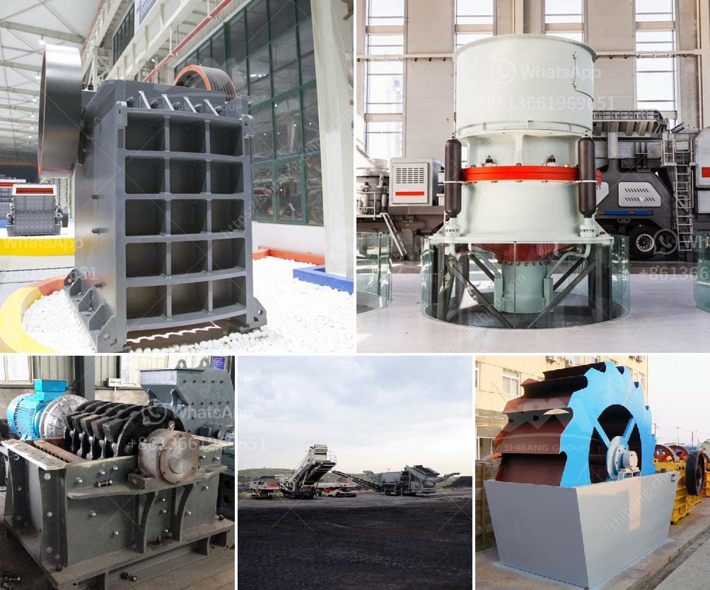

<h3>How crusher crushes rock ?</h3>
Crushers are an essential piece of machinery used in many industries to break down large rocks into smaller, more manageable pieces. These machines are designed to perform a variety of tasks, such as crushing stones, minerals, ores, or even demolition debris into smaller sizes for further processing or use. The process of how a crusher crushes rock is fascinating, as it involves a combination of mechanical forces and the application of energy.

The primary mechanism responsible for rock crushing in a crusher is compression. This occurs when the rock material is squeezed between two surfaces, causing it to break into smaller pieces. The two surfaces are typically referred to as jaws or plates and may be stationary or moving. When the rock is fed into the crusher, it encounters the first jaw, which remains stationary. As the rock moves closer to the second jaw, which is moving, the space between the two jaws decreases, exerting pressure on the rock and causing it to fracture.

In addition to compression, crushers may also utilize impact forces to crush rock. This occurs when the rock material is struck by a fast-moving object, such as a hammer or an impact plate. The impact force causes the rock to break apart into smaller pieces. This method is commonly used in crushers known as impact crushers or hammer mills. These machines deliver a high-speed impact blow to the rock material, reducing it to smaller size particles.

Crushers can be further categorized into different types, depending on their design and the mechanisms they employ to crush rocks. The most common types of crushers include jaw crushers, cone crushers, gyratory crushers, and impact crushers.

Jaw crushers are commonly used in the mining industry due to their ability to break down heavy, hard rock. They consist of two vertical jaws that move back and forth to apply pressure on the rock material. Gyratory crushers are similar in concept to jaw crushers but have a conical head that gyrates around a central axis, providing a circular crushing motion.

Cone crushers are specially designed to crush hard and abrasive materials. They operate by compressing the rock between a rotating mantle and a stationary concave surface. This crushing action produces a finer product compared to jaw or gyratory crushers.

Impact crushers, as previously mentioned, utilize the impact force to crush rocks. They are typically used to produce finely crushed materials, such as asphalt and concrete aggregates. Impact crushers can be horizontal shaft impactors or vertical shaft impactors. The former operates by throwing the rock against a solid surface, while the latter utilizes the material's own velocity to generate impact forces.

In conclusion, the crushing process in a crusher involves a combination of compression and impact forces. These forces allow the crusher to break down large rocks into smaller, more manageable pieces. Different types of crushers utilize various mechanisms to achieve this, such as jaw crushers, cone crushers, gyratory crushers, and impact crushers. Understanding how a crusher operates is crucial for industries that rely on these machines for rock processing.
<h3>Contact us</h3><ul><li><strong>Whatsapp:&nbsp;<a href="https://wa.me/8613661969651">+8613661969651</a></strong></li><li><a href="https://swt.shibang-china.com/?git&amp;zhl&amp;How crusher crushes rock "><strong>Online Service(chat now)</strong></a></li></ul><h3>Related</h3><ul><li><a href='How to choose the right grinder for the processing mineral materials.md'>How to choose the right grinder for the processing mineral materials?</a></li><li><a href='How to choose a small rock crusher for mining ？.md'>How to choose a small rock crusher for mining ？</a></li><li><a href='How does the operation of crusher plants work.md'>How does the operation of crusher plants work?</a></li><li><a href='How to make a coal primary jaw crusher machine.md'>How to make a coal primary jaw crusher machine?</a></li><li><a href='how to give a seminar on jaw crusher .md'>how to give a seminar on jaw crusher ?</a></li></ul>