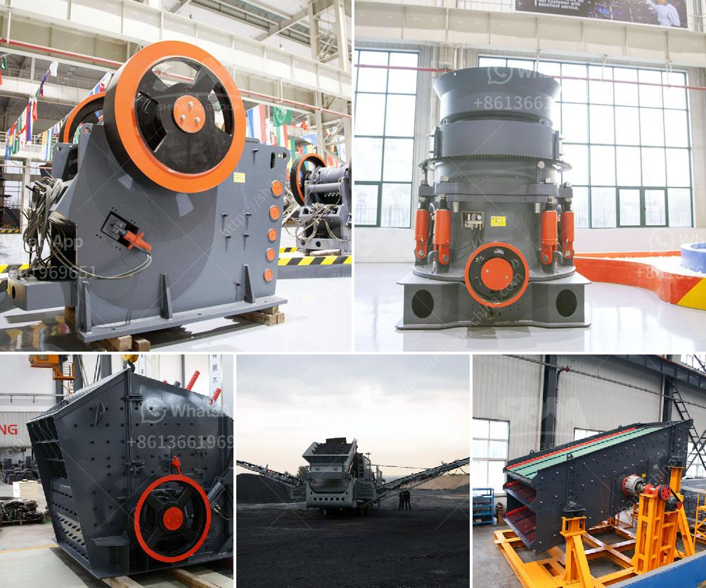

<h3>How do I adjust a cone-type crusher?</h3>
A cone-type crusher is a popular choice for crushing materials like ore, limestone, granite, and others. A cone crusher operates like a gyratory crusher, where the mantle and concave are positioned inside the main crusher chamber. The mantle moves under the pressure of the main shaft and swings around its own axis, causing crushing forces on the material being crushed.

When it comes to adjusting a cone-type crusher, it is essential to ensure the equipment operates optimally and produces the desired output. Here are key steps to help you adjust a cone-type crusher effectively:

   Before making any adjustments, ensure you understand the current crusher settings. Identify the gap between the mantle and concave, known as the closed side setting (CSS). This measurement determines the maximum size of the material that can pass through the crusher. Use an appropriate measuring tool to determine the CSS accurately.

   Determine the final product size you want to achieve. The CSS directly affects the final particle size distribution. If you desire smaller output, a smaller CSS is required.

   Check the concave and mantle for visible wear. If the components are worn out, consider replacing them before adjusting the crusher. Worn-out wear parts can impact the crusher's performance and lead to poor product quality.

   To adjust the CSS, you need to open the crusher chamber, which involves removing the crusher's top cover or overhead guard. Follow the manufacturer's instructions carefully and take necessary safety precautions.

   a. Loosen the locking bolts holding the concave in place. These bolts are typically located on the upper part of the crusher.

   b. Move the concave up or down to adjust the CSS accordingly. Turn the adjustment nuts clockwise to increase the CSS or counterclockwise to decrease it. Small adjustments can significantly impact the final product size.

   c. Once the desired CSS is achieved, tighten the locking bolts to secure the concave in place. Make sure not to overtighten the bolts to avoid damaging the equipment.

   After adjusting the CSS, run a test to ensure the crusher operates efficiently and produces the desired product. Monitor the crusher's performance, such as the power draw, product size distribution, and throughput rate. If necessary, make further adjustments to optimize the crusher's operation.

Properly adjusting a cone-type crusher is crucial for achieving desired product quality and maximizing production efficiency. Regularly monitor the crusher's performance and wear parts condition to identify the need for adjustments or replacements. When in doubt, consult the equipment manufacturer or seek assistance from an experienced professional to ensure the job is done safely and effectively.
<h3>Contact us</h3><ul><li><strong>Whatsapp:&nbsp;<a href="https://wa.me/8613661969651">+8613661969651</a></strong></li><li><a href="https://swt.shibang-china.com/?git&amp;zhl&amp;How do I adjust a conetype crusher"><strong>Online Service(chat now)</strong></a></li></ul><h3>Related</h3><ul><li><a href='How to manufacture cement plant ball mill in Kenya.md'>How to manufacture cement plant ball mill in Kenya?</a></li><li><a href='How to calculate the cemnet grinding aid requirement for cement .md'>How to calculate the cemnet grinding aid requirement for cement ?</a></li><li><a href='How to Grind Manganese Ores Using a Ball Mill.md'>How to Grind Manganese Ores Using a Ball Mill?</a></li><li><a href='How to process lightweight aggregates in Ethiopia.md'>How to process lightweight aggregates in Ethiopia?</a></li><li><a href='How to select a reversible hammer crusher as a coal crusher.md'>How to select a reversible hammer crusher as a coal crusher?</a></li></ul>