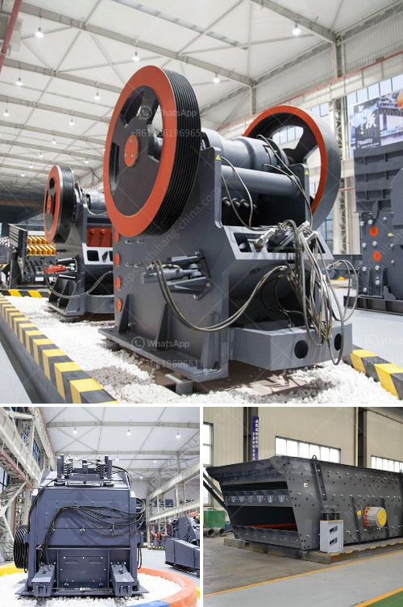

<h3>How do I change the mantle of a cone crusher?</h3>
A cone crusher is an important part of your stone or mineral processing operation, as it crushes the material to the desired dimensions. Since this process usually involves several crushing stages, it is essential to correctly install and maintain this critical piece of equipment. One crucial aspect of maintaining these machines is replacing the mantle, which is the wearable surface within the crusher cavity.

The mantle is the component that exerts the crushing force on the material being fed into the machine. Over time, the constant friction and pressure wear out the mantle surface, reducing its effectiveness. To maintain optimal performance and efficiency, it is necessary to replace the mantle at predefined intervals.

If you are wondering how to change the mantle of a cone crusher, the following step-by-step guide will provide you with the necessary information:

1. Prepare the work area: Before beginning the mantle replacement process, ensure that the crusher is shut down and the power is disconnected. Create a safe work environment by removing any debris or obstacles around the machine.

2. Remove the old mantle: Using an appropriate lifting device, carefully remove the old mantle from the crusher. Keep in mind that the mantle is heavy and requires careful handling to avoid any injuries.

3. Clean the crusher cavity: Once the old mantle is removed, thoroughly clean the crusher cavity to remove any debris, dirt, or dust. This step helps ensure proper seating of the new mantle and avoids any potential issues that may arise from dirty surfaces.

4. Inspect and replace the worn parts: While the mantle is being replaced, it is recommended to inspect other wear parts, such as the concave liners, spider caps, or arm guards. Any worn or damaged parts should be replaced to maintain optimum crusher performance.

5. Prepare the new mantle: Examine the new mantle to ensure it is the correct size and shape for your specific cone crusher model. It should match the manufacturer's specifications. If necessary, consult the equipment manual or contact the manufacturer for guidance.

6. Install the new mantle: Position the new mantle into the crusher cavity, ensuring it is properly aligned with the mantle seating surface. Use lifting equipment or a dedicated lifting tool to maneuver the heavy mantle into place. Take care not to damage any other components during installation.

7. Secure and tighten the mantle: Once in place, secure the mantle by carefully following the manufacturer's recommended torque requirements. Use the specified tightening sequence to evenly distribute the force and prevent any potential imbalance.

8. Test the crusher: After completing the mantle replacement process, start the crusher and perform a test run to ensure everything is functioning as expected. Monitor the crusher's performance and check for any unusual vibrations or noises.

By following these steps, you can effectively change the mantle of a cone crusher, ensuring its continued operation and maximum productivity. Remember to always prioritize safety and refer to the equipment manual or seek professional assistance if you encounter any difficulties during the process.
<h3>Contact us</h3><ul><li><strong>Whatsapp:&nbsp;<a href="https://wa.me/8613661969651">+8613661969651</a></strong></li><li><a href="https://swt.shibang-china.com/?git&amp;zhl&amp;How do I change the mantle of a cone crusher"><strong>Online Service(chat now)</strong></a></li></ul><h3>Related</h3><ul><li><a href='How to Design a Copper Processing Plant.md'>How to Design a Copper Processing Plant?</a></li><li><a href='How to install a sand making machine.md'>How to install a sand making machine?</a></li><li><a href='How can we reduce the amount of fines generated from a coal double roll crusher.md'>How can we reduce the amount of fines generated from a coal double roll crusher?</a></li><li><a href='How to adjust the discharge opening of an impact crusher.md'>How to adjust the discharge opening of an impact crusher?</a></li><li><a href='How much area is required for the installation of a crusher plant.md'>How much area is required for the installation of a crusher plant?</a></li></ul>