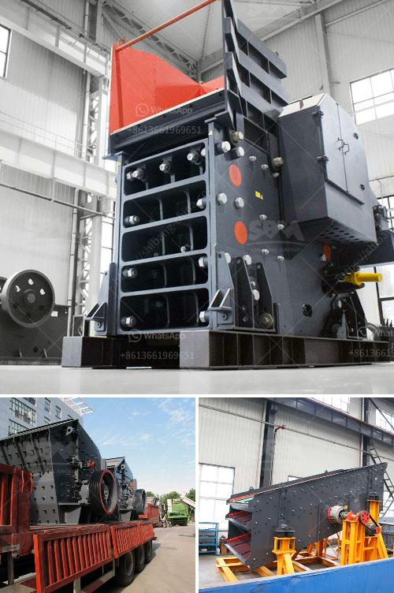

<h3>How do belt conveyors work?</h3>
Belt conveyors are widely used in various industries to transport heavy and bulk materials efficiently and quickly. These systems consist of a continuous loop of belt, with two pulleys at either end that rotate and move the belt along the conveyor path. Belt conveyors are designed to handle a wide range of materials, from dry dusty powders to heavy ores and rocks. Understanding how these conveyors work can provide valuable insight into their numerous applications and benefits.

The basic design of a belt conveyor consists of a horizontal bed supported by rollers or pulleys at each end. The belt is typically made of durable materials such as rubber, fabric, or metal, and it is stretched and supported by tension mechanisms to ensure a smooth and continuous movement. The size and capacity of the conveyor depend on factors such as the type and weight of materials being transported and the specific requirements of the application.

When in operation, the motorized pulleys or driveshaft rotates, which in turn moves the belt along the conveyor. The belt is pulled tightly and wraps around the pulleys at each end, creating a rotating loop. This continuous movement allows for a steady and consistent flow of materials. To ensure that the belt stays in place and doesn't slip off the pulleys, guide rails or side guards are often installed along the conveyor path.

One of the key advantages of belt conveyors is their ability to handle a wide range of materials. The belt can be designed to have different properties, such as resistance to heat, abrasion, or chemicals, depending on the nature of the materials being transported. Additionally, various accessories can be added to the conveyor system to enhance its functionality, such as loading and discharge chutes, sorting systems, or weighing devices.

Another noteworthy feature of belt conveyors is their flexibility and adaptability. These systems can be installed in straight lines, curves, or even inclined or declined angles to accommodate specific layout requirements. This versatility makes belt conveyors suitable for various industries, including mining, agriculture, food processing, manufacturing, and logistics.

Belt conveyors are also known for their high efficiency and low operating costs. Due to their simple design and minimal moving parts, they require minimal maintenance and have a long service life. Additionally, they can handle large volumes of materials and can be automated to improve productivity and reduce labor costs. Their smooth and consistent movement ensures a controlled flow of materials, preventing any spillage or loss during transportation.

In conclusion, belt conveyors play a crucial role in the movement of heavy and bulk materials across different industries. Their simple yet effective design, along with their flexibility and efficiency, make them a preferred choice for material handling applications. Understanding how these conveyors work allows for better utilization and optimization of their capabilities, resulting in improved productivity and cost-effectiveness.
<h3>Contact us</h3><ul><li><strong>Whatsapp:&nbsp;<a href="https://wa.me/8613661969651">+8613661969651</a></strong></li><li><a href="https://swt.shibang-china.com/?git&amp;zhl&amp;How do belt conveyors work"><strong>Online Service(chat now)</strong></a></li></ul><h3>Related</h3><ul><li><a href='How to Make Sand from River Pebbles ？.md'>How to Make Sand from River Pebbles ？</a></li><li><a href='How to build a ball mill.md'>How to build a ball mill?</a></li><li><a href='How to find capacity of a cone crusher.md'>How to find capacity of a cone crusher?</a></li><li><a href='How is quartz mined and processed.md'>How is quartz mined and processed?</a></li><li><a href='How to fit water pipes on vibrating screen in sand washing plant.md'>How to fit water pipes on vibrating screen in sand washing plant?</a></li></ul>