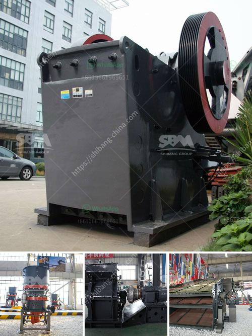

<h3>How do high-pressure grinding rolls mills work?</h3>
High-pressure grinding roll (HPGR) mills are becoming increasingly popular in the mining industry to process hard rock ores. They provide a highly energy-efficient alternative to traditional SAG (semi-autogenous grinding) mills, reducing the overall costs of mineral processing and resulting in a more environmentally friendly operation.

HPGR mills consist of two counter-rotating rolls that exert high pressure on the ore material. This compression force causes the feed material to grind against itself, reducing the size and creating a more uniform product. The rolls are typically made from tungsten carbide studs, which provide the necessary high-pressure grinding forces.

The material is fed into the gap between the rolls, and as it is crushed and ground, it passes through a series of specially designed grooves on the surface of the rolls. These grooves help to direct the crushed material and promote particle breakage.

One of the key advantages of HPGR mills is their ability to generate a significant amount of fines. These fines are essentially small particles, and they play a crucial role in the efficient operation of the mill. The presence of these fines helps to fill the gaps between larger particles, increasing the packing density and reducing the overall void space. This, in turn, improves the mill's efficiency and reduces the specific energy consumption.

The high pressure applied by the rolls also promotes the liberation of valuable minerals from the ore matrix. This means that more of the valuable mineral particles are exposed and can be readily recovered during subsequent processing stages, such as flotation or leaching.

Another benefit of using HPGR mills is their ability to handle a wide range of materials. Whether it be hard rock ores, cement clinker, or diamond ore, these mills can effectively grind and liberate the desired mineral particles. This versatility makes HPGR mills highly desirable in the mining industry.

Additionally, HPGR mills have a smaller footprint compared to traditional mills. They often require less space, making them easier to integrate into existing mineral processing plants. This can be a significant advantage, especially in areas where land is limited or expensive.

In summary, high-pressure grinding roll mills work by applying a high pressure to the ore material between two counter-rotating rolls. This compression force promotes particle breakage and the creation of fines, leading to improved grinding efficiency and liberation of valuable minerals. These mills are versatile, energy-efficient, and have a small footprint, making them an attractive option for mineral processing operations. As the mining industry continues to prioritize sustainable and cost-effective practices, HPGR mills are likely to become even more prevalent in the years to come.
<h3>Contact us</h3><ul><li><strong>Whatsapp:&nbsp;<a href="https://wa.me/8613661969651">+8613661969651</a></strong></li><li><a href="https://swt.shibang-china.com/?git&amp;zhl&amp;How do highpressure grinding rolls mills work"><strong>Online Service(chat now)</strong></a></li></ul><h3>Related</h3><ul><li><a href='How do highpressure grinding rolls mills work.md'>How do high-pressure grinding rolls mills work?</a></li><li><a href='How does a stone crusher work？.md'>How does a stone crusher work？</a></li><li><a href='How does a raw mill work in a cement plant.md'>How does a raw mill work in a cement plant?</a></li><li><a href='How is nickel extracted from its ore.md'>How is nickel extracted from its ore?</a></li><li><a href='How to manage and run a crushing plant.md'>How to manage and run a crushing plant?</a></li></ul>