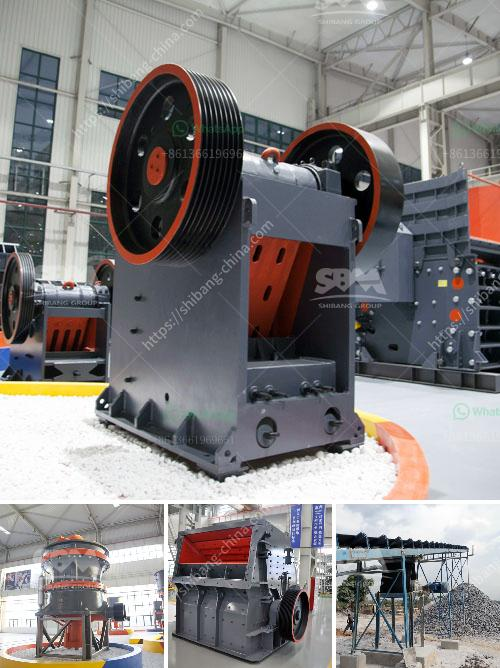

<h3>How do they grind phosphate in a ball mill?</h3>
Phosphate rock is a valuable mineral resource that is mined worldwide, valued for its high phosphorus content. It is primarily used in the production of fertilizers, agricultural supplements, and animal feed. Before it can be used in these applications, though, phosphate rock must be processed and ground into a fine powder. One common method of achieving this particle size reduction is through the use of a ball mill.

A ball mill is a type of grinder used to grind materials into extremely fine powder for use in mineral dressing processes, paints, pyrotechnics, ceramics, and selective laser sintering. The ball mill works on the principle of impact and attrition: the size reduction is done by impact as the balls drop from near the top of the shell.

When it comes to grinding phosphate rock, the ball mill is the main machine used in the process. Commonly used in the beneficiation process, ball mills are designed to reduce the size of large rocks or ores, and make them suitable for further processing. Choosing the right ball mill for grinding phosphate rock depends on careful consideration of the characteristics of the raw material and the downstream process.

Phosphate rock characteristics such as hardness, grindability, and abrasiveness play a crucial role in determining the appropriate ball mill design. The grindability index of phosphate rock is typically specified in terms of the Bond Ball Work Index, which measures the energy required to grind a large sample of the material in a laboratory-scale ball mill. Using this index, various parameters for the equipment can be configured to achieve the desired particle size.

The grinding process in a ball mill involves a series of impact and attrition-based operations. The grinding media in the ball mill, typically steel or ceramic balls, are placed inside the mill's drum, where they collide with the material being processed. The grinding media transfer the kinetic energy to the ore particles, causing them to fracture into smaller particles.

The particles' size reduction occurs due to the combination of impact and abrasion caused by the grinding media. As the drum rotates, the grinding media tumble and cascade, gradually reducing the size of the phosphate rock particles. The rotation speed of the drum also affects the grinding process, as higher speeds enhance the impact and cascade effects, resulting in finer particle size.

To achieve the desired particle size, grinding aids, such as dispersants or grinding media coatings, can be added to the mill. These additives improve the grinding efficiency and prevent the particles from clumping. Additionally, the addition of water to the ball mill may be required to control the temperature, reduce dust generation, and improve the flowability of the material.

In conclusion, the grinding of phosphate rock in a ball mill is an important technological process applied to reduce the size of raw phosphate rock, ensuring its suitability for various downstream purposes. The selection of the right ball mill design and the addition of grinding aids play a crucial role in achieving the desired particle size and quality. With the continuous advancements in technology and the growing demand for phosphate-based products, the optimization of the ball milling process remains an area of ongoing research and development.
<h3>Contact us</h3><ul><li><strong>Whatsapp:&nbsp;<a href="https://wa.me/8613661969651">+8613661969651</a></strong></li><li><a href="https://swt.shibang-china.com/?git&amp;zhl&amp;How do they grind phosphate in a ball mill"><strong>Online Service(chat now)</strong></a></li></ul><h3>Related</h3><ul><li><a href='How to choose crusher manufacturer.md'>How to choose crusher manufacturer?</a></li><li><a href='How to select a jaw crusher.md'>How to select a jaw crusher?</a></li><li><a href='How to adjust the eccentric spindle of a cone crusher.md'>How to adjust the eccentric spindle of a cone crusher?</a></li><li><a href='How much does an 800ton jaw crusher cost.md'>How much does an 800-ton jaw crusher cost?</a></li><li><a href='How to start stone crushing business in Ghana .md'>How to start stone crushing business in Ghana ?</a></li></ul>