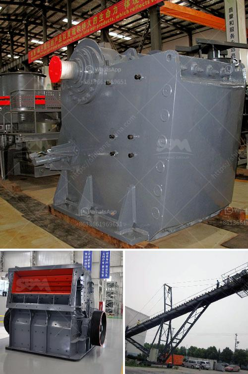

<h3>How do we crush cobaltite?</h3>
Cobaltite, also known as cobalt glance, is a silver-gray mineral that contains cobalt, sulfur, and arsenic. It is primarily found in hydrothermal veins associated with silver, nickel, and copper deposits. Despite its unique properties and potential uses, cobaltite needs to be crushed to release its valuable components. In this article, we will explore the process of crushing cobaltite and the significance it holds.

Crushing cobaltite is a crucial step in the extraction of cobalt, which has gained remarkable attention in recent years due to its various industrial applications, particularly in the battery industry. Cobalt is a vital component of rechargeable batteries found in portable electronic devices, electric vehicles, and renewable energy storage systems. As the demand for these technologies rises, so does the need for cobaltite extraction, making the crushing process increasingly important.

The primary method used to crush cobaltite is mechanical crushing, which involves reducing the mineral to smaller particles using mechanical force. There are various crushing techniques employed, depending on the desired outcome and the available equipment. One of the commonly used techniques is jaw crushing. This method involves feeding cobaltite rocks into a jaw crusher, which applies pressure to break them down into smaller sizes.

Another technique is cone crushing, which involves squeezing the cobaltite rocks between two surfaces—called concave and mantle—within a cone crusher. Cone crushing is suitable for larger rocks and produces more uniform-sized particles compared to jaw crushing. Both methods have their advantages, and the choice depends on the nature of the rocks, equipment availability, and desired particle size.

Crushing cobaltite is a delicate process that requires skilled operators and high-quality machinery. The crushing equipment must be able to withstand the hardness of the mineral and operate efficiently to maximize the extraction yield. Regular maintenance and inspections are crucial to ensure the machinery is in optimal condition, preventing any potential downtime during the crushing process.

Apart from its significance in cobalt extraction, the crushing of cobaltite holds intriguing possibilities for environmental sustainability. The recovery of cobalt from cobaltite helps reduce reliance on conventional cobalt mining, which often involves detrimental environmental practices. By crushing cobaltite and extracting the cobalt, we can reduce the demand for new mining operations and instead focus on recycling existing resources.

Furthermore, the extraction of cobalt from cobaltite promotes a circular economy approach by reusing valuable materials. As cobalt is a finite resource, its efficient recovery from minerals like cobaltite can contribute to a more sustainable future. By utilizing advanced extraction techniques and optimizing the crushing process, we can extract cobalt with minimal environmental impact.

In conclusion, crushing cobaltite is a fundamental step in the extraction process of this valuable mineral. The demand for cobalt, particularly in battery technology, necessitates efficient and effective extraction methods. Mechanical crushing techniques such as jaw crushing and cone crushing play a pivotal role in breaking down cobaltite rocks and liberating the cobalt within. When performed with precision and attention to sustainability practices, cobaltite crushing can contribute to a more environmentally friendly approach to mineral extraction while catering to the growing demand for cobalt.
<h3>Contact us</h3><ul><li><strong>Whatsapp:&nbsp;<a href="https://wa.me/8613661969651">+8613661969651</a></strong></li><li><a href="https://swt.shibang-china.com/?git&amp;zhl&amp;How do we crush cobaltite"><strong>Online Service(chat now)</strong></a></li></ul><h3>Related</h3><ul><li><a href='How to install a gyratory crusher 7 steps are critical.md'>How to install a gyratory crusher? 7 steps are critical</a></li><li><a href='How to choose granite mining machinery in Nigeria ？.md'>How to choose granite mining machinery in Nigeria ？</a></li><li><a href='How to operate a commercial crushing plant in Pakistan.md'>How to operate a commercial crushing plant in Pakistan</a></li><li><a href='How much is the stone crusher plant.md'>How much is the stone crusher plant?</a></li><li><a href='How to design a vibrating screen.md'>How to design a vibrating screen?</a></li></ul>