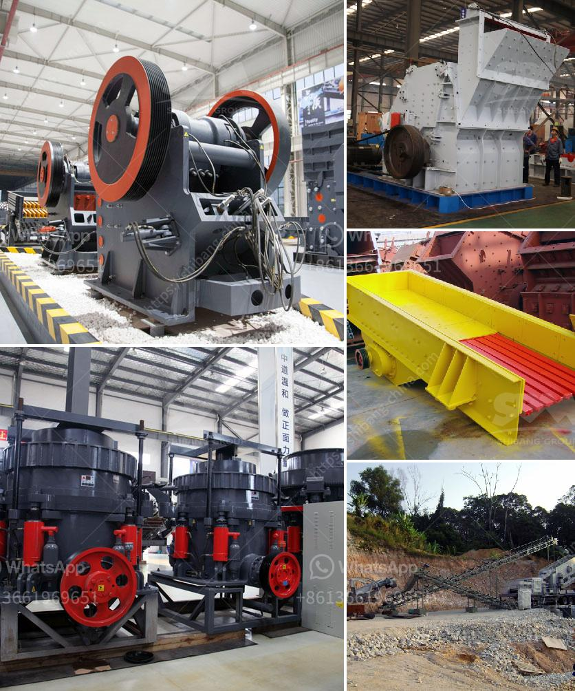

<h3>How do you calculate the motor power for a vibrator screen?</h3>
Calculating the motor power for a vibrator screen is crucial in determining the capacity and efficiency of the equipment. The power requirement for a vibrator screen depends on several factors, including the size and nature of the material being processed, the desired screening efficiency, and the specific design parameters of the screen.

The first step in calculating the motor power for a vibrator screen is to determine the screening requirements. This involves understanding the size and characteristics of the material to be processed, such as its bulk density, particle size distribution, moisture content, and inclination angle of the screen. These factors will have a direct impact on the capacity and efficiency of the screen.

Once the screening requirements are known, the next step is to determine the screening area. The screening area refers to the effective surface area of the screen deck that is available for material to pass through. It is usually expressed in square meters or square feet and can be calculated by multiplying the width and length of the screen deck.

The next important parameter is the stroke length, which refers to the distance the screen deck travels during each revolution of the vibrator motor. The stroke length is usually expressed in millimeters or inches and can be determined based on the material characteristics and desired screening efficiency. A longer stroke length generally provides better screening efficiency.

After determining the screening area and stroke length, the next step is to calculate the required amplitude. The amplitude refers to the maximum displacement of the screen deck during operation. It can be calculated using the formula: amplitude = 1.2 x stroke length.

With the screening area, stroke length, and amplitude known, the next step is to determine the frequency of the vibrator motor. The frequency refers to the number of times the vibrator motor completes a cycle per second and is usually expressed in Hertz (Hz). The frequency is typically selected based on the material characteristics and desired screening efficiency, with higher frequencies resulting in better separation of fine particles.

The final step in calculating the motor power is to consider the efficiency factor. The efficiency factor accounts for various losses in the system, such as friction losses, belt losses, and motor losses. It is usually expressed as a percentage and can be estimated based on the specific design and operating conditions of the vibrator screen.

It is worth noting that the calculated motor power should be higher than the power consumed by the vibrator screen during operation. This ensures sufficient power for overcoming the resistance of the material being processed and achieving the desired screening efficiency.

In conclusion, calculating the motor power for a vibrator screen is a critical step in the design and selection of the equipment. By considering factors such as the screening requirements, screening area, stroke length, amplitude, frequency, and efficiency factor, it is possible to determine the optimal motor power for achieving desired screening capacity and efficiency.
<h3>Contact us</h3><ul><li><strong>Whatsapp:&nbsp;<a href="https://wa.me/8613661969651">+8613661969651</a></strong></li><li><a href="https://swt.shibang-china.com/?git&amp;zhl&amp;How do you calculate the motor power for a vibrator screen"><strong>Online Service(chat now)</strong></a></li></ul><h3>Related</h3><ul><li><a href='How do they grind phosphate in a ball mill.md'>How do they grind phosphate in a ball mill?</a></li><li><a href='How to choose crusher manufacturer.md'>How to choose crusher manufacturer?</a></li><li><a href='How to build a ball mill.md'>How to build a ball mill?</a></li><li><a href='How to work a gyratory crusher.md'>How to work a gyratory crusher?</a></li><li><a href='How to choose jaw crusher in Malaysia 7 suggestions for you.md'>How to choose jaw crusher in Malaysia? 7 suggestions for you</a></li></ul>