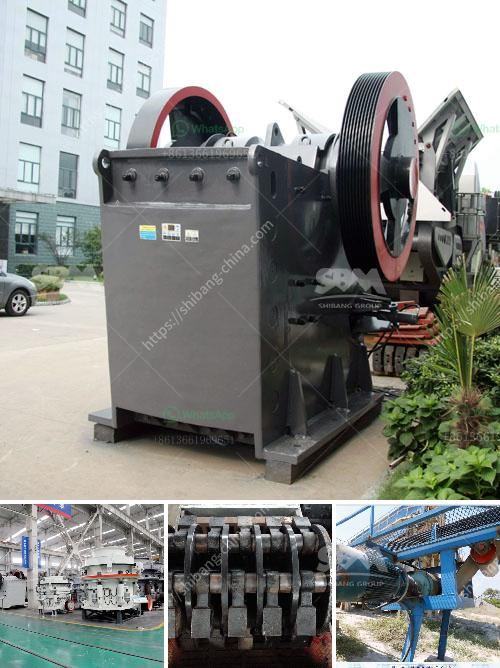

<h3>How do you calculate the size reduction ratio of a crusher?</h3>
Calculating the size reduction ratio of a crusher is a crucial parameter in the design and operation of the crushing plant. The size reduction ratio is the ratio of the crusher feed size to the product size. In mining, it is usually between 4 and 6, which typically implies that the discharge P80 size of the crusher is controlled by the size of the openings in the screen used to classify the product. The crusher size reduction ratio is calculated as follows:

Where: F80 is the feed size to the primary crusher, and P80 is the product size or closing screen aperture size.

In the overriding interest of simplicity, we will consider only single-stage crushing and a single-stage screen. F80 is typically input into the primary crushing stage, and P80 is the output of the screening stage.

Let us take an example to illustrate how to calculate the size reduction ratio for a primary crusher station with a discharge size of 70mm and a product size of 20mm.

The ability of the crusher to handle the maximum size of feed, reducing the total load on the crusher, not just the crushing chamber, is an essential factor in achieving consistent production and product sizing. This results in improved overall efficiency and reduced power consumption.

Furthermore, the size reduction ratio can also impact the selection of the crusher. For instance, jaw crushers are generally recommended for primary crushing due to their ability to handle larger feed sizes. Cone crushers, on the other hand, are more suited for secondary crushing applications where the feed size ranges from 150mm to 40mm.

In conclusion, calculating the size reduction ratio of a crusher is a crucial parameter in the design and operation of the crushing plant. It can help ensure that the final product size meets the desired specifications and optimize the overall efficiency of the crushing circuit. By considering the feed size and product size, the size reduction ratio can be easily calculated using the given formula.
<h3>Contact us</h3><ul><li><strong>Whatsapp:&nbsp;<a href="https://wa.me/8613661969651">+8613661969651</a></strong></li><li><a href="https://swt.shibang-china.com/?git&amp;zhl&amp;How do you calculate the size reduction ratio of a crusher"><strong>Online Service(chat now)</strong></a></li></ul><h3>Related</h3><ul><li><a href='How to change the toggle plate and toggle seat in a jaw crusher.md'>How to change the toggle plate and toggle seat in a jaw crusher?</a></li><li><a href='How to build a sand washing plant.md'>How to build a sand washing plant?</a></li><li><a href='How does a stone crusher work？.md'>How does a stone crusher work？</a></li><li><a href='How to operate a vibrating screen.md'>How to operate a vibrating screen?</a></li><li><a href='how to wash stone chippings ？.md'>how to wash stone chippings ？</a></li></ul>