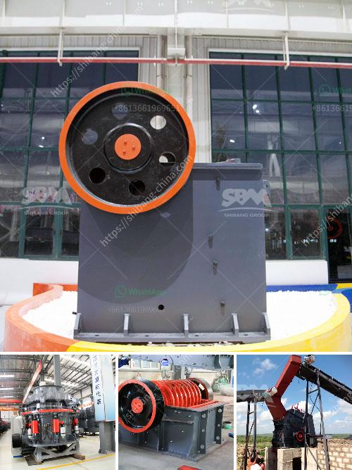

<h3>How do you extract limestone from a quarry?</h3>
How is limestone extracted from a quarry? As a sedimentary rock, limestone is composed of calcium carbonate. Extracting pure limestone is essential for ensuring the longevity of a quarry’s lifespan where the rock is primarily used for making cement, building blocks, and other construction materials.

Limestone extraction involves both physical removal and chemical processing. The extraction process is known as quarrying, and the quarried limestone is used for various purposes. Some of the common uses of limestone include road construction, landscape designing, cement manufacturing, and agriculture.

The extraction of limestone begins with blasting the rock into smaller pieces. This is achieved using tools like explosive charges, excavators, and dump trucks. The quarry face is initially cut into manageable blocks that can be moved easily. The rock may be further drilled and blasted just to ensure that it is of the desired size and quality.

Once the limestone has been blasted or extracted, it is transported to a crusher where it is broken down into smaller pieces. The crushed limestone is then mixed with other materials or added as is to cement kilns. This ensures that the limestone is of suitable quality and size for the intended use.

To extract limestone from the quarry, a process known as crushing and grinding takes place. The limestone is crushed to size and mixed with other materials like clays and iron ores, which are used as additives during cement production. The resulting mixture, known as raw meal, is heated in a cement kiln to form cement clinker.

During the heating process, various chemical reactions occur, including the breakdown of calcium carbonate into calcium oxide or lime. This process releases carbon dioxide gas, which is a byproduct of limestone extraction from the quarry. The clinker is then finely ground into cement powder, which is mixed with water to form concrete.

The water used for the mixing process reacts with the cement powder, starting a chemical process known as hydration. This process solidifies the concrete mix and gives it strength. Limestone, due to its high calcium carbonate content, is an essential component in the production of cement. Without limestone, the typical gray color and strength of concrete would not be possible.

Overall, limestone extraction from a quarry requires various processes, including blasting, crushing, grinding, and chemical reactions. These processes are essential for producing high-quality limestone that is suitable for various construction purposes.

While limestone extraction is essential for meeting construction needs, it is crucial to ensure sustainable and responsible quarrying practices. Environmental mitigation measures, such as using water sprays to reduce dust emissions and proper site restoration after quarrying, should be implemented to minimize the environmental impact of limestone extraction.

In conclusion, limestone extraction from a quarry involves physical and chemical processes to ensure the availability of high-quality limestone for construction purposes. Quarrying practices should be carried out with environmental sustainability in mind to protect the ecosystem and maintain the balance between economic development and environmental preservation.
<h3>Contact us</h3><ul><li><strong>Whatsapp:&nbsp;<a href="https://wa.me/8613661969651">+8613661969651</a></strong></li><li><a href="https://swt.shibang-china.com/?git&amp;zhl&amp;How do you extract limestone from a quarry"><strong>Online Service(chat now)</strong></a></li></ul><h3>Related</h3><ul><li><a href='How to crush lumps of coal.md'>How to crush lumps of coal?</a></li><li><a href='How does a vertical raw mill work.md'>How does a vertical raw mill work?</a></li><li><a href='How To Build A Top Quarry In Nigeria.md'>How To Build A Top Quarry In Nigeria?</a></li><li><a href='How to measure the jaw crusher bearing temperature.md'>How to measure the jaw crusher bearing temperature?</a></li><li><a href='How to control the feed size of the ball mill.md'>How to control the feed size of the ball mill?</a></li></ul>