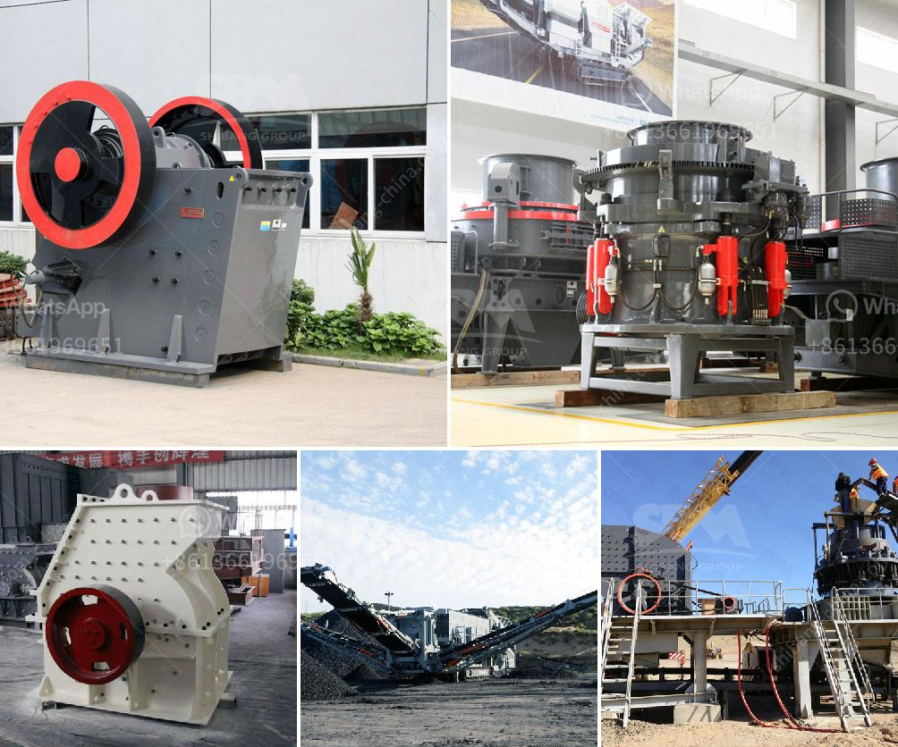

<h3>How do you find the feed rate for a jaw crusher?</h3>
A jaw crusher is a vital piece of equipment in many industries these days. It is used primarily to crush large rocks into small chunks and is often used in construction projects, mining, and various other fields. To get the desired particle size distribution from the crusher, you need to assess and control the feed rate accurately.

The feed rate of a jaw crusher refers to the amount of material fed into the crusher per unit of time (tons per hour). It is generally measured in terms of the Volume Control System (VCS) or the Electric Load Trend (ELT) methods. Both methods are commonly used in industry to estimate the feed rate accurately.

The Volume Control System method calculates the feed rate based on the volume flow rate of the material. The material is usually fed into the jaw crusher through a vibrating grizzly feeder, which is equipped with a set of grizzly bars that filter out larger rocks. The volume flow rate is determined by measuring the width, depth, and height of the material on the feeder and multiplying those measurements together. Once you have the volume flow rate, you can convert it into tons per hour by multiplying it by the bulk density of the material.

The Electric Load Trend method, on the other hand, uses the power consumption of the crusher to estimate the feed rate. As the crusher operates, it consumes a certain amount of electrical power. By monitoring the power consumption over a specific time period, you can determine the average power consumption rate. This average power consumption is then converted into a feed rate using a predefined equation or calibration curve established for the specific jaw crusher model.

To find the feed rate using either method, it is essential to ensure accurate measurements and calibrations. Regular maintenance and calibration of the crusher, feeder, and associated equipment are crucial for reliable and accurate feed rate estimations. Additionally, factors such as the jaw crusher's design, material properties, and operating conditions can affect the feed rate. It is important to consider these factors and adjust the calculations accordingly to obtain the desired results.

Accurate feed rate control is essential for optimal crusher performance. If the feed rate is too high, it can overload the crusher and cause excessive wear and damage. On the other hand, if the feed rate is too low, the crusher may not efficiently process the material, leading to reduced productivity and inadequate particle size distribution. So, finding the right balance is key.

In conclusion, finding the feed rate for a jaw crusher involves measuring and monitoring either the volume flow rate or the power consumption. Precise measurements, regular maintenance, and calibration are crucial for accurate feed rate estimations. By controlling the feed rate, you can optimize crusher performance, ensure proper material processing, and achieve the desired particle size distribution.
<h3>Contact us</h3><ul><li><strong>Whatsapp:&nbsp;<a href="https://wa.me/8613661969651">+8613661969651</a></strong></li><li><a href="https://swt.shibang-china.com/?git&amp;zhl&amp;How do you find the feed rate for a jaw crusher"><strong>Online Service(chat now)</strong></a></li></ul><h3>Related</h3><ul><li><a href='How to separate iron from manganese.md'>How to separate iron from manganese?</a></li><li><a href='how to set up stone crusher unit ？.md'>how to set up stone crusher unit ？</a></li><li><a href='How to set up concrete batching plant malaysia .md'>How to set up concrete batching plant malaysia ?</a></li><li><a href='How can you tell the head has come up on of cone crusher.md'>How can you tell the head has come up on of cone crusher?</a></li><li><a href='How to choose crushing machinery for sand making plant？.md'>How to choose crushing machinery for sand making plant？</a></li></ul>