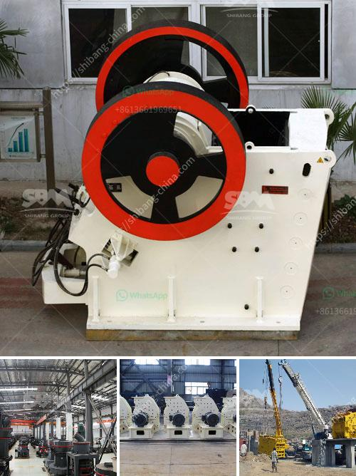

<h3>How does Raymond Mill work?</h3>
Raymond mill is a commonly used equipment in the grinding industry, mainly used for barite, calcite, potassium feldspar, talc, marble, limestone, dolomite, fluorite, lime, activated clay, activated carbon, bentonite, kaolin, cement, phosphate rock, gypsum, glass, insulation materials, etc. with Mohs hardness not more than 9.3 and humidity below 6%. So, how does Raymond mill work? Let's take a look.

The structure of Raymond mill is mainly composed of a main machine, an analyzer, a fan, a finished cyclone separator, a fine powder cyclone separator, and a duct. Among them, the main body is composed of a frame, an inlet volute, a blade, a grinding roller, a grinding ring, and a casing.

When Raymond mill is working, the material is sent to the main grinding chamber by the feeder, and the grinding roller swings outward due to the centrifugal force during rotation. The grinding roller presses the grinding ring tightly against the grinding roller, and the material is shoveled by the blade to the middle of the grinding roller and the grinding ring. Due to the rolling of the grinding roller, the material achieves the purpose of pulverizing.

The analyzer drives the impeller of the analyzer to rotate by the motor drive device, and the higher speed of the impeller rotates the air flow around the grinding roller. The qualified fine powder after grinding through the analyzer's impeller classification, does not meet the fineness requirements of the material, falls into the main grinding chamber for regrinding, and the material meeting the fineness requirements is brought into the cyclone separator with the air flow for separation and collection. The coarse particles in the separated material are thrown to the grinding ring, and the fine particles are discharged through the cyclone outlet and sent to the finished product level through the connecting pipeline.

In addition, the fan blows the external air into the main machine cavity, and the circulating airflow is brought into the cyclone separator for separation. The separated air flow increases the circulation of the airflow, and at the same time, the accumulated powder is lifted up by the blade and sent to the analytical engine for classification to meet the fineness requirements.

In summary, Raymond mill works by pulverizing the material between the grinding roller and the grinding ring. The grinding roller swings outward under the action of centrifugal force, pressing the grinding ring tightly against the grinding roller. The powdered material achieves the purpose of pulverization through the rolling of the grinding roller. The qualified fine powder is separated and collected by the analyzer's impeller classifier, and the coarser particles are thrown to the grinding ring for re-grinding.

In conclusion, Raymond mill is an important grinding equipment in the grinding production line. It has many advantages such as high production efficiency, low energy consumption, small occupation area, high cost performance, simple operation, and convenient maintenance. It is widely used in the fields of metallurgy, building materials, chemicals, mining minerals, etc.
<h3>Contact us</h3><ul><li><strong>Whatsapp:&nbsp;<a href="https://wa.me/8613661969651">+8613661969651</a></strong></li><li><a href="https://swt.shibang-china.com/?git&amp;zhl&amp;How does Raymond Mill work"><strong>Online Service(chat now)</strong></a></li></ul><h3>Related</h3><ul><li><a href='How to disassemble a cone crusher.md'>How to disassemble a cone crusher?</a></li><li><a href='How to operate ball mills.md'>How to operate ball mills?</a></li><li><a href='How can I get more production out of my impact crusher.md'>How can I get more production out of my impact crusher?</a></li><li><a href='How to change the jaw crusher plates.md'>How to change the jaw crusher plates</a></li><li><a href='How to choose the size of jaw crusher ？.md'>How to choose the size of jaw crusher ？</a></li></ul>