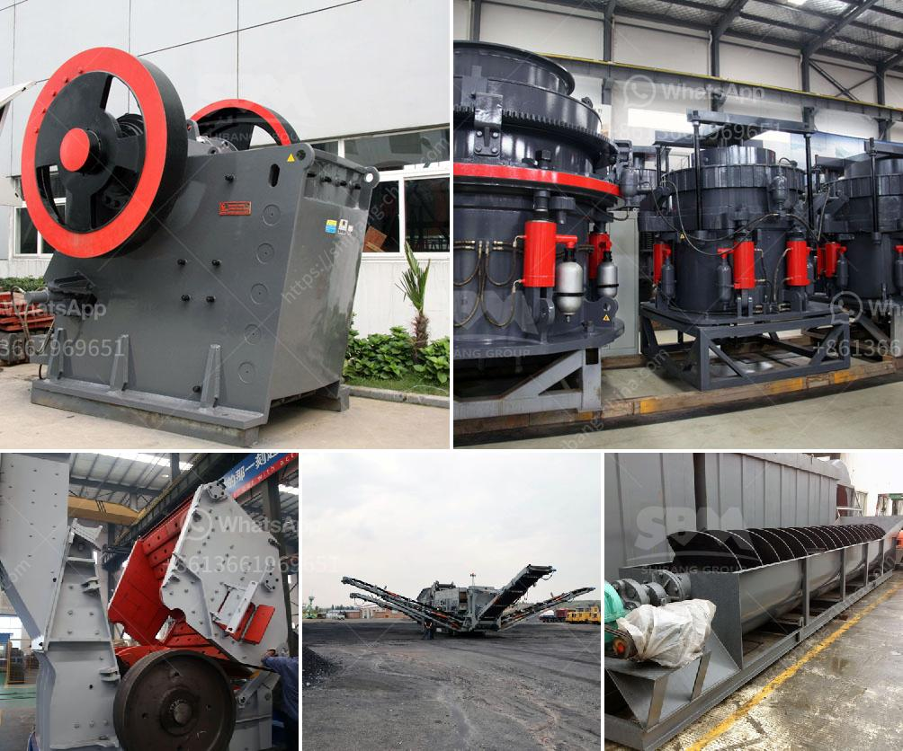

<h3>How does a Raymond mill work?</h3>
Raymond mill is a commonly used equipment in the processing industry. Although its performance is stable and reliable, it is not unfamiliar to many people in the industry. However, it is still necessary to learn more about its operation and maintenance. So, what are the working principles and processes of Raymond mills? 

Raymond mill is mainly composed of an analyzer, a roller device, a grinding ring, a grinding roller assembly, a suspension device, a mill limit device, a pressure spring, and a blade. Its working process involves the material being crushed, sorted, and delivered to the grinding chamber for grinding by a vibrating feeder. The material is ground between the grinding roller and the grinding ring under the action of centrifugal force due to the rotation of the main machine. 

During the grinding process, the blade system plays a vital role. In the lower part of the Raymond mill, there is a blade system, which effectively controls the size of the material and the circulation of the material. After the material is ground, it is sent to the storage bin by the bucket elevator, and then sent to the grinding chamber of the main machine by the electromagnetic vibrating feeder. The material enters the grinding chamber and is scooped up by the blade and sent between the grinding roller and the grinding ring for grinding. The powder after grinding is carried by the fan airflow and classified by the analyzer. In the grinding chamber, the airflow enters the cyclone collector through the analysis machine for separation, and is collected and discharged through the powder discharge port. 

Another important component of Raymond mills is the roller device, which plays a crucial role in the grinding process of the material. In the operation of Raymond mills, the roller device is not only responsible for grinding the material, but also plays a guiding role in the movement of the grinding roller. In addition, it is an important part of ensuring the normal operation of Raymond mills. 

The Raymond mill has a simple structure, small footprint, and low cost. It has the characteristics of low energy consumption, high efficiency, and good dedusting effect. It is used to grind materials in the fields of building materials, mining, metallurgy, and chemical industry. The materials must be non-flammable and non-explosive materials such as limestone, calcite, barite, dolomite, potassium feldspar, marble, talcum, gypsum, kaolin, medical stone, rock phosphate, manganese ore, iron ore, glass, ceramics, thermal insulation materials, etc. 

In summary, the working principle and process of Raymond mills are mainly composed of the grinding ring, the grinding roller assembly, the blade system, the powder selection system, and the grinding chamber. These components work together to achieve the grinding and milling of materials. Raymond mills have a wide range of applications and can be used in various industries to grind and process more than 300 kinds of non-flammable and explosive materials with a Mohs hardness of less than 9.3 and a humidity of less than 6%.
<h3>Contact us</h3><ul><li><strong>Whatsapp:&nbsp;<a href="https://wa.me/8613661969651">+8613661969651</a></strong></li><li><a href="https://swt.shibang-china.com/?git&amp;zhl&amp;How does a Raymond mill work"><strong>Online Service(chat now)</strong></a></li></ul><h3>Related</h3><ul><li><a href='How to control the feed size of the ball mill.md'>How to control the feed size of the ball mill?</a></li><li><a href='How to grind fly ash with a ball mill made in China ？.md'>How to grind fly ash with a ball mill made in China ？</a></li><li><a href='How to extract gold from limonite ore .md'>How to extract gold from limonite ore ?</a></li><li><a href='How will the bauxite crusher work.md'>How will the bauxite crusher work?</a></li><li><a href='How to make railway ballast stones.md'>How to make railway ballast stones?</a></li></ul>