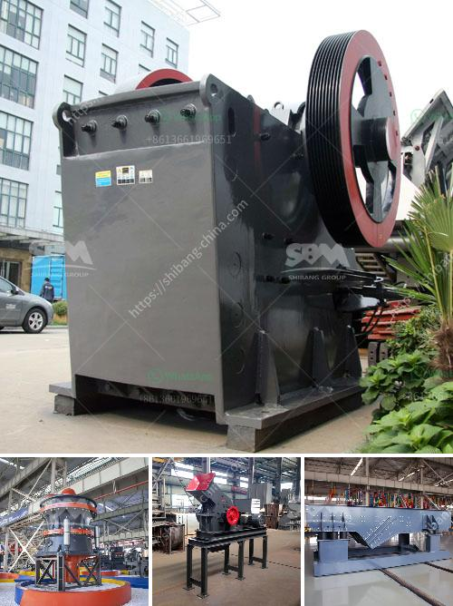

<h3>How does a coal mill work?</h3>
A coal mill is a type of grinding mill that is used to grind and crush coal into different sizes. It is used in different industries such as cement, power generation, and steel production. It is important to understand how it works to ensure that it operates efficiently and effectively.

The coal is first crushed into a fine powder by a pulverizer. This process is necessary to ensure that the coal can be combusted in a boiler furnace. It is then mixed with hot air and blown into the furnace. The hot air dries the coal and carries it into the grinding chamber of the mill.

Inside the grinding chamber, the coal particles are crushed and ground by the rollers. The rollers rotate and grind the coal against the grinding ring. As the coal gets crushed and ground, it is continuously fed into the mill through a series of feeder devices.

The coal mill operates on a conventional vertical roller mill system. The mill’s rollers are pressed tightly against the grinding ring by hydraulic cylinders. As the coal particles get crushed and ground between the roller and the grinding ring, they are gradually removed from the mill through the outlet.

The coal mill also has a classifier that separates the coal particles according to size. When desired coal fineness is achieved, the coal particles are classified and directed to the coal burners for combustion.

There are several critical components in a coal mill, including the grinding elements, the wear parts, and the primary air fan. All these components need to be maintained in good working condition for the mill to operate efficiently.

Regular inspections and maintenance work are necessary to keep the coal mill running smoothly. This includes checking the roller alignment, inspecting the wear parts, and monitoring the mill’s temperature and pressure. Any abnormalities or issues that are detected during these inspections need to be addressed promptly to prevent downtime or more serious damage.

The operation of a coal mill is complex and requires meticulous monitoring and control. Over the years, technological advancements have led to improved safety, efficiency, and performance of coal mills. Various automation systems are now available that help to optimize the mill’s operation and ensure its reliable and consistent performance.

In conclusion, a coal mill is a necessary component of the industries that burn coal for energy production. It grinds the coal into a fine powder, enabling it to be combusted efficiently. Maintaining good working condition and monitoring the mill’s performance is essential to ensure its smooth operation and efficient performance. With advancements in technology, coal mills have become safer, more efficient, and more reliable, contributing to the overall sustainability of the industries they serve.
<h3>Contact us</h3><ul><li><strong>Whatsapp:&nbsp;<a href="https://wa.me/8613661969651">+8613661969651</a></strong></li><li><a href="https://swt.shibang-china.com/?git&amp;zhl&amp;How does a coal mill work"><strong>Online Service(chat now)</strong></a></li></ul><h3>Related</h3><ul><li><a href='how to produce alternative to river sand ？.md'>how to produce alternative to river sand ？</a></li><li><a href='how to give a seminar on jaw crusher .md'>how to give a seminar on jaw crusher ?</a></li><li><a href='How to break down a copper ore.md'>How to break down a copper ore?</a></li><li><a href='how a stone crusher operates ？.md'>how a stone crusher operates ？</a></li><li><a href='How to clean copper ore with equipment .md'>How to clean copper ore with equipment ?</a></li></ul>