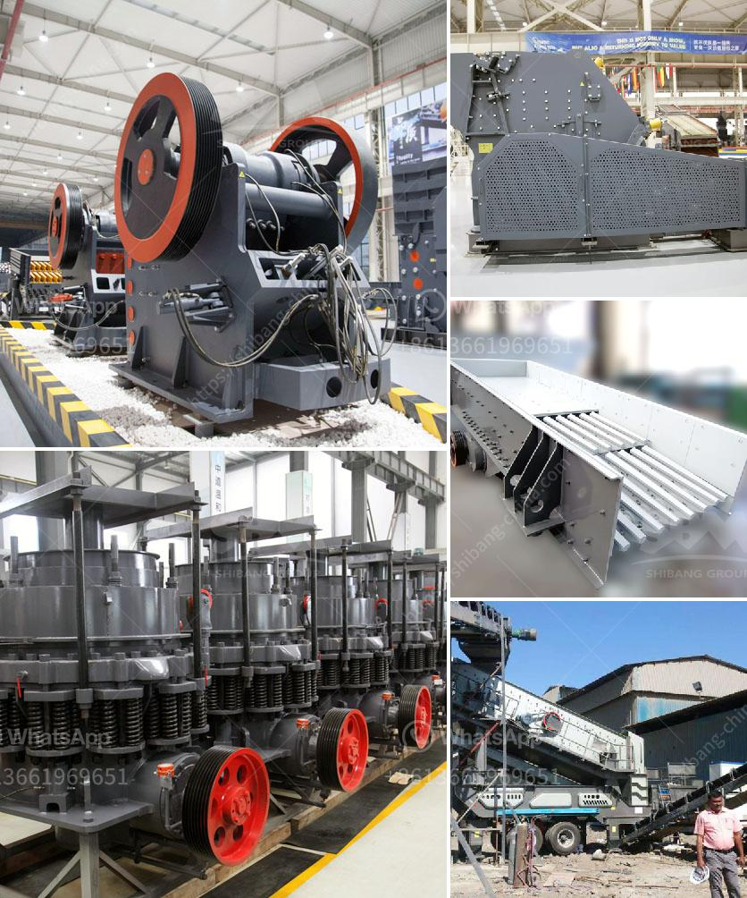

<h3>How does a crusher work to make different types of sand?</h3>
Sand is a key ingredient in the construction industry, and its usage in many other applications is also varied. From landscaping projects to industrial uses, sand is a vital material for numerous sectors. To meet the demand for sand, various forms of crushing machinery are used to process and refine it for different purposes. In this article, we will explore how a crusher works to produce different types of sand.

A crusher is a machine designed to reduce large rocks into smaller rocks, gravel, or rock dust. It utilizes a high-speed spinning rotor with metal plates or hammers attached to it, which throw the rock against hard surfaces and cause it to break into smaller pieces. These broken pieces, or aggregates, are then further crushed to the desired size using different screens and classifiers. The resulting material is known as sand.

1. Jaw crushers: These are heavy-duty machines designed to handle large rocks and achieve maximum productivity. They consist of a fixed plate and a movable plate that form a "V" shape when the crusher is set to its minimum gap. Material enters the chamber and is crushed between the plates, producing sand of various sizes.

2. Cone crushers: This type of crusher uses a spinning cone that gyrates in an eccentric motion inside a bowl or concave surface. As the cone moves, it crushes the material against the concave, resulting in smaller-sized particles. Cone crushers are particularly suitable for producing sand with a more uniform shape compared to other crushers.

3. Impact crushers: These crushers utilize impact rather than pressure to crush the material. As the rotor spins, it throws the rocks against hardened anvils or plates, breaking them into smaller pieces. Impact crushers are effective at producing sand with a cubical shape, making them useful for certain applications, such as concrete production.

4. VSI crushers: VSI stands for Vertical Shaft Impactor. In these crushers, a high-speed rotor throws the aggregate against a rotating anvil, causing it to break into smaller pieces. VSI crushers are known for their ability to produce sand with high quality and uniformity, thanks to their unique crushing mechanism.

The choice of crusher type depends on various factors, including the desired end product specifications, the hardness of the rock or material being crushed, and the required production capacity. It's essential to consider these factors and consult with experts to determine the most suitable crusher for a particular application.

Once the material is crushed to the desired size, it goes through a series of screens and classifiers that separate it into different fractions, ensuring that the sand produced meets the required specifications. The use of these screens and classifiers allows for the production of various types of sand, such as fine sand, coarse sand, and even specialty sands for specific applications.

In conclusion, crushers play a crucial role in the production of sand by breaking down larger rocks into smaller, more manageable pieces. The type of crusher used can impact the quality and characteristics of the sand produced. Different crushers are designed for different applications, and it's essential to consider factors such as end product requirements, rock hardness, and production capacity when selecting a crusher. By understanding how crushers work, we can ensure the production of high-quality sand to meet the diverse needs of various industries.
<h3>Contact us</h3><ul><li><strong>Whatsapp:&nbsp;<a href="https://wa.me/8613661969651">+8613661969651</a></strong></li><li><a href="https://swt.shibang-china.com/?git&amp;zhl&amp;How does a crusher work to make different types of sand"><strong>Online Service(chat now)</strong></a></li></ul><h3>Related</h3><ul><li><a href='How to build a small crusher production line ？.md'>How to build a small crusher production line ？</a></li><li><a href='How to get a sandmaking mini machine.md'>How to get a sand-making mini machine?</a></li><li><a href='how to size a limestone screen？.md'>how to size a limestone screen？</a></li><li><a href='How to set up a quarry plant in India.md'>How to set up a quarry plant in India?</a></li><li><a href='how to calculate the processing capacity of the mill .md'>how to calculate the processing capacity of the mill ?</a></li></ul>