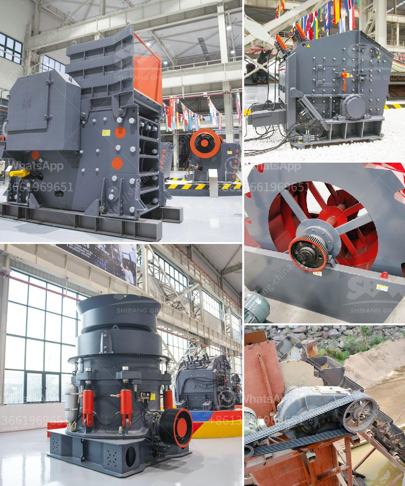

<h3>How does a jaw crusher crush limestone?</h3>
A jaw crusher is a compression type crusher, comprised of a fixed jaw and moving jaw positioned in a (V). The movable jaw compresses material against the fixed jaw, crushing the material to the desired size. The material exits the jaw through the bottom of the crusher otherwise, known as the discharge opening. Changing the discharge opening controls the product size made by the crusher.

Jaw crushers are mainly used at the primary stage of material reduction in several applications, including rock quarries, sand and gravel, mining, construction and demolition recycling, construction aggregates, metallurgy, and chemical industries.

One of the keys to the successful operation of the jaw crusher is the selection of the proper feed material. The hardness, shape, and size of the feed material are the primary factors that dictate the amount of pressure required for compression. It is essential to choose a material that is durable enough to withstand the crushing forces without breaking down excessively. Limestone, often referred to as quarry process, is an excellent choice for its durability and effectiveness.

When limestone enters the crushing chamber, it compresses against the fixed jaw, resulting in a highly efficient and effective crushing action. The material is fed into the chamber from above, and the movement of the jaw creates a crushing force against the stationary jaw. As the material is crushed, it moves downward through the chamber until it reaches the desired size and is discharged at the bottom opening.

The primary advantage of a jaw crusher is its ability to process large and abrasive materials. Due to their crushing principle, they can handle materials with compressive strength up to 400 MPa. In comparison, impact crushers typically have a lower maximum reduction ratio and cannot crush as hard or abrasive materials such as limestone.

Another significant advantage of jaw crushers is their excellent versatility. If the shape of the limestone is different from traditional cube-like or spherical, jaw crushers can achieve a similar final shape by feeding the material at different angles. Additionally, jaw crushers offer the option of adjustable discharge openings, allowing for more controlled final product sizes. Whether a customer requires a coarse or fine limestone product, jaw crushers can be tailored to meet their specific needs.

Operating a jaw crusher at the optimum settings ensures that the desired product size is achieved efficiently while minimizing the wear on the crushing surfaces. Regular maintenance and inspection of jaw crusher wear parts, such as the jaw plates and liners, are crucial to ensure the efficient operation of the equipment and prevent premature wear and failure.

In conclusion, jaw crushers are a highly effective crushing machine for crushing limestone. They offer outstanding advantages, including large capacity, high reduction ratio, and uniform product size. A properly designed and maintained jaw crusher can greatly enhance the efficiency of crushing limestone and reduce operating costs.
<h3>Contact us</h3><ul><li><strong>Whatsapp:&nbsp;<a href="https://wa.me/8613661969651">+8613661969651</a></strong></li><li><a href="https://swt.shibang-china.com/?git&amp;zhl&amp;How does a jaw crusher crush limestone"><strong>Online Service(chat now)</strong></a></li></ul><h3>Related</h3><ul><li><a href='how to rebuild cone crusher .md'>how to rebuild cone crusher ?</a></li><li><a href='How to determine hp for aggregate conveyor .md'>How to determine hp for aggregate conveyor ?</a></li><li><a href='How to make boulders into gravel.md'>How to make boulders into gravel</a></li><li><a href='How does a jaw crusher crush limestone.md'>How does a jaw crusher crush limestone?</a></li><li><a href='How to write a proposal for a quarry ？.md'>How to write a proposal for a quarry ？</a></li></ul>