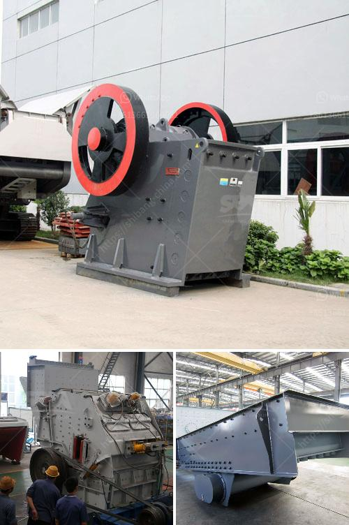

<h3>How does a line ball mill working?</h3>
A line ball mill is a cylindrical device used in grinding or mixing materials like ores, chemicals, ceramic raw materials, and paints. It works on the principle of impact and attrition: size reduction is done by impact as the balls drop from near the top of the shell. A line ball mill consists of a hollow cylindrical shell rotating about its axis. The axis of the shell may be either horizontal or at a small angle to the horizontal. It is partially filled with balls. The grinding media is the balls, which may be made of steel, stainless steel, ceramic, or rubber. The inner surface of the cylindrical shell is usually lined with an abrasion-resistant material such as manganese steel or rubber.

To start the line ball mill, the material to be ground is loaded into the neoprene barrel that contains grinding media. As the barrel rotates, the material is crushed between the individual pieces of grinding media that mix and crush the product into fine powder over a period of several hours. The longer the line ball mill runs, the finer the powder will be.

In the line ball mill, there are many factors that affect the grinding efficiency. Some of these factors include the rotational speed, the size of the balls, and the direction of rotation. Another important factor is the nature of the material being ground. It should be noted that different materials require different grinding conditions and grinding media.

The line ball mill is widely used in mineral processing, building materials and chemical industries. It can be divided into dry type and wet type grinding methods. According to different ways of discharging, the line ball mill can be divided into grid type and overflow type.

In the line ball mill, materials are sent into the first chamber through the hollow shaft spiral. In this chamber, there are stepped lining plates or corrugated lining plates, which are equipped with different specifications of steel balls. When the cylinder rotates, the steel balls are lifted to a certain height and then fall down, which has a grinding effect on the materials.

The line ball mill is equipped with a classifier to classify the grinding materials. The classifier is a device for mechanical separation of solid particles according to the size of the particles. It can be divided into two types: dynamic and static. The static classifier is mainly composed of grading impeller and casing. The dynamic classifier is mainly composed of a rotating turbine and a guide vane.

In conclusion, a line ball mill is a versatile grinding machine that is capable of grinding and mixing materials for various applications. It operates on the principle of impact and attrition, and it can be used for both dry and wet grinding processes. With its wide range of applications, the line ball mill is an essential tool for many industries.
<h3>Contact us</h3><ul><li><strong>Whatsapp:&nbsp;<a href="https://wa.me/8613661969651">+8613661969651</a></strong></li><li><a href="https://swt.shibang-china.com/?git&amp;zhl&amp;How does a line ball mill working"><strong>Online Service(chat now)</strong></a></li></ul><h3>Related</h3><ul><li><a href='How to move and install a mobile rock crusher.md'>How to move and install a mobile rock crusher?</a></li><li><a href='How do you find the feed rate for a jaw crusher.md'>How do you find the feed rate for a jaw crusher?</a></li><li><a href='How to use the impact crusher ？.md'>How to use the impact crusher ？</a></li><li><a href='How to Splice Crusher Belt Conveyor ？.md'>How to Splice Crusher Belt Conveyor ？</a></li><li><a href='How to repair mining crushers You need to know these 7 steps.md'>How to repair mining crushers? You need to know these 7 steps</a></li></ul>