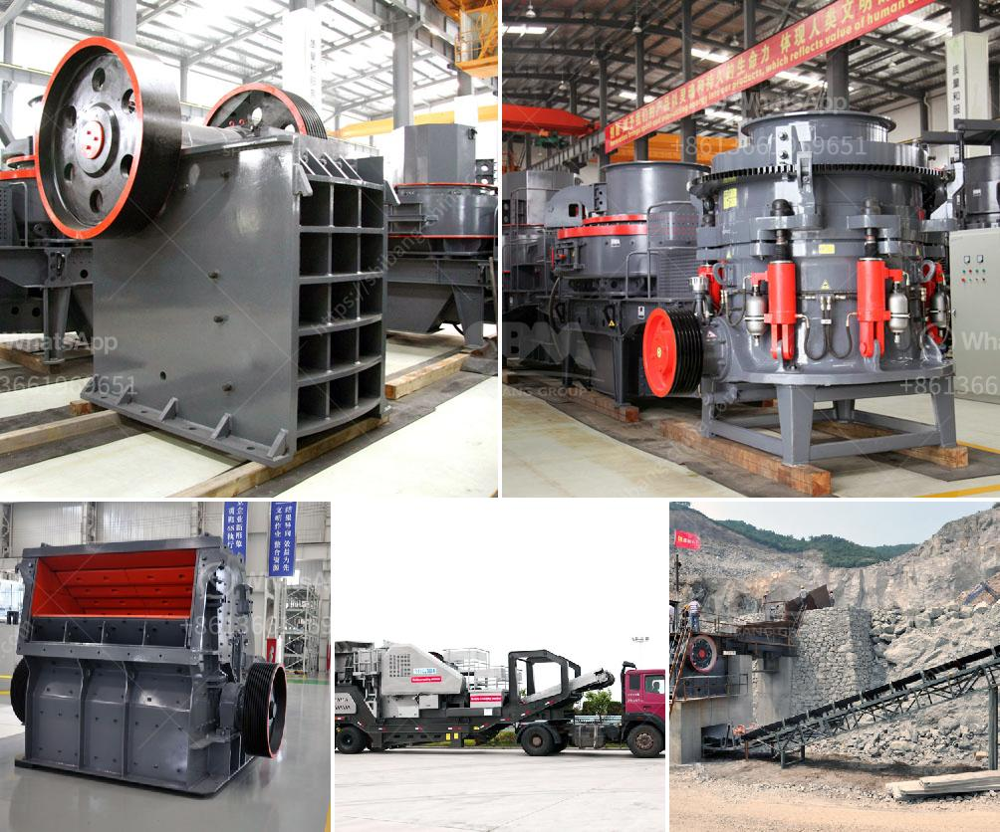

<h3>How does a mobile crushing plant work?</h3>
A mobile crushing plant is a unique machine that includes three stages of crushing. It has been around for many years, but the mobile crushing plant is finally reaching its peak. The main characteristics of the mobile crushing plant are: little space required, improved production capacity, environment protection, and of course, great mobility. Currently, it is the most advanced crushing equipment available on the market.

The mobile crushing plant is typically equipped with a jaw crusher (or an impact crusher) with a rated capacity of 150 to 600 tons per hour. A vibrating screen is also used for reinforcing the plant by separating the usable material from the waste material. Once the material is crushed, it can be used for construction purposes and to build roads. By using this machine, the overall operating cost will be significantly reduced and, at the same time, the environmental impact will be minimized.

The mobile crushing plant is perfect for small to medium-sized projects or industries that require substantial crushing capacity without compromising on the quality of the end product. It is built upon the principles of sizer technology, which uses two rotating shafts to break down materials. The crushing process itself is typically carried out by either compression or impact forces, depending on the material being processed and the desired end product. This versatility allows the mobile crushing plant to be used in various industries, such as mining, quarrying, recycling, and construction.

One of the key benefits of a mobile crushing plant is the efficiency it offers. Between the various crushing stages, the mobile crushing plant can produce a wide range of different final products in an efficient manner. The materials that can be crushed include limestone, marble, granite, basalt, river pebbles, etc. It is particularly suitable for many different types of materials and offers excellent crushing performance.

Additionally, the mobile crushing plant is also very safe to operate and maintain. It is equipped with a variety of safety features, such as hydraulic overload protection, and automatic feeding control system, which prevent the machine from causing any harm to human operators.

Furthermore, the mobile crushing plant is also designed for optimized fuel consumption. The efficient diesel engine provides enough power to operate the machine efficiently, while minimizing fuel consumption. Additionally, the mobile crushing plant can operate remotely and be monitored through a centralized control panel, allowing for easy operation and maintenance.

In conclusion, a mobile crushing plant is a valuable machine that greatly improves the efficiency of hard rock mining and construction operations. At the same time, it minimizes costs by reducing water and energy consumption. It can be used for a variety of materials, making it a highly versatile and efficient machine. Whether in construction or mining, the mobile crushing plant offers an efficient and environmentally-friendly solution.
<h3>Contact us</h3><ul><li><strong>Whatsapp:&nbsp;<a href="https://wa.me/8613661969651">+8613661969651</a></strong></li><li><a href="https://swt.shibang-china.com/?git&amp;zhl&amp;How does a mobile crushing plant work"><strong>Online Service(chat now)</strong></a></li></ul><h3>Related</h3><ul><li><a href='How to Make Cement Powder Using a Ball Mill ？.md'>How to Make Cement Powder Using a Ball Mill ？</a></li><li><a href='How to work a gyratory crusher.md'>How to work a gyratory crusher?</a></li><li><a href='How to find capacity of a cone crusher.md'>How to find capacity of a cone crusher?</a></li><li><a href='How to crush calcium carbonate.md'>How to crush calcium carbonate?</a></li><li><a href='how to grinder calcium carbonate stone crusher machine.md'>how to grinder calcium carbonate stone crusher machine?</a></li></ul>