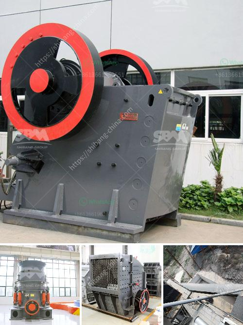

<h3>How does a raw mill work in a cement plant?</h3>
The raw mill is a crucial part of the cement manufacturing process. It is the machine that grinds the raw materials into fine particles, which are then blended and homogenized with other additives to produce the cement. The raw mill uses pressure and shear generated between the rollers and the rotating table to crush and grind the raw materials.

Raw materials are loaded into the feed hoppers of the raw mill. The hoppers are equipped with vibrating feeders to ensure a consistent flow of raw materials to the mill. The materials are pulverized by the roller pressure and are discharged through the discharge chute located at the bottom of the mill. The material passes through a separator, which separates the fine and coarse particles.

The grinding process in a raw mill is a complex and time-consuming process. It is essential to follow strict procedures to ensure a high quality product. To control the process, operators need to be aware of the critical parameters such as temperature, pressure, and flow rates, as well as the quality of the raw material.

The raw mill is usually placed close to the kiln preheater tower to ensure the best possible moisture content of the raw material. This allows the kiln to operate at its maximum efficiency. The raw mill also enables the kiln to run with a higher air flow rate and thus increase its production capacity.

Another important feature of the raw mill is that it is equipped with a de-dusting system to remove any fine dust particles that may escape in the air. This ensures that the working environment is clean and healthy for the workers.

The raw mill is a critical component in a cement manufacturing plant. It is mainly used for grinding the raw materials, but it can also be used for grinding clinker and other materials. As the mill rotates, the grinding media crush the raw materials onto the grinding table and then grind them to a fine powder.

The typical raw mill is a large rotating cylindrical drum containing grinding media (normally steel balls). As the drum rotates, the motion of the balls crushes the clinker. The drum is positioned at an angle with respect to the horizontal to facilitate grinding of the raw materials.

In conclusion, the raw mill plays a critical role in cement manufacturing. It is the machine that grinds the raw materials into fine particles, which are then blended and homogenized with other additives to produce the cement. To ensure high quality cement, the raw mill needs to be closely monitored and controlled. It is equipped with various sensors and detectors to measure critical parameters such as temperature, pressure, and flow rates. The raw mill also has a de-dusting system to remove any fine dust particles that may escape into the air. All these features make the raw mill a vital part of the cement manufacturing process.
<h3>Contact us</h3><ul><li><strong>Whatsapp:&nbsp;<a href="https://wa.me/8613661969651">+8613661969651</a></strong></li><li><a href="https://swt.shibang-china.com/?git&amp;zhl&amp;How does a raw mill work in a cement plant"><strong>Online Service(chat now)</strong></a></li></ul><h3>Related</h3><ul><li><a href='how to set up screening and crushing plant .md'>how to set up screening and crushing plant ?</a></li><li><a href='How can hammer mill grind fine without a screen.md'>How can hammer mill grind fine without a screen?</a></li><li><a href='How to move a mobile screen crusher.md'>How to move a mobile screen crusher?</a></li><li><a href='How to adjust rotary kiln support rollers.md'>How to adjust rotary kiln support rollers?</a></li><li><a href='How to achieve a smooth coal pulverizer.md'>How to achieve a smooth coal pulverizer?</a></li></ul>