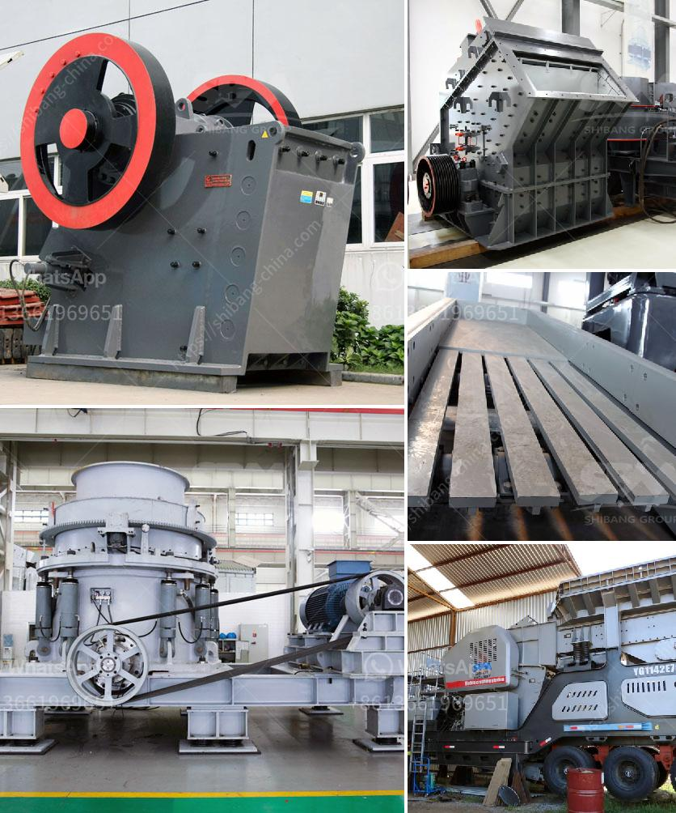

<h3>How does a rock crusher plant work?</h3>
A rock crusher plant, also known as a stone crusher plant, can crush and grind large rocks into various sizes and materials for construction and industrial purposes. The crushing process involves 3 stages of crushing in which the main machinery includes jaw crushers, impact crushers, cone crushers, vibrating screens, and auxiliary equipment like conveyors.

The jaw crusher is the primary crusher in the first crushing stage. It is used to break large-sized rocks into smaller particle sizes that are suitable for the next stages of crushing. The jaw crusher does not lose any of its "new-condition" throw when the babbitt wears in the main, or in the pitman, bearings. The jaw crusher will handle sticky, or dirty feed better than the gyratory, as it is not prone to packing.

In the second stage, the material is further reduced in size by the secondary cone crusher. The cone crusher is suitable for crushing medium and high-hardness rocks with different cavity types, such as standard, medium, and short head. The cone crusher is mainly used in the secondary crushing stage to produce aggregate of a certain size for the asphalt and concrete industries.

In the third stage, the crushed material is conveyed to the vibrating screen for sieving. Larger pieces are sent back to the cone crusher for further crushing and smaller pieces are conveyed to different stockpiles for different sizes of finished products.

The smaller-sized materials pass through the screen mesh, while larger ones are sent back to the impact crusher or cone crusher for re-crushing to ensure adequate fineness of the finished product. The vibrating screen uses a vibrator to generate a strong vibration, which forces the material to separate into different sizes.

The material that meets the requirements of the finished product size is conveyed to the finished product pile through the belt conveyor. The material that does not meet the requirements is returned to the cone crusher for re-crushing.

Rock crushers are extensively used in the mining industry and construction industry due to the ability to crush large rocks, thereby reducing the size of particles for later use. However, the process is incredibly demanding, and a few important factors must be taken into consideration.

Firstly, the right rock crusher must be chosen regarding the type of rock being crushed. It is important to assess the characteristics of the rocks to determine their hardness and abrasiveness. Certain rocks, such as limestone, are much easier to break down than granite or basalt.

Secondly, the configuration of the plant determines the type of rock crusher that needs to be installed. Various crushing plants are available, including jaw crushers, impact crushers, and cone crushers that break down rocks into various sizes. Different types of conveyor belts are used to transport the material from one machine to another, which ultimately forms a complete production line and ensures the production efficiency and quality of the finished product.

Overall, rock crushers play a crucial role in the construction and mining industry as they allow for the crushing of rocks into specific sizes for various uses. However, there are numerous factors that need to be taken into consideration when purchasing a rock crusher, including the type of local rock, availability of spare parts, and accessibility to maintenance and repairs. The rock crusher industry also has a significant impact on the local economy and environment.
<h3>Contact us</h3><ul><li><strong>Whatsapp:&nbsp;<a href="https://wa.me/8613661969651">+8613661969651</a></strong></li><li><a href="https://swt.shibang-china.com/?git&amp;zhl&amp;How does a rock crusher plant work"><strong>Online Service(chat now)</strong></a></li></ul><h3>Related</h3><ul><li><a href='How to buy a cone crusher.md'>How to buy a cone crusher?</a></li><li><a href='how to build stone crushing machine .md'>how to build stone crushing machine ?</a></li><li><a href='How to choose a jaw crusher.md'>How to choose a jaw crusher?</a></li><li><a href='How to control vibrating screen .md'>How to control vibrating screen ?</a></li><li><a href='how to increase the amplitude of vibrating screen ？.md'>how to increase the amplitude of vibrating screen ？</a></li></ul>