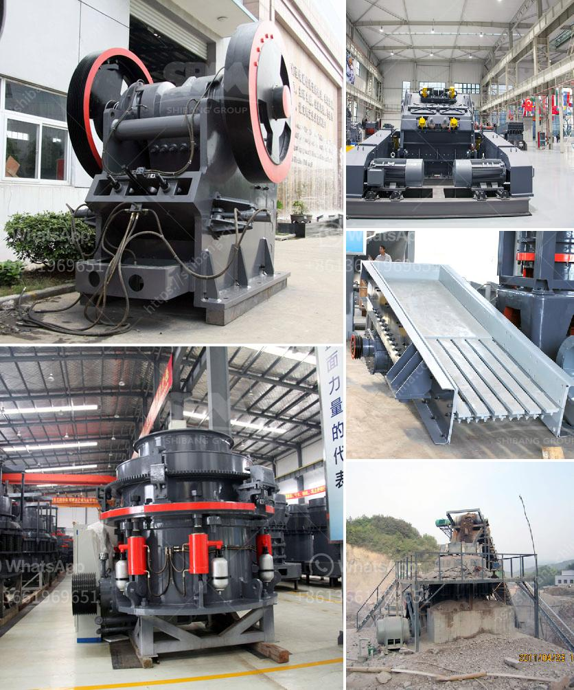

<h3>How does a rock crusher work?</h3>
Rock crushers have a relatively simple and efficient mechanism that makes them perfect for crushing rocks and other hard materials. The device uses a cone-shaped inner crushing chamber that is surrounded by a massive outer crushing component. As the rocks enter the crusher, they are crushed between the outer and inner crushing chambers. The cone-shaped inner crushing component gyrates, resulting in the rocks being crushed into smaller pieces.

The primary function of a rock crusher is to smash larger rock pieces into smaller ones. The process starts by feeding the rock into the crusher's hopper, which then spills the rock onto a vibrating feeder or grizzly. A vibrating feeder has vibrating motors that help move everything along at a consistent pace. This ensures that all the rocks enter the crushing chamber evenly.

From the vibrating feeder, the rocks are then sent through a jaw crusher, which is usually the primary crushing machine. This crusher breaks the rocks up into smaller pieces through a compressive force. Jaw crushers are popular because they can be used for primary crushing in any mining or construction setting, and they are extremely reliable.

Once the rocks have been crushed by the jaw crusher, they are then sent to either a cone crusher or a gyratory crusher as secondary crushing machines. Cone crushers and gyratory crushers have a similar principle of operation, but differ in their structure and application. Cone crushers are widely used in the aggregate and mining industries to crush hard materials, whereas gyratory crushers are mainly used for the primary crushing of ores.

A cone crusher consists of an outer crushing shell and an inner crushing shell. Both the outer and inner crushing shells have a mantle, which is bolted to the main body of the crusher. When the mantle rotates, the rock material is crushed between the mantle and the concave. This crushing action is caused by the gyrating motion of the inner crushing shell.

Gyratory crushers, on the other hand, have a main shaft with an eccentric assembly that rotates within a mantle. The eccentric assembly uses a circular motion to crush rocks against the concave surface. This crushing motion is achieved through a gyrating motion of the main shaft, resulting in a squeezing and grinding action.

In conclusion, rock crushers are powerful machines that break down large rocks into smaller pieces. The crushing process involves jaw crushers for primary crushing, followed by secondary crushing with either cone crushers or gyratory crushers. The crushing process is highly efficient and ensures the rock material is uniformly crushed. Rock crushers are commonly used in mining, aggregate, and construction industries due to their reliable performance and ability to crush hard materials.
<h3>Contact us</h3><ul><li><strong>Whatsapp:&nbsp;<a href="https://wa.me/8613661969651">+8613661969651</a></strong></li><li><a href="https://swt.shibang-china.com/?git&amp;zhl&amp;How does a rock crusher work"><strong>Online Service(chat now)</strong></a></li></ul><h3>Related</h3><ul><li><a href='How to make a foundation for sand crusher.md'>How to make a foundation for sand crusher?</a></li><li><a href='How much does an iron ore crushing machine cost.md'>How much does an iron ore crushing machine cost?</a></li><li><a href='How to get the best aggregates after crushing and screening.md'>How to get the best aggregates after crushing and screening?</a></li><li><a href='how to size vibrating screen.md'>how to size vibrating screen?</a></li><li><a href='How to calculate the cemnet grinding aid requirement for cement .md'>How to calculate the cemnet grinding aid requirement for cement ?</a></li></ul>