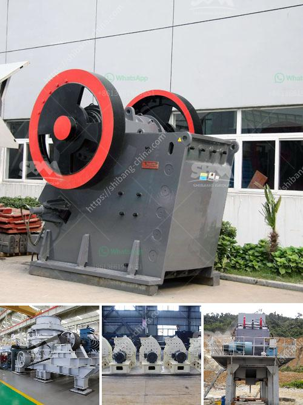

<h3>How does a sand washing machine work?</h3>
Sand washing machines are designed to remove dirt, debris, and other impurities from sand. They are commonly used in construction, mining, and other industries, where sand is used as a productive material. In modern times, these machines have become an essential part of sand processing systems due to their ability to effectively clean and separate sand particles.

The basic principle of a sand washing machine revolves around three main components - the impeller, the wheel-type, or spiral-type washing machine barrel, and the drainage system. The impeller is typically equipped with evenly distributed blades that aid in the rotation of sand and gravel particles. The spiral-type washing machine barrel, on the other hand, contains a spiral-shaped groove that enhances the movement and mixing of sand and water. Lastly, the drainage system ensures that excessive moisture is expelled, leaving behind clean and dry sand.

1. Feeding: Raw sand or gravel is fed into the machine's inlet. The impeller helps to evenly distribute the material for effective cleaning.

2. Washing: As the sand rotates and mixes with water, the impurities in the material are dislodged and separated. The blades on the impeller remove dirt, dust, and other particles from the sand as it churns through the washing machine barrel.

3. Separation: The spiral-shaped groove inside the washing machine barrel aids in the separation of clean sand from the dirty water and impurities. The spiral movement encourages heavier particles to settle at the bottom while the cleaner sand is lifted to the top and drained out through the discharge outlet.

4. Drainage: Excessive water, along with the separated impurities, is drained out through the drainage system. The drainage system usually consists of draining pipes or outlets strategically placed to facilitate the efficient removal of water and impurities.

5. Recycling or Disposal: In some sand washing machines, there is a provision for recycling and reusing the water used in the process. The water is usually passed through a filtration system to remove any remaining impurities before it is reused for further washing cycles. However, in some cases, the water may be discharged as waste after proper treatment and in compliance with environmental regulations.

Sand washing machines can differ in terms of their designs and capabilities. Some machines are equipped with additional features such as vibrating screens or dewatering screens. These screens help in further separating sand particles of different sizes, allowing for the production of specific sand grades as per the required specifications.

In conclusion, a sand washing machine is a valuable asset in any sand processing system. It efficiently removes dirt, debris, and other impurities from sand, resulting in cleaner and higher-quality sand for various industries. Understanding the workings of a sand washing machine can help users make informed decisions while selecting the right equipment for their specific needs.
<h3>Contact us</h3><ul><li><strong>Whatsapp:&nbsp;<a href="https://wa.me/8613661969651">+8613661969651</a></strong></li><li><a href="https://swt.shibang-china.com/?git&amp;zhl&amp;How does a sand washing machine work"><strong>Online Service(chat now)</strong></a></li></ul><h3>Related</h3><ul><li><a href='How to choose the useful sand making machine.md'>How to choose the useful sand making machine?</a></li><li><a href='How do you calculate the motor power for a vibrator screen.md'>How do you calculate the motor power for a vibrator screen?</a></li><li><a href='How to set up concrete batching plant malaysia .md'>How to set up concrete batching plant malaysia ?</a></li><li><a href='How to choose the right primary crusher for your plant.md'>How to choose the right primary crusher for your plant?</a></li><li><a href='How to create a business plan for crushers in Brazil.md'>How to create a business plan for crushers in Brazil?</a></li></ul>