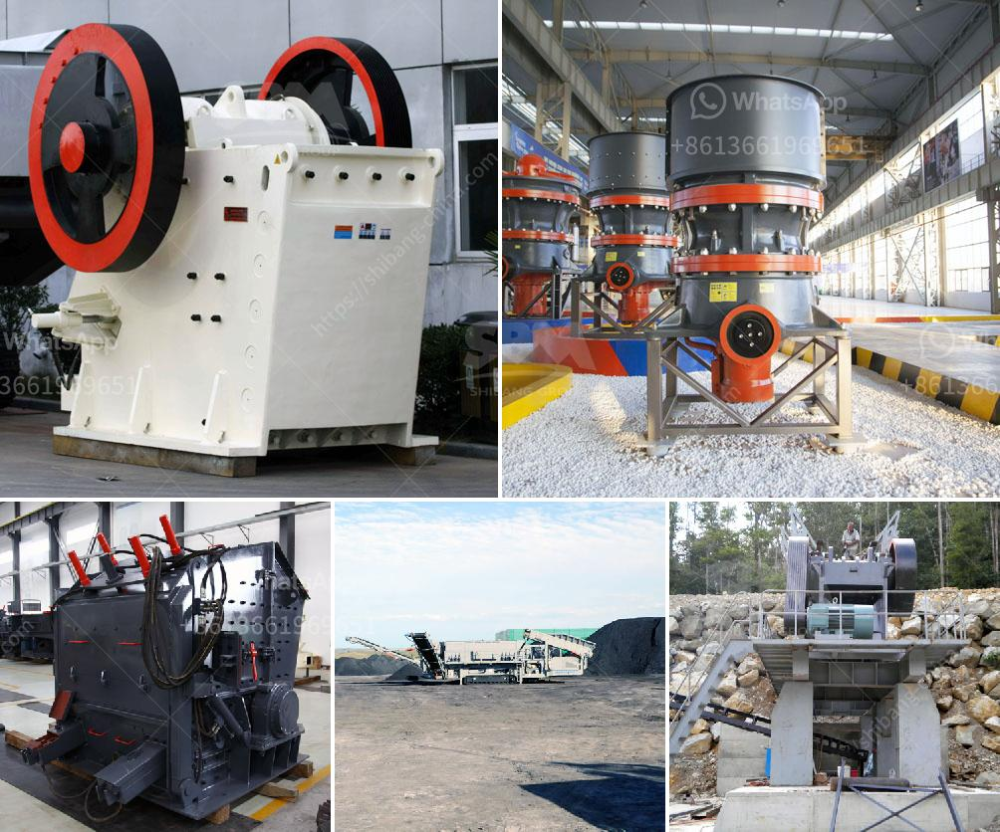

<h3>How does a spring cone crusher work?</h3>
A spring cone crusher is used for rock mining and construction. It can make the final product of rock stone smaller than the jaw crusher, thus creating more uniform products and high efficiency. Spring cone crushers are usually placed in secondary and tertiary crushing stations. They are suited to crush variety of materials, ranging from hard and abrasive rocks to softer and more delicate ones.

Cone crushers manipulate rock between a fixed cone and the movable cone (the central shaft). The width of the exit opening is adjustable through ascending and descending the fixed cone, which allows the rock to be crushed to a variety of sizes. This method is more advanced than the one used in jaw crushers. You can see how jaw crushers work by clicking here.

Cone crushers are one of the main types of primary crushers used in mining and ore processing. They are categorised through size in either the mantle diameter or the size of the receiving entrance. They are suitable for crushing a variety of matter including mid-hard ores and rocks. They are easy to adjust, have high productivity and require a lower operation cost.

Cone crushers are suitable for crushing a variety of mid-hard and above mid-hard ores and rocks. The cone crusher products from Power Equipment Company have the advantage of reliable construction, high productivity, easy adjustment, and lower operational costs.

Power Equipment Company has the largest aggregate equipment product availability in the Rocky Mountain region. All of our aggregate equipment is available to buy, rent, or rent-to-purchase. With over 30 years of aggregate industry experience, no other dealership can match the solutions that we deliver to your operation.

The hopper collects the incoming rocks from the feeding equipment. Rock material is typically fed into the hopper with a loader or excavator. Particles that are small enough fall through the sizing device with a discharge opening at the bottom, allowing them to bypass the crusher and continue to be processed in the crushing circuit.

Powerful springs force the material to pop out from the front or side of the machine. This makes the springs especially vulnerable to damage, which leads to an incredible amount of downtime. Additionally, springs are not ideal for handling tramp metal or fine materials, as they could damage the delicate components of the machine.
<h3>Contact us</h3><ul><li><strong>Whatsapp:&nbsp;<a href="https://wa.me/8613661969651">+8613661969651</a></strong></li><li><a href="https://swt.shibang-china.com/?git&amp;zhl&amp;How does a spring cone crusher work"><strong>Online Service(chat now)</strong></a></li></ul><h3>Related</h3><ul><li><a href='How to improve coal crusher hammer life .md'>How to improve coal crusher hammer life ?</a></li><li><a href='How to separate the gold from the powdered sand .md'>How to separate the gold from the powdered sand ?</a></li><li><a href='How to remove salt from sea sand .md'>How to remove salt from sea sand ?</a></li><li><a href='How much does it cost to set up the crusher plant.md'>How much does it cost to set up the crusher plant?</a></li><li><a href='How to achieve a smooth coal pulverizer.md'>How to achieve a smooth coal pulverizer?</a></li></ul>