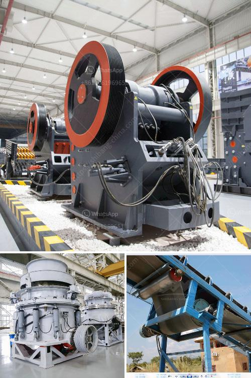

<h3>How does a stone crusher work?</h3>
A stone crusher, also known as rock crusher, is one of the most commonly used mining machines which is used to reduce the size of large rocks into smaller rocks, gravel, or rock dust. This machine is commonly used in construction projects of mining sites due to its ability to crush vast materials into manageable sizes. Chunks of blasted rock, tossed into the air, land in various locations around the country and are crushed fabricated impressive machines to meet specific requirements for production. This article will explore the working principles, features, and application of this versatile machine. 

The crushing process in a stone crusher is conducted by a combination of crushing, shearing, and impact. The rocks are initially flattened and fractured by the constant pressure exerted by the fixed jaw and the movable jaw. The impact of the jaws reduces rocks to sizes that are manageable for the crushers. Crushing takes place in a chamber which is usually fitted with concave surface made of wear-resistant manganese steel. This liner amplifies the crushing process by releasing the crushed materials in a uniform shape which minimizes the variations in size.

Stone crushers are heavy-duty machines that are designed to reduce the size of large materials. They are widely used in industries such as mining, smelting, building materials, highway, railway, water conservancy and chemical industries. Over the years, various types of crushers have been developed to meet different requirements including jaw crushers, gyratory crushers, impact crushers, and cone crushers.

The jaw crusher is a compression type crusher that employs a first-class jaw mounted in an eccentric shaft to reduce the size of larger rocks. The primary crusher processes more than 2000 tons of stone per hour, which is widely used in a variety of ore crushing, railway, highway, energy, cement, chemical, construction and other industries. These materials have various properties and work together to achieve crushing purposes.

The jaw crusher is either stationary or moving. Their jaw consists of one stationary piece and one movable piece. As the rocks move from the top to the bottom of the crusher, they are crushed between the two jaws. The moving jaw exerts a compressive force against the stone in the chamber causing it to fracture and reduce.

On the other hand, the gyratory crusher works as a conical-shaped rotating crushing chamber. The rocks enter from the uppermost point and gradually decrease in size. As they move down the chamber, they are crushed between the gyrating spindle and the chamber wall.

Impact crushers are suitable for materials with a low compressive strength, such as limestone, gypsum, and limestone mixtures. These crushers use impact rather than pressure to crush materials. They contain a rotor that spins at a high speed when the materials enter the blow bar area, they are crushed due to the high-speed impact of the blow bar and thrown back onto the impact plates.

Stone crushers are versatile machines that can be used in different industries and environments. They are designed with heavy-duty components to ensure durability and long service life. With proper maintenance and care, stone crushers can continue to operate effectively for many years to come.
<h3>Contact us</h3><ul><li><strong>Whatsapp:&nbsp;<a href="https://wa.me/8613661969651">+8613661969651</a></strong></li><li><a href="https://swt.shibang-china.com/?git&amp;zhl&amp;How does a stone crusher work"><strong>Online Service(chat now)</strong></a></li></ul><h3>Related</h3><ul><li><a href='how to produce alternative to river sand ？.md'>how to produce alternative to river sand ？</a></li><li><a href='How to remove calcium oxide from manganese ore.md'>How to remove calcium oxide from manganese ore?</a></li><li><a href='How to unjam a mine crushing mill.md'>How to unjam a mine crushing mill?</a></li><li><a href='How to commission a limestone crusher first.md'>How to commission a limestone crusher first?</a></li><li><a href='How to weld the broken jaw plate of jaw crusher.md'>How to weld the broken jaw plate of jaw crusher?</a></li></ul>