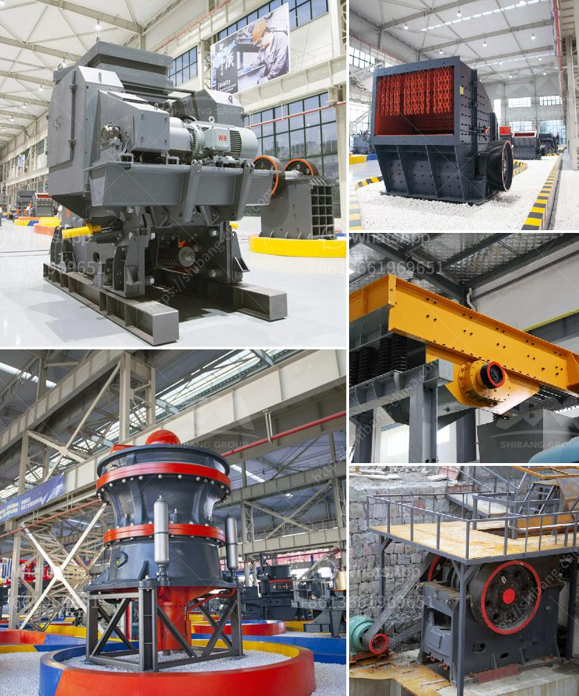

<h3>How does a stone crusher work？</h3>
Stone Crusher, capable of effortlessly crushing rocks to dust, is one of the hottest topics among enthusiasts nowadays. With technological advancements, the newly developed crushers have an astounding capability to tear down stone, rocks, and other materials into small, manageable chunks and dust. With so many stone-crushing machines functioning across various industries, what exactly is taking place in these powerhouses? In this article, we are going to delve into the working mechanism of a stone crusher and discuss the vital components that make it work proficiently.

Firstly, the raw material is fed into the hopper, which is placed at the top of the crusher. Raw materials can be either naturally occurring stones or large chunks of rock that are reduced to a manageable size using explosives or heavy machinery. The hopper helps to safeguard the material being fed into the crusher and regulates the flow, preventing any interruptions.

From the hopper, the material is then guided into the jaw crusher by a vibrating feeder. The jaw crusher consists of a set of vertical jaws that crush the material into smaller pieces as it moves downward. The jaws are positioned in a V-shape configuration, which enables efficient crushing of the material. The crushed material moves through the narrow opening at the bottom of the V-shaped jaws and emerges as smaller chunks.

Once the material is crushed by the jaw crusher, it moves onto the next stage, where it is further refined. The secondary crusher, better known as the impact crusher, works by hitting the material against a stationary plate. As the material passes through the machine, it is further reduced in size by the high-speed rotations of the impacting hammers. This process shatters the material into even smaller pieces.

After the secondary crusher, the material then moves onto the vibrating screen. This screen filters out the desired sizes and sends the remaining oversized rocks back to the crusher for further grinding. The vibrating screen consists of multiple layers of mesh, each with different hole sizes. This allows for the separation of different-sized materials based on the desired end product.

In the final stage, the materials are sent to the tertiary crusher, also known as the cone crusher. The cone crusher operates similarly to the other crushers, but it has its own set of unique features. The cone crusher crushes the material between the concave and the mantle, converging the material towards the smaller end of the chamber. This final crushing action produces high-quality, finer materials required for construction purposes.

In conclusion, a stone crusher works by reducing larger rocks or stones into smaller pieces, shaping them into the desired end product. It's a crucial tool used across various industries, including mining, construction, and recycling. The stone crusher industry is filled with a staggering variety of crushers, each with their own unique working principle. Hence, to determine which specific crusher is best suited for each individual application, thorough research and a deep understanding of the materials being crushed are vital.
<h3>Contact us</h3><ul><li><strong>Whatsapp:&nbsp;<a href="https://wa.me/8613661969651">+8613661969651</a></strong></li><li><a href="https://swt.shibang-china.com/?git&amp;zhl&amp;How does a stone crusher work？"><strong>Online Service(chat now)</strong></a></li></ul><h3>Related</h3><ul><li><a href='How to crush calcium carbonate.md'>How to crush calcium carbonate?</a></li><li><a href='How much does an iron ore crushing machine cost.md'>How much does an iron ore crushing machine cost?</a></li><li><a href='how a cone crusher works .md'>how a cone crusher works ?</a></li><li><a href='how to increase vibrating screen capacity ？.md'>how to increase vibrating screen capacity ？</a></li><li><a href='How to manufacture marble powder with a mesh size of 1000.md'>How to manufacture marble powder with a mesh size of 1000?</a></li></ul>