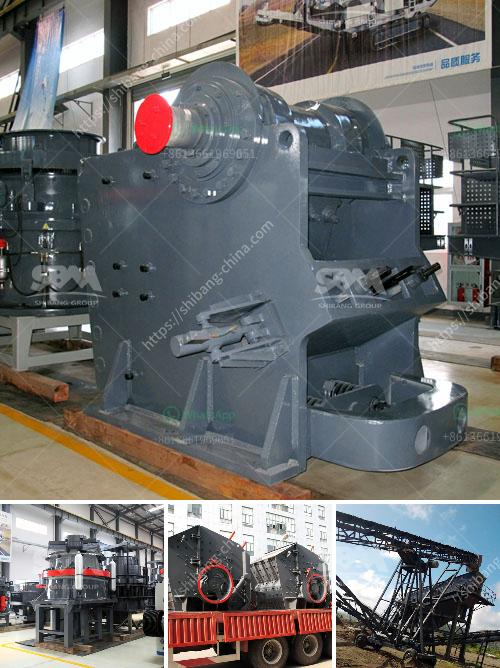

<h3>How does a stone crushing plant work?</h3>
A stone crushing plant is a machine designed to reduce the large stone, granites, marble, lime rocks into the smaller size and output gravel, dust, different size of the material.

Stone crusher plants used worldwide. It is available with different-2 capacity, design, and utility. In the stone crushing plant, the raw material is feeded into jaw crusher machine by vibrating feeder machine for primary crushing through the belt conveyor connected to the size of raw material.

The belt conveyor carries the fresh materials to jaw crusher for primary crushing. The big block materials will be crushed into small size. With the help of the impact crusher, the small-sized stones will be crushed into the fine, uniformly sized stones. The materials from jaw crusher and impact crusher are fed into vibrating screen by the belt conveyor for screening and grading.

The screened materials are divided into several sizes and the size of the final products can be adjusted by the vibrating screen. It is suitable for sieving different types of materials, including sand, gravel, crushed stone, etc. The feed size of the screen attached to the hopper is normally 10 to 25 times the aperture of the screen.

The further the material is processed, the smaller the particle size becomes. Finished products of the stone crushing plant are called aggregates, which are available in the market, and used for various construction purposes.

The crushing process is like this, after the materials enter the crusher, they are broken by the impact of the hammers, which rotate at high speed inside the crusher. In the stone crushing plant, large-sized rocks are manually carried out from the mines, and are placed in the crusher, which then reduces the size.

The stones are then loaded into the dumpers and transported to the primary crushers. They are transported by dump trucks that separate the rocks according to their size. Depending on the size of the stones, several stones can be crushed at the same time.

The crushing process and conveyor belts running in the stone crushing plant unit produce enormous amounts of noise and vibration. To mitigate these effects on workers and the environment, noise and dust abatement measures are implemented.

Stone crushing plants are complete only with metal detectors in place to avoid breakdowns or permanent damage to crushing machinery like cone crushers, vertical shaft impactors, VSI incline vibrating screens, and horizontal vibrating screens. They are ideally suited for crushing of hard granite stone, back trap rock, river gravel, and the houses with high mechanical foundations.

To meet the diversified requirements of customers, the mobile crusher plant can be equipped with jaw crusher, impact crusher, and cone crusher to meet various capacities, various requirements of customers, and the combination of different models to achieve different particle size. Classification of customers can be equipped with auxiliary dust removal equipment. Aggregate production line equipment configuration uses a vertical shaft impact crusher as the main sand-making machine.

In conclusion, a stone crushing plant is a viable business venture for new entrepreneurs, providing numerous employment opportunities but also posing certain challenges. As a working model, it is subject to the vagaries of the shifting market dynamics, unpredictable weather conditions, and unforeseen technical glitches, all of which need to be taken into account for sustainable success in the long run.
<h3>Contact us</h3><ul><li><strong>Whatsapp:&nbsp;<a href="https://wa.me/8613661969651">+8613661969651</a></strong></li><li><a href="https://swt.shibang-china.com/?git&amp;zhl&amp;How does a stone crushing plant work"><strong>Online Service(chat now)</strong></a></li></ul><h3>Related</h3><ul><li><a href='how to increase production capicity of ball mill.md'>how to increase production capicity of ball mill?</a></li><li><a href='How to crush calcite lumps.md'>How to crush calcite lumps?</a></li><li><a href='How do we crush cobaltite.md'>How do we crush cobaltite?</a></li><li><a href='How to feed a jaw crusher from a concrete hopper.md'>How to feed a jaw crusher from a concrete hopper?</a></li><li><a href='How to install a crusher for quarry operation.md'>How to install a crusher for quarry operation?</a></li></ul>