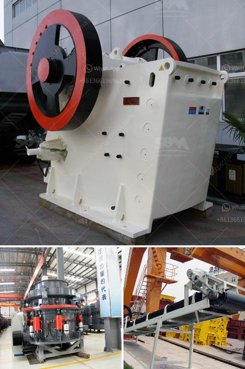

<h3>How does a tungsten ore crusher work?</h3>
Tungsten, also known as wolfram, is a naturally occurring metal widely used in many industrial applications due to its unique combination of strength and melting point. To extract and process tungsten ore, the rock containing the ore is first crushed and then chemically treated to separate the tungsten from other minerals. The primary crusher, like many others, is an industrial machine that is specifically designed to use a high amount of energy to break apart and crush rocks into a smaller size. One of the main advantages of a tungsten ore crusher is its ability to produce a relatively uniform cubical end product.

As the tungsten ore undergoes crushing and grinding, the ore particles are gradually reduced in size by a combination of impact and abrasion forces. The main crushing mechanism in traditional crushers is compression, which is achieved through a combination of eccentric motion and fixed jaw plates. As the materials enter the crusher, they are continuously subjected to the rotating motion of the eccentric shaft, which causes the materials to be crushed between the main crushing chamber and the fixed jaw plates.

Another important factor in the crushing process is the closed-side setting (CSS) of the crusher. The CSS is the minimum distance between the mantle and concave at the bottom of the crusher, which determines the size of the crushed product. By adjusting the CSS, operators can control the size of the final product, making it more suitable for downstream processes.

In the case of a tungsten ore crusher, a VSI crusher is typically used. This type of crusher is considered to be more efficient due to the high-speed impact action and the use of autogenous (self-crushing) principles. In a VSI crusher, tungsten ore rocks are crushed by a combination of impact and abrasion forces generated by a high-speed rotor with wear-resistant tips.

The tungsten ore rocks are fed into the crusher by a vibrating feeder, and then transferred by conveyor belt to a second crusher for further crushing. The second crusher will reduce the tungsten ore into much smaller sizes. Once it has reached the desired size, the ore is placed into a stockpile by a stacker for later processing.

After crushing and grinding, the tungsten ore is chemically treated to extract the tungsten metal from the rock matrix. The first step of the process involves roasting the ore in the presence of oxygen, converting the tungsten sulfide minerals into tungsten oxide. The next step is to reduce the tungsten oxide using hydrogen gas to obtain tungsten metal.

In summary, a tungsten ore crusher works by crushing the large rocks into smaller pieces before chemically treating the ore to extract the tungsten metal. The technology used to produce a uniform product size ensures that downstream processes are efficient and reliable. With the increasing demand for tungsten in various industries, the importance of efficient and reliable ore crushers cannot be overstated.
<h3>Contact us</h3><ul><li><strong>Whatsapp:&nbsp;<a href="https://wa.me/8613661969651">+8613661969651</a></strong></li><li><a href="https://swt.shibang-china.com/?git&amp;zhl&amp;How does a tungsten ore crusher work"><strong>Online Service(chat now)</strong></a></li></ul><h3>Related</h3><ul><li><a href='How to work jaw crusher and impact crusher .md'>How to work jaw crusher and impact crusher ?</a></li><li><a href='How is quartz mined and processed.md'>How is quartz mined and processed?</a></li><li><a href='how to repair a vibrating Sand Washer  ？.md'>how to repair a vibrating Sand Washer  ？</a></li><li><a href='how is iron ore transported to kenya.md'>how is iron ore transported to kenya</a></li><li><a href='How can we increase the production of the jaw crusher.md'>How can we increase the production of the jaw crusher?</a></li></ul>