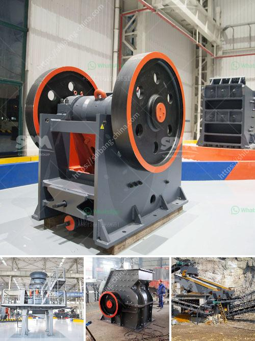

<h3>How does a vertical raw mill work?</h3>
A vertical raw mill is a type of industrial equipment used to crush or grind materials into small particles. Vertical raw mills are widely used in the concrete and mining fields, and are also used to process gypsum. These units can process both raw and recycled materials, while helping to reduce waste and preserve virgin supplies of these materials.

Vertical raw mills are particularly prevalent in the cement industry, where they are used to grind raw materials into smaller, more uniform particles. These raw materials are then used to make cement, which is used in the construction industry to build everything from houses to roads.

The grinding process is the next step in reducing the particle size. Vertical mills are commonly used for raw material and cement grinding. In terms of lubrication, the most critical parts of vertical mills are the bearings of the grinding rollers, the separator bearings, and the gearbox. The bearings of the grinding rollers are exposed to extremely high loads and multiple movements, while ensuring serviceability during maintenance activities.

The material that is fed into the mill typically passes through a spinning table. Air enters from below the table and passes across the path of the material being ground. The larger particles fall back onto the table in a circular motion and continue grinding until they are small enough to be blown out of the mill by the airflow generated by the fan.

To understand the process of grinding and how it works in a vertical raw mill, let's delve deeper into the components, which can be divided into three main categories: grinding rollers, grinding table, and separator.

The grinding rollers are the primary components that suffer wear due to the grinding process. They consist of a hard wear-resistant surface layer and a core of ductile material, providing both strength and toughness. The grinding table is another crucial component, as it supports the material during the grinding process. It is composed of an abrasion-resistant material and acts as a platform for the grinding process.

The separator, located above the grinding table, separates coarse and fine particles. The coarse particles fall back onto the grinding table for further grinding, while the fine particles are collected in a cyclone or bag filter for further processing or disposal.

Overall, a vertical raw mill is a highly efficient and energy-saving solution for the grinding process. The mill can produce raw materials with a fineness ranging from 12% to 30%, which is a significant reduction from the 40% to 50% range usually achieved by standard ball mills.

In conclusion, a vertical raw mill is a vital piece of equipment in the cement industry, mainly used to grind raw materials into smaller particles. This process assures a more consistent and homogeneous output for further processing, reducing waste and maximizing efficiency. Additionally, vertical raw mills can also be used to process gypsum, helping to reduce the need for raw materials and preserve natural resources.
<h3>Contact us</h3><ul><li><strong>Whatsapp:&nbsp;<a href="https://wa.me/8613661969651">+8613661969651</a></strong></li><li><a href="https://swt.shibang-china.com/?git&amp;zhl&amp;How does a vertical raw mill work"><strong>Online Service(chat now)</strong></a></li></ul><h3>Related</h3><ul><li><a href='how to choose mobile jaw crusher machinery ？.md'>how to choose mobile jaw crusher machinery ？</a></li><li><a href='How to buy mobile crusher .md'>How to buy mobile crusher ?</a></li><li><a href='How to invest in crushing machines？.md'>How to invest in crushing machines？</a></li><li><a href='how is iron ore transported to kenya.md'>how is iron ore transported to kenya</a></li><li><a href='How to install tunnel feeders in a crushing plant.md'>How to install tunnel feeders in a crushing plant?</a></li></ul>