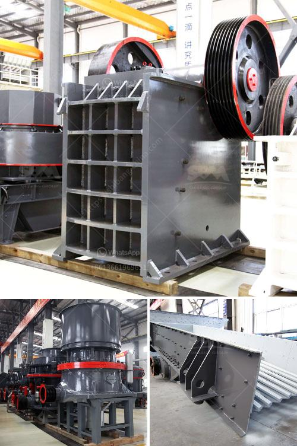

<h3>How does a work of impact crusher?</h3>
The impact crusher is a machine that uses striking as opposed to pressure to reduce the size of a material. In impact crushing, horizontal shaft impactors (HSI) are often used, which are heavy duty machines that can handle medium to hard rocks, such as limestone, dolomite, and basalt. In cone crushers, compression crushing is used, whereas in impact crushers, impact crushing is used.

The working principle of an impact crusher involves the use of a rotor that rotates at a high speed within a crushing chamber. The material is fed into the chamber through an opening in the top and is hit by the rotor's blow bars or hammers. These strike the material and break it apart, causing it to be thrown against the chamber walls. The broken pieces then rebound and are thrown back against the blow bars, further reducing their size.

Impact crushers can be configured in a variety of ways to suit different applications. For example, some impact crushers have a horizontal shaft and a fixed crushing chamber. This configuration is ideal for very hard and abrasive materials, as it allows the material to be crushed between the rotor and the fixed walls of the chamber. Other impact crushers have a vertical shaft and a variable crushing chamber, allowing for more versatility in the size and shape of the crushed product.

The material that enters the impact crusher is subject to tremendous forces and pressures. To ensure the crusher operates efficiently, it is important to keep the rotor and blow bars clean and free of any buildup or blockages. Regular maintenance should include inspection and cleaning of the rotor and blow bars, checking the wear of the blow bars, and replacing them if necessary. Additionally, the impact crusher should be lubricated regularly to ensure smooth operation and prevent excessive wear.

When properly maintained and operated, an impact crusher can produce a high-quality and uniform product with excellent particle shape. It is often used in the production of construction materials, such as concrete and asphalt, as well as in the mining industry to crush ore and extract valued minerals. Impact crushers are versatile machines that can handle a wide range of materials and are capable of producing a high reduction ratio.

In conclusion, the workings of an impact crusher involve the use of a rotor that rotates at high speed within a crushing chamber. The material is struck by the rotor's blow bars or hammers and is broken apart, causing it to be thrown against the chamber walls. The broken pieces then rebound and are struck again, further reducing their size. The impact crusher is a powerful machine that can handle medium to hard rocks and produce a high-quality product. Proper maintenance and operation are key to ensuring its efficiency and longevity.
<h3>Contact us</h3><ul><li><strong>Whatsapp:&nbsp;<a href="https://wa.me/8613661969651">+8613661969651</a></strong></li><li><a href="https://swt.shibang-china.com/?git&amp;zhl&amp;How does a work of impact crusher"><strong>Online Service(chat now)</strong></a></li></ul><h3>Related</h3><ul><li><a href='How to maintain the longterm advantages of the impact crusher.md'>How to maintain the long-term advantages of the impact crusher</a></li><li><a href='How much does a quarry crusher cost.md'>How much does a quarry crusher cost?</a></li><li><a href='How does a vertical raw mill work.md'>How does a vertical raw mill work?</a></li><li><a href='How does a raw mill work in a cement plant.md'>How does a raw mill work in a cement plant?</a></li><li><a href='How to replace the belt on the crushing machinery ？.md'>How to replace the belt on the crushing machinery ？</a></li></ul>