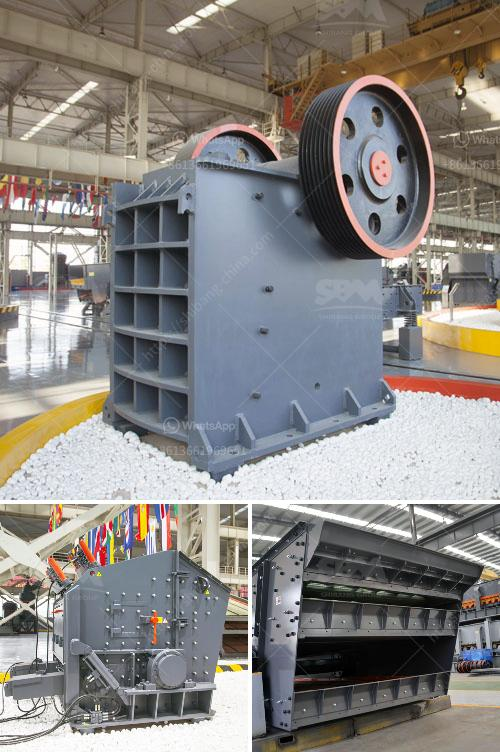

<h3>How does bauxite crushers work?</h3>
Bauxite is a rare and valuable mineral resource mainly composed of aluminum oxide compounds. Its widely used in industries such as metallurgy, chemical, refractory materials, and ceramics due to its unique properties. Bauxite has been played an important role in the industry. However, how does the bauxite crusher work?

Bauxite processing can be relatively simple or incredibly complex. In basic terms, bauxite is crushed and milled into a fine powder. Dissolved in caustic soda (sodium hydroxide) at high pressure and temperature, this is a process known as the Bayer process. Bauxite is pulverized into a raw material and mixed with caustic soda, resulting in what is called red mud. The red mud is then washed, filtered, and converted into a white powder, which is the final product.

Bauxite crushers are used to break the raw materials into small particles. Initially, bauxite is extracted from mines, and excavators or loaders are used to load the bauxite onto haul trucks for transport to the crusher. When mining operations are done, the bauxite is transported to a refinery for further processing.

1. Jaw Crushers: Jaw crushers are heavy-duty machines and are widely used in the primary crushing stage of bauxite. They are designed to withstand heavy loads and are usually fitted with a fixed jaw and a swinging jaw for effective crushing action.

2. Impact Crushers: Impact crushers are based upon several decades of experience with the impact method. They use a high-speed rotor or blow bar to impact the material and require less maintenance compared to jaw or cone crushers.

3. Cone Crushers: Cone crushers are generally used for secondary crushing, especially in the sintering process. It is well-suited for producing high-quality cubical aggregates.

4. Gyratory Crushers: Gyratory crushers are used for primary or secondary crushing. Gyratory crushers have a conical outer shell that gyrates about the axis, causing the rocks to be crushed.

The choice of crusher depends on the desired end product size and the capacity requirements. Bauxite crushers can be used in various industries, such as mining, construction, metallurgy, chemistry, and others.

When choosing the best crusher for your mining operation, it is important to consider various factors, such as the hardness, toughness, moisture content, and abrasiveness of the bauxite. It is also essential to determine the desired end product size, capacity, and power requirements.

In conclusion, bauxite crushers work by breaking down raw materials into smaller pieces that can be further processed. They are ideal for producing high-quality aggregate materials used in various industries. The choice of crusher depends on the desired end product size and capacity requirements. By selecting the appropriate crusher, mining companies can ensure efficient and effective bauxite processing.
<h3>Contact us</h3><ul><li><strong>Whatsapp:&nbsp;<a href="https://wa.me/8613661969651">+8613661969651</a></strong></li><li><a href="https://swt.shibang-china.com/?git&amp;zhl&amp;How does bauxite crushers work"><strong>Online Service(chat now)</strong></a></li></ul><h3>Related</h3><ul><li><a href='How to increase the output of stone milling machine？.md'>How to increase the output of stone milling machine？</a></li><li><a href='How to install quarry equipment.md'>How to install quarry equipment?</a></li><li><a href='How to crush material from 12mm to 6mm.md'>How to crush material from 12mm to 6mm?</a></li><li><a href='How to turn off crushing and screening plant.md'>How to turn off crushing and screening plant?</a></li><li><a href='How to adjust the discharge opening of a spring cone crusher.md'>How to adjust the discharge opening of a spring cone crusher?</a></li></ul>