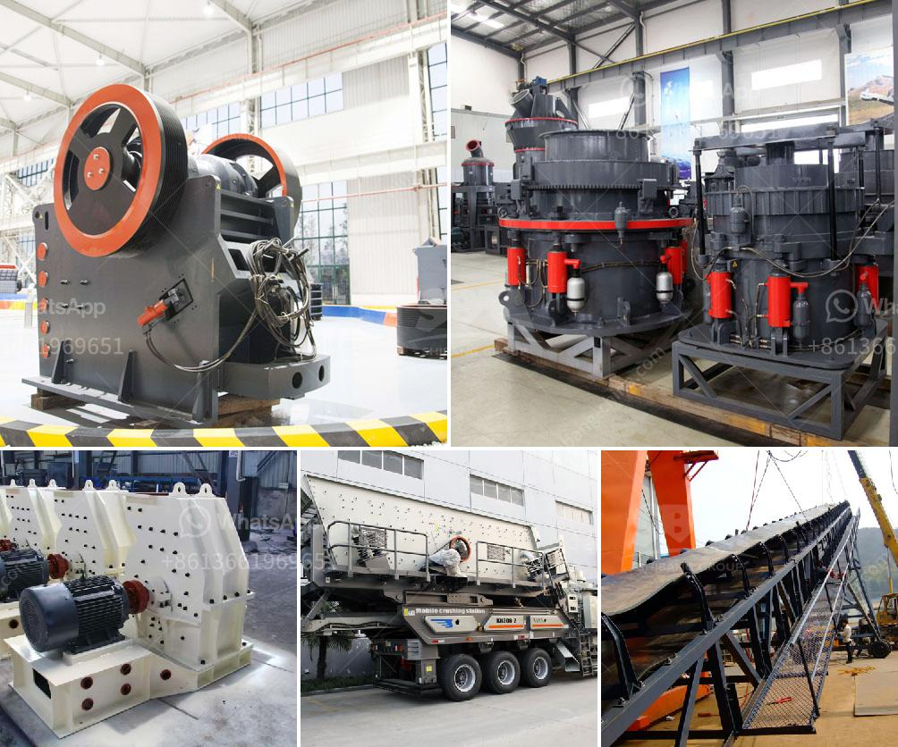

<h3>How does bulk density affect the capacity of a rock crusher?</h3>
Bulk density is a property of any solid substances such as rocks, ores, minerals, or aggregates. It is defined as the mass of the material divided by its volume. Bulk density reflects the compactness of a material and is often used in various engineering calculations. When it comes to rock crushing, understanding the relationship between bulk density and the capacity of a rock crusher is crucial.

The capacity of a rock crusher is essentially a measure of the maximum amount of material that can be crushed per unit time. The bulk density directly affects the capacity by determining how many rocks can fit within the crusher's chamber at any given time. A higher bulk density means more rocks can be fed into the chamber, resulting in greater crushing efficiency.

One aspect to consider when analyzing the impact of bulk density on crusher capacity is the type of rock being crushed. Different rocks have different bulk densities due to variations in their mineral composition and porosity. For example, igneous rocks such as granite or basalt tend to have higher bulk densities than sedimentary rocks like limestone or sandstone.

When a rock with high bulk density is fed into the crusher, it takes up more space within the chamber compared to a rock with lower bulk density. This reduces the effective volume available for rock crushing, leading to a decrease in the crusher's capacity. The crusher may struggle to achieve the desired reduction ratio, leading to lower productivity and potentially larger energy consumption.

Moreover, bulk density can affect the flowability of the material within the crusher. Rocks with higher bulk densities are generally more cohesive and tend to stick together, causing blockages in the crusher's feed system. This can further decrease the crusher's capacity and increase the risk of equipment damage. On the other hand, rocks with lower bulk densities often exhibit better flowability, allowing for smoother material feeding and maximizing the capacity of the crusher.

In addition to bulk density, the particle size distribution within the rock material can also influence the crusher's capacity. Rocks with a wide particle size distribution, such as a mix of fine and coarse particles, may result in uneven feeding, inefficient crushing, and reduced capacity. Therefore, it is important to ensure a consistent and well-graded feed material to optimize the crusher's performance.

To summarize, bulk density plays a critical role in determining the capacity of a rock crusher. Higher bulk density allows for more rocks to be crushed within the crusher's chamber, leading to greater efficiency. It is essential to understand the bulk density of the rocks being processed and ensure a well-graded feed material to achieve the desired capacity and maximize the crusher's performance.
<h3>Contact us</h3><ul><li><strong>Whatsapp:&nbsp;<a href="https://wa.me/8613661969651">+8613661969651</a></strong></li><li><a href="https://swt.shibang-china.com/?git&amp;zhl&amp;How does bulk density affect the capacity of a rock crusher"><strong>Online Service(chat now)</strong></a></li></ul><h3>Related</h3><ul><li><a href='How to plan and develop a small mine.md'>How to plan and develop a small mine?</a></li><li><a href='How to prevent environmental pollution in washing plants？.md'>How to prevent environmental pollution in washing plants？</a></li><li><a href='how to choose a jaw crusher malaysia.md'>how to choose a jaw crusher malaysia?</a></li><li><a href='How to remove feldspars from sand production.md'>How to remove feldspars from sand production?</a></li><li><a href='How much is the copper ore separation machine.md'>How much is the copper ore separation machine?</a></li></ul>