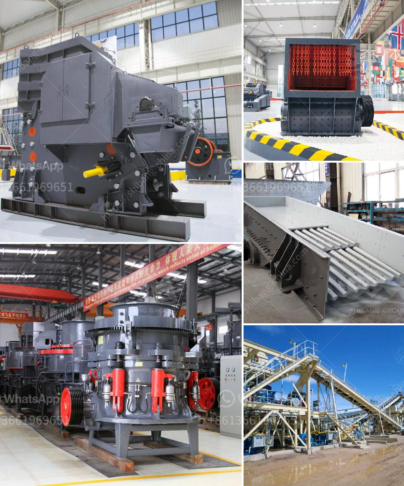

<h3>How does investing in a cone crusher benefit?</h3>
When it comes to enhancing the efficiency of your crushing process, a Cone Crusher is an essential tool. The cone crusher is a versatile and powerful machine that can crush various materials into different sizes. With its advanced technology and sturdy design, it provides numerous benefits that help improve productivity and reduce operating costs. Let's delve deeper into why investing in a cone crusher can be highly advantageous for your business.

A cone crusher excels at breaking down hard and abrasive materials, including granite, ores, and minerals. Its powerful crushing action allows for better particle shape and consistency. The ability to process a wide range of materials and produce a uniform finished product makes it a preferred choice for many industries.

Cone crushers are available in various models and configurations to suit different crushing needs. From coarse to fine crushing, they can handle different types of materials with ease. Whether you need to crush large rocks or finer aggregates, a cone crusher can adapt to your requirements. This versatility makes it a valuable investment for industries like mining, construction, and recycling.

Investing in a cone crusher can significantly increase your productivity. With its efficient crushing mechanism, it can process more material in less time. This means you can produce higher volumes of product, meeting the demands of your customers. By reducing the time and effort required for crushing, you can streamline your operations and maximize output.

While the initial investment in a cone crusher may seem significant, it can lead to substantial long-term cost savings. Cone crushers are built to be durable and reliable, requiring minimal maintenance. This means lesser downtime and reduced repair and replacement costs. Additionally, their energy-efficient design helps minimize power consumption, resulting in lower utility bills. A cone crusher allows you to achieve more with less, ultimately saving you money.

Safety is paramount in any workplace, and cone crushers prioritize it. With advanced safety features, such as a hydraulic system for overload protection, they ensure the safety of operators and other personnel. Cone crushers are also designed to minimize dust emissions, reducing the risk of respiratory problems. By investing in a cone crusher, you demonstrate your commitment to providing a safe and healthy working environment.

In today's environmentally conscious world, investing in equipment that promotes sustainability is crucial. Cone crushers are designed to operate efficiently while minimizing environmental impact. Their low emission levels and reduced noise pollution make them an eco-friendly choice. By choosing a cone crusher, you contribute to a greener planet while meeting your crushing needs.

In summary, investing in a cone crusher can bring a multitude of benefits to your business. From superior crushing performance and increased productivity to cost savings and improved safety, it is a valuable asset that enhances your overall efficiency. Moreover, with its versatility and environmental responsibility, it aligns with the sustainable practices required in today's world. So, if you're looking to optimize your crushing process, investing in a cone crusher is a smart decision.
<h3>Contact us</h3><ul><li><strong>Whatsapp:&nbsp;<a href="https://wa.me/8613661969651">+8613661969651</a></strong></li><li><a href="https://swt.shibang-china.com/?git&amp;zhl&amp;How does investing in a cone crusher benefit"><strong>Online Service(chat now)</strong></a></li></ul><h3>Related</h3><ul><li><a href='How to choose a small rock crusher for mining ？.md'>How to choose a small rock crusher for mining ？</a></li><li><a href='How to install ore jaw crusher.md'>How to install ore jaw crusher?</a></li><li><a href='how to build stone crushing machine .md'>how to build stone crushing machine ?</a></li><li><a href='How to wash manufacturing sand .md'>How to wash manufacturing sand ?</a></li><li><a href='How to Choose a Vibrating Feeder.md'>How to Choose a Vibrating Feeder?</a></li></ul>