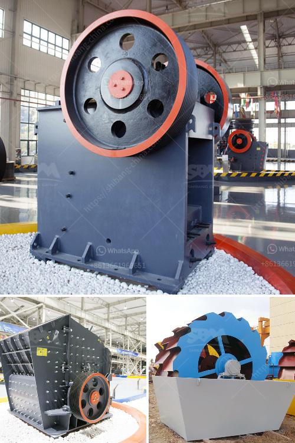

<h3>How does the Vibrating Screen machine work？</h3>
The vibrating screen machine, also known as a separator or a circular vibrating screen, is a piece of industrial machinery used to separate materials by particle size. Today’s vibrating screens operate efficiently and accurately by utilizing a variety of screen media, such as woven wire, rubber, or polyurethane. These screens are typically powered by an electric motor and transmit motion via a series of gears and exciters.

The primary function of a vibrating screen machine is to remove impurities and grading or sort materials into different sizes. This is accomplished by feeding the material onto the vibrating screen mesh. The screen deck, typically consisting of several layers of woven wire, rubber, or polyurethane, allows only the desired size particles to pass through. The remaining materials are directed to an outlet for further processing.

The vibrating motion of the screen deck is generated by an eccentric flywheel or counterweights. These motor-driven eccentric weights rotate at high speeds, causing the screen deck to vibrate in a circular motion. This motion encourages the particles to move along the screen mesh openings and separate according to size.

An additional feature of vibrating screens is their inclination angle, which helps to improve the efficiency of the screening process. The angle can be adjusted based on the material being processed and the desired separation criteria. A steeper incline angle allows for better dewatering and liquid-solid separation, while a shallower angle enhances the screening efficiency of dry materials.

It is important to note that vibrating screens are designed with different types of screen media to meet specific application requirements. For example, woven wire screens are commonly used for heavy-duty applications, where high strength and wear resistance are critical. Rubber screens, on the other hand, are preferred for situations that require corrosion and abrasion resistance. Polyurethane screens, known for their durability and flexibility, are often used in mining and quarrying applications.

To optimize the performance of a vibrating screen machine, routine maintenance is essential. This includes checking the screen tension, inspecting the screen panels for wear or damage, and verifying the alignment of the motor and exciter components. Proper lubrication of bearings and replacing worn-out parts are also crucial to ensure smooth operation and extend the machine's lifespan.

In conclusion, the vibrating screen machine plays a vital role in numerous industries by efficiently separating and grading materials of different sizes. Its functioning relies on the combination of motor-driven eccentric weights or flywheel, combined with various screen media options. By understanding how these machines work and properly maintaining them, operators can maximize their efficiency and productivity.
<h3>Contact us</h3><ul><li><strong>Whatsapp:&nbsp;<a href="https://wa.me/8613661969651">+8613661969651</a></strong></li><li><a href="https://swt.shibang-china.com/?git&amp;zhl&amp;How does the Vibrating Screen machine work？"><strong>Online Service(chat now)</strong></a></li></ul><h3>Related</h3><ul><li><a href='How does a vertical raw mill work.md'>How does a vertical raw mill work?</a></li><li><a href='How to choose the specification of jaw crusher？.md'>How to choose the specification of jaw crusher？</a></li><li><a href='How to import stone crusher machine from China to Canada.md'>How to import stone crusher machine from China to Canada?</a></li><li><a href='How to increase the output of ball mill.md'>How to increase the output of ball mill?</a></li><li><a href='how ores are classified .md'>how ores are classified ?</a></li></ul>