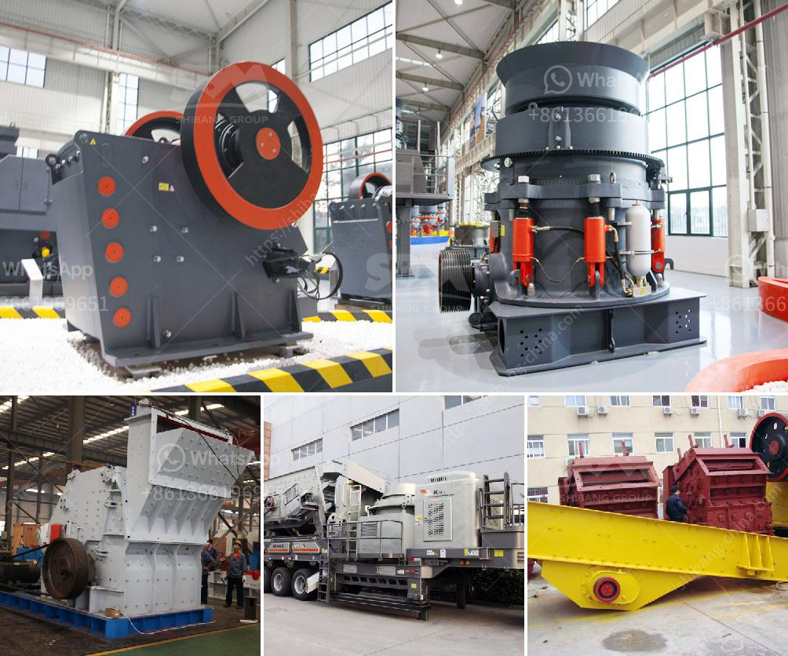

<h3>How does the ball mill produce cement</h3>
A ball mill is a grinding device that is used to turn material into fine powder. Ball mills are cylindrical in shape, and are often the grinder of choice when it comes to mashing paints, ores, ceramic materials, and certain hard chemicals. By rotating on a horizontal axis, a ball mill can effectively convert a hard material into a loose powder.

In addition to the material that is meant to be ground, ball mills also contain a grinding material. Ceramic balls, stainless steel balls, and flint pieces are often used as grinding materials. When this matter grinds against another matter, the result is a crushed powder that can then be used for other applications.

An industrial ball mill has the ability to operate continuously. These ball mills are often controlled by a machine that feeds materials through one end of the mill and out the other end. Smaller mills can only operate with the help of a cylindrical container containing a tight cap. These mills are part of a pulley system that uses belts and pulleys to operate smaller ball mills.

The concept of the ball mill is pretty simple – it comes in a hollow cylindrical form and rotates on a horizontal axis, which is mounted on a sturdy structure. Moreover, the cylindrical container is filled with the grinding medium (ball or rods) that further grinds the material as it rotates around the cylinder. This process is called grinding.

Ball mills are used extensively for grinding metal bearing ores and abrasive minerals. When it comes to grinding cement, the ball mill is considered to be the industry standard. Manufacturers use different technologies to produce cement with the help of a ball mill, including dry grinding, high-pressure grinding, and low-pressure grinding.

The ball mill grinder is cylindrical in shape with a rotating drum, and the drum is partially filled with grinding media (balls or rods) that mix and crush the materials inside. During this process, the grinding media will crush the materials into powder size based on the requirement. Wet and dry grinding is an important task in the processing of mineral, cement, refractory materials, and other materials.

Ball mills are a key piece of equipment in the cement industry. These machines often work when it comes to grinding hard and abrasive materials. Such materials include glass, bottles, and cement. Additionally, they can also be used for dry and wet grinding of a variety of ores and other materials.

The cement industry relies on ball mills to grind materials into cement clinker, which is needed for further refinement. An optimized efficiency is easily achieved with advanced machinery specifically designed to increase performance. It's important to note that ball mills are used along with separators to increase the grinding capacity of the cement.

In conclusion, it's important to understand that ball mills are a valuable piece of equipment when it comes to grinding materials and producing cement. Although not the only solution available, they stand out as the industry standard due to their versatility, efficiency, and ability to grind various materials. With advanced technology, ball mills have become more energy-efficient while producing high-quality cement.
<h3>Contact us</h3><ul><li><strong>Whatsapp:&nbsp;<a href="https://wa.me/8613661969651">+8613661969651</a></strong></li><li><a href="https://swt.shibang-china.com/?git&amp;zhl&amp;How does the ball mill produce cement"><strong>Online Service(chat now)</strong></a></li></ul><h3>Related</h3><ul><li><a href='How to increase the production capacity of stone grinding machine ？.md'>How to increase the production capacity of stone grinding machine ？</a></li><li><a href='How to increase the capacity of ball mill .md'>How to increase the capacity of ball mill ?</a></li><li><a href='How to calculate the charge volume of a ball mill.md'>How to calculate the charge volume of a ball mill?</a></li><li><a href='how to choose mobile rock crusher machines？.md'>how to choose mobile rock crusher machines？</a></li><li><a href='How to select the screen size for a crusher plant.md'>How to select the screen size for a crusher plant?</a></li></ul>