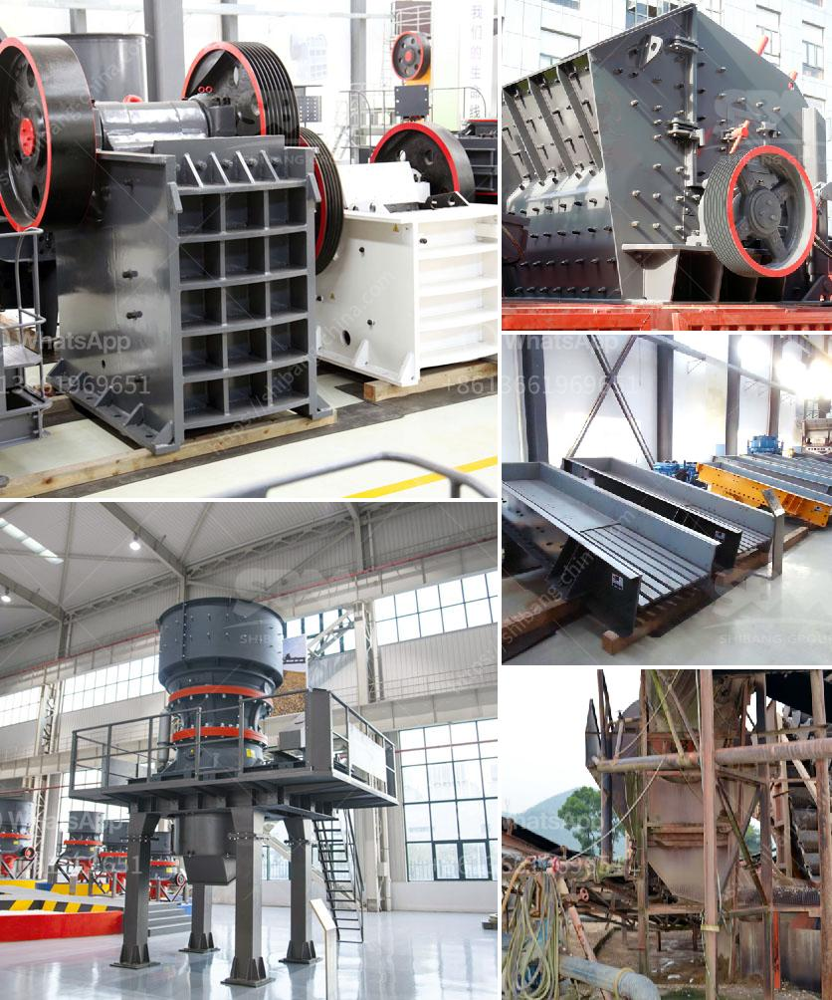

<h3>How does the operation of crusher plants work?</h3>
Crusher plants are designed to operate and function efficiently, with the aim to crush stones and rocks of various sizes into smaller gravel, sand, or rock dust. These machines play a crucial role as they reduce the size of larger rocks to smaller ones for further processing. As the name suggests, a crusher plant consists of several components, including a vibrating feeder, jaw crusher, impact crusher, vibrating screen, and belt conveyor.

The first step in the operation of a crusher plant is to feed the materials into the hopper. This hopper allows the entry of rocks into the crusher chamber. The size and quality of the materials can significantly affect the performance of the crusher. The crusher will reduce the material size by using a mechanical force generated by two jaw plates, one fixed and the other reciprocating. The reciprocating motion of the jaw plates creates a compressive force on the rocks, leading to their reduction in size.

After the materials are crushed in the jaw crusher, they are transferred to the impact crusher or the cone crusher for further crushing. These secondary crushers provide finer and more uniform particles, ensuring high-quality production. The choice of the secondary crusher depends on the hardness of the rocks and the required final product size.

The vibrating screen sieves the crushed materials to ensure that the remaining particles meet the desired specifications. It separates the crushed materials according to their size, and those that do not meet the specified size requirement are returned to the crushers for re-crushing, while the qualified ones are transported to the storage area or the next processing stage.

Additionally, a crusher plant may also include a belt conveyor system. This system allows the materials to be transported from one stage to another efficiently. The belt conveyor can move the crushed materials over long distances, enabling the smooth flow of the production process. It also increases productivity by reducing the need for manual handling of materials.

To ensure the smooth operation of a crusher plant, regular maintenance plans are necessary. This includes routinely inspecting and lubricating the components, such as bearings, belts, and screens. Potential issues, such as worn-out parts or loose connections, should be addressed promptly to prevent breakdowns and delays in production. Additionally, operators must follow safety protocols to protect themselves and others, especially when performing maintenance or repairs.

In conclusion, the operation of crusher plants involves a series of steps, including feeding, crushing, screening, and transportation. These machines play a crucial role in the processing of rocks into smaller materials for various applications. With regular maintenance and adherence to safety protocols, crusher plants can operate efficiently and contribute to the success of industries such as mining, construction, and demolition.
<h3>Contact us</h3><ul><li><strong>Whatsapp:&nbsp;<a href="https://wa.me/8613661969651">+8613661969651</a></strong></li><li><a href="https://swt.shibang-china.com/?git&amp;zhl&amp;How does the operation of crusher plants work"><strong>Online Service(chat now)</strong></a></li></ul><h3>Related</h3><ul><li><a href='How to use mineral processing equipment for tin ore beneficiation .md'>How to use mineral processing equipment for tin ore beneficiation ?</a></li><li><a href='How to install a stone crusher plant.md'>How to install a stone crusher plant?</a></li><li><a href='How to crush basalt rock.md'>How to crush basalt rock?</a></li><li><a href='How to start a granite quarry.md'>How to start a granite quarry?</a></li><li><a href='How to start stone crushing business in Ghana .md'>How to start stone crushing business in Ghana ?</a></li></ul>