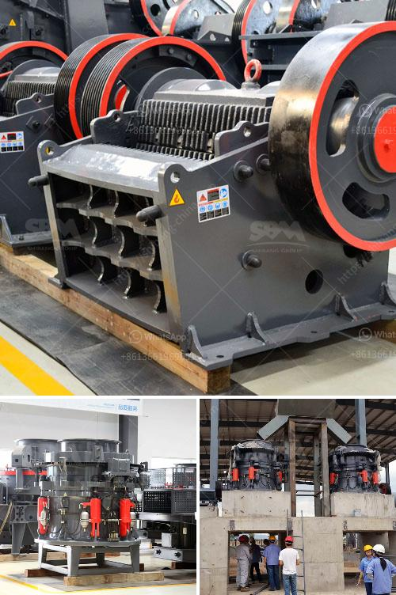

<h3>How does the sand washing machine work?</h3>
Sand washing machines, also called sand washers, are mainly used to wash impurities (such as dust) and other unwanted particles from sand. They remove dirt and dust and improve the quality of sand used in construction and other industries. Due to the different degree of washing required, the process of the sand washing machine can vary.

The sand washing machine operates based on the principle of gradual sieving of sand and sedimentation in the water trough. The sand and impurities are fed into the washing tank by the feeding chute. The electric motor drives the impeller in the water tank to rotate at a high speed. As a result, the sand and impurities are washed and separated.

The sand washer is equipped with a dewatering screen, which uses mechanical vibration to remove excess moisture from the washed sand. The dewatered sand is then discharged from the outlet while the wastewater containing impurities is collected through the sewage pipe and discharged into a sedimentation tank for further treatment.

The sand washing machine has several key components that work together to produce a high-quality end product:

1. Feeding system: The feeding system consists of a vibrating feeder or a conveyor belt that evenly feeds the sand into the washing tank. This ensures that the sand is evenly distributed and thoroughly washed.

2. Washing tank: The washing tank is where the sand and impurities go through the washing process. It is filled with water, and the sand is agitated by the impeller, which helps to remove dirt, dust, and other impurities.

3. Dewatering system: The dewatering system consists of a dewatering screen or a cyclone separator. These components help to remove excess moisture from the washed sand, ensuring a dry and clean end product.

4. Control system: The control system regulates the operation of the sand washing machine, including the motor, the feeding system, and the dewatering system. It allows for the adjustment of various parameters to optimize the washing process.

The sand washing machine offers numerous benefits in various industries. In construction, it ensures that the sand used for concrete is free of impurities, which improves the strength and durability of the final product. In the mining industry, it is used to wash and separate minerals from crushed rocks, making them suitable for further processing.

Overall, the sand washing machine plays a crucial role in the production of high-quality sand. By removing impurities and excess moisture, it ensures that the sand meets the required specifications. Its simple yet effective design and operation make it a popular choice for companies in the construction and mining industries. With ongoing advancements in technology, sand washing machines are becoming more efficient, environment-friendly, and easy to maintain.
<h3>Contact us</h3><ul><li><strong>Whatsapp:&nbsp;<a href="https://wa.me/8613661969651">+8613661969651</a></strong></li><li><a href="https://swt.shibang-china.com/?git&amp;zhl&amp;How does the sand washing machine work"><strong>Online Service(chat now)</strong></a></li></ul><h3>Related</h3><ul><li><a href='How to break material using a hammer crusher.md'>How to break material using a hammer crusher?</a></li><li><a href='how much power does a 50 tph crusher need ？.md'>how much power does a 50 tph crusher need ？</a></li><li><a href='how to cal belt conveyor length for stone crusher ？.md'>how to cal belt conveyor length for stone crusher ？</a></li><li><a href='How to commission a limestone crusher first.md'>How to commission a limestone crusher first?</a></li><li><a href='how to intall a jaw crusher ？.md'>how to intall a jaw crusher ？</a></li></ul>