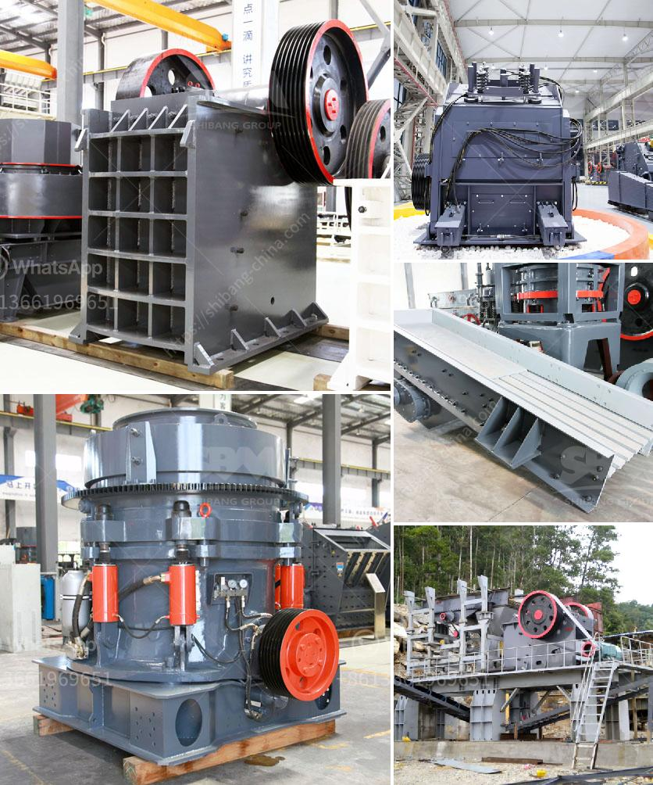

<h3>How industry crush graphite?</h3>
Graphite may appear as a humble material at first glance, often associated with writing instruments. However, it is much more than that. In fact, graphite has become a crucial component in various industries, such as automotive, aerospace, energy storage, and electronics. But what makes graphite so valuable and how is it manufactured to meet these industries' demands?

Graphite, a form of carbon, possesses unique properties that make it highly sought after by different sectors. It is known for its excellent thermal and electrical conductivity, as well as its remarkable strength and stability. These qualities make graphite an ideal material for various applications where heat dissipation, electrical conductivity, and durability are critical.

The process of crushing graphite begins with sourcing high-quality raw materials. Graphite is often extracted from mines and then undergoes a series of purification processes. During purification, impurities like sulfur, silicon, and other non-carbon elements are removed. This ensures that the graphite is of high purity, further enhancing its properties and making it suitable for industrial applications.

Once purified, the graphite is in the form of large flakes or fine powders. Depending on the desired application, the graphite is then crushed and processed further. Crushing graphite involves reducing its size through various methods such as grinding, milling, or pulverizing. This step is critical in creating graphite powders of different particle sizes, which are used in specific industries depending on the required conductivity, lubrication properties, or other specific qualities.

In the aerospace industry, graphite is commonly used in the manufacturing of lightweight yet sturdy components for aircraft and spacecraft. The industry crushes graphite into fine powders to create composites that can withstand extreme temperatures and provide effective heat dissipation, ensuring the safety and reliability of aerospace vehicles.

In the automotive sector, graphite plays a crucial role in the production of lithium-ion batteries, which power electric vehicles and hybrid cars. The graphite is crushed into fine powders and used as an anode material in these batteries, allowing for efficient energy storage and release. The unique properties of graphite enable it to store and deliver electricity reliably, making it a key component in the quest for sustainable transportation.

Additionally, the electronics industry heavily relies on graphite for its thermal management and electrical conductivity properties. Graphite powders are used in computer chips, heat sinks, and other electronic components, where they help dissipate heat efficiently while ensuring electrical conductivity. The ability of graphite to spread heat evenly helps prevent overheating and enhances the performance and longevity of electronic devices.

In conclusion, graphite has emerged as a fundamental material in various industries due to its exceptional thermal and electrical conductivity, strength, and stability. From aerospace to automotive and electronics, the versatility of graphite is harnessed through a precise crushing process that results in different particle sizes suited for each application. As technology advances and industries demand more efficient and sustainable solutions, the crushing of graphite will continue to play a pivotal role in enabling innovation and progress across sectors.
<h3>Contact us</h3><ul><li><strong>Whatsapp:&nbsp;<a href="https://wa.me/8613661969651">+8613661969651</a></strong></li><li><a href="https://swt.shibang-china.com/?git&amp;zhl&amp;How industry crush graphite"><strong>Online Service(chat now)</strong></a></li></ul><h3>Related</h3><ul><li><a href='How to cut costs for a quarry.md'>How to cut costs for a quarry?</a></li><li><a href='How to make a coal primary jaw crusher machine.md'>How to make a coal primary jaw crusher machine?</a></li><li><a href='How to make sand from rocks.md'>How to make sand from rocks?</a></li><li><a href='How do I change the mantle of a cone crusher.md'>How do I change the mantle of a cone crusher?</a></li><li><a href='How to Build an Ore Processing Plant ？.md'>How to Build an Ore Processing Plant ？</a></li></ul>